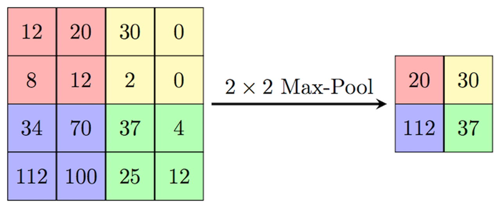
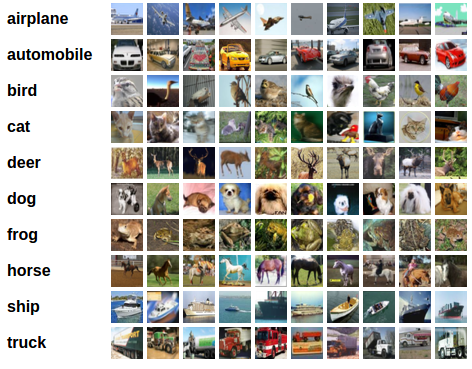

# 분류자 교육

## 소개

PyTorch의 [분류자 교육](https://pytorch.org/tutorials/beginner/blitz/cifar10_tutorial.html) 가이드는 시작할 수 있는 좋은 장소이지만 코드의 일부 세부정보는 필드에 새로운 독자를 위해 너무 희박하게 설명되어 있습니다. 이 실습은 해당 자습서를 기반으로 작성되며 코드에 대한 라인별 설명이 포함되어 더 명확한 학습 경로를 지원합니다.

예상 실습 시간: 45분

### 목표

이 실습에서는 다음 내용을 다룹니다.

*   DataLoaders
*   CNN(Convolutional Neural Networks)
*   손실 기능 및 옵티마이저
*   모델 교육

### 필수 조건

이 실습에서는 다음 사항이 있다고 가정합니다.

*   Oracle Free Tier 또는 유료 클라우드 계정
*   실습 1 및 2에서 다루는 CPU 또는 GPU 인스턴스에 액세스

## 작업 1: 환경 설정

PyTorch를 실행하도록 python 환경을 설정하는 방법에는 여러 가지가 있습니다. 원하는 방법 또는 다음 지침 세트를 따를 수 있습니다.

1.  사이트로 이동하여 "Linux Installers"로 스크롤하고 최상위 링크를 복사하여 [최신 버전의 miniconda](https://docs.conda.io/en/latest/miniconda.html)에 대한 링크를 가져옵니다.
    
2.  인스턴스에 대한 터미널에서 wget을 사용하여 파일을 다운로드합니다.
    
         wget https://repo.anaconda.com/miniconda/Miniconda3-latest-Linux-x86_64.sh
        
3.  [install 명령을 실행](https://conda.io/projects/conda/en/latest/user-guide/install/linux.html)하고 설치를 완료합니다.
    
         bash Miniconda3-latest-Linux-x86_64.sh
        
4.  터미널을 종료하고 설치 후 새 터미널을 열어 conda가 활성화되도록 합니다. 선택 사항: `conda create --name pytorch python=3.6` 명령을 실행한 다음 `conda activate pytorch`를 실행하여 환경을 사용으로 설정하여 PyTorch에 대한 특정 환경을 생성합니다.
    
5.  [설치 PyTorch](https://pytorch.org/) - conda `conda install pytorch torchvision cudatoolkit=10.2 -c pytorch`
    

## 작업 2: CIFAR10 및 DataLoader

전체 코드 예제는 이 페이지의 맨 아래에 있습니다.

AI 연구자의 대부분의 시간은 훈련 및 테스트 모델을 실행하는 데 쓰지 않고 데이터를 정리하고 준비하는 데 사용됩니다. 놀라운 양의 작업이 아래에 코드의 몇 줄로 응축되었습니다. CIFAR10는 이미지 및 레이블의 완전히 사전 처리된 데이터 세트입니다. 새로운 모델을 테스트하거나 딥 러닝을 시작하기 위한 표준화된 벤치마크 역할을 하도록 만들어졌으며 공개되었습니다. 원시 데이터 세트를 PyTorch에서 작동하는 구조로 변환하려면 많은 시간이 걸릴 수 있으므로 장벽을 낮추려면 데이터 세트가 PyTorch 라이브러리 배포에 포함되었습니다.

    import torch
    import torchvision
    import torchvision.transforms as transforms
    
    transform = transforms.Compose(
        [transforms.ToTensor(),
         transforms.Normalize((0.5, 0.5, 0.5), (0.5, 0.5, 0.5))])
    
    trainset = torchvision.datasets.CIFAR10(root='./data', train=True,
                                            download=True, transform=transform)
    trainloader = torch.utils.data.DataLoader(trainset, batch_size=4,
                                              shuffle=True, num_workers=2)
    
    testset = torchvision.datasets.CIFAR10(root='./data', train=False,
                                           download=True, transform=transform)
    testloader = torch.utils.data.DataLoader(testset, batch_size=4,
                                             shuffle=False, num_workers=2)
    
    classes = ('plane', 'car', 'bird', 'cat',
               'deer', 'dog', 'frog', 'horse', 'ship', 'truck')
    

[transform.Compose](https://pytorch.org/docs/stable/torchvision/transforms.html)는 데이터가 모델에 필요한 텐서 형식이고 모든 값이 정의된 범위 내에 맞도록 [정규화](https://discuss.pytorch.org/t/understanding-transform-normalize/21730)되었는지 확인합니다. 데이터를 정규화하면 데이터 세트의 값을 보다 일관성 있게 만드는 데 도움이 되므로 모델 학습이 향상되는 경우가 많습니다.

이러한 코드 행은 데이터 세트 다운로드를 관리하고 이미지를 세 가지 색상 채널(빨간색, 녹색 및 파란색)로 분할하여 올바른 레이블(평면, 새, 개, 개구리 등)에 일치시키고 모든 이미지 및 레이블을 [torch.Tensors](https://pytorch.org/docs/stable/tensors.html)로 변환합니다. [torchvision.datasets.CIFAR10](http://pytorch.org/docs/stable/torchvision/datasets.html?highlight=cifar10#torchvision.datasets.CIFAR10) 메소드의 출력은 사용할 준비가 된 객체입니다. 다음 방법인 [torch.utils.data.DataLoader](https://pytorch.org/docs/stable/data.html?highlight=dataloader#torch.utils.data.DataLoader)는 컴퓨트 리소스 최적화와 관련된 물류 작업을 관리합니다. GPU 시스템의 경우 데이터를 먼저 CPU 메모리에 로드한 다음 가속 병렬 처리를 위해 GPU 메모리로 전송해야 합니다. 이상적으로는 처리된 데이터가 삭제되고 처리되지 않은 데이터가 이를 최대한 짧은 지연으로 대체할 수 있도록 충분한 CPU 작업자가 있습니다.

GPU 활용률은 주로 데이터 세트의 크기와 모델에 대한 계산 프로세스에 따라 달라질 수 있습니다. 효율적인 데이터 로딩 알고리즘 개발 및 인공 지능 연구 수행은 일반적으로 두 가지 기술이므로 PyTorch 팀은 모든 torch.Tensor에 대해 이 작업을 처리하도록 최적화된 일반 방법을 만들었습니다. GPU 활용률을 높이기 위해 데이터 로더의 하이퍼매개변수(예: `batch_size` 및 `num_workers`)를 조정할 수 있습니다. 이 경우 `batch_size`는 4이고 `num_workers`는 2입니다. 즉, 두 CPU 프로세스가 한 번에 네 개의 이미지를 GPU로 로드합니다. 사용 중인 이미지 및 시스템의 크기에 따라 이러한 값을 조정하여 최적의 GPU 활용률을 달성할 수 있습니다. 이 특정 예는 신경망이 얕고 데이터 세트가 작기 때문에 GPU를 실행하기가 특히 어렵지 않습니다. 하지만 더 많은 채널과 더 큰 데이터세트를 보유한 자체 모델을 개발할수록 성능 향상이 더욱 중요해집니다.

이 예에서는 두 개의 데이터 세트를 사용합니다. CIFAR10는 모델 개발을 위해 반복되는 _교육_ 데이터 세트와 모델의 성능을 테스트하는 데 사용되는 보이지 않는 데이터의 _테스트_ 데이터 세트로 분할됩니다. 데이터세트를 사용할 때는 교육에 사용된 원시 데이터를 80%, 테스트에 사용된 20%로 분할하는 것이 좋습니다. 모델 학습에 사용되는 데이터로 테스트하지 않아야 합니다. 이는 모델이 학습 데이터에 대해 제대로 작동하지만 새 데이터가 아닌 [초과적합](https://www.kdnuggets.com/2019/12/fighting-overfitting-deep-learning.html)을 감지하는 기능을 제한하기 때문입니다.

## 작업 3: 컨볼루션 신경망

[Convolutional Neural Network 정의](https://pytorch.org/tutorials/beginner/blitz/cifar10_tutorial.html#define-a-convolutional-neural-network) - 모델을 정의합니다. 데이터 세트는 빨간색, 녹색 및 파란색의 세 가지 색상 채널로 분할된 이미지로 구성됩니다. 이러한 값은 픽셀 단위로 다른 색상을 표시하기 위해 LCD 디스플레이로 전송됩니다. 색상을 세 개의 개별 채널로 분할하면 머신 러닝 기능을 통해 색상을 전환하고 심층 신경망을 만들 수 있습니다. 우리는 각 채널에 대해 여러 번 컨벌루션을 실행하여 이를 수행합니다.

    import torch.nn as nn
    import torch.nn.functional as F
    
    
    class Net(nn.Module):
        def __init__(self):
            super(Net, self).__init__()
            self.conv1 = nn.Conv2d(3, 6, 5)
            self.pool = nn.MaxPool2d(2, 2)
            self.conv2 = nn.Conv2d(6, 16, 5)
            self.fc1 = nn.Linear(16 * 5 * 5, 120)
            self.fc2 = nn.Linear(120, 84)
            self.fc3 = nn.Linear(84, 10)
    
        def forward(self, x):
            x = self.pool(F.relu(self.conv1(x)))
            x = self.pool(F.relu(self.conv2(x)))
            x = x.view(-1, 16 * 5 * 5)
            x = F.relu(self.fc1(x))
            x = F.relu(self.fc2(x))
            x = self.fc3(x)
            return x
    
    
    net = Net()
    

상위 수준에서 [nn.Conv2d](https://pytorch.org/docs/stable/generated/torch.nn.Conv2d.html?highlight=conv2d#torch.nn.Conv2d) 함수는 앞의 애니메이션과 같이 입력 텐서를 통해 유죄 판결을 실행합니다. 노란색 사각형으로 표시되는 _필터_(_필터_ 및 _커널_이라는 용어는 여러 텍스트에서 같은 의미로 사용됨)는 각 채널을 오타 작성기처럼 전달하고 새 채널을 출력합니다. 이 자습서에서는 첫번째 수정 방법을 `nn.Conv2d(3, 6, 5)`로 설정합니다. 이 `Conv2d` 호출은 입력 텐서에 3개의 채널이 있을 것으로 예상하고 컨볼루션을 여러 번 실행하여 6개의 채널로 텐서를 출력합니다. 마지막 값인 5는 필터(커널) 크기인 5x5 사각형입니다. 튜플(5,2)이 전달되면 직사각형 필터가 사용됩니다. 데이터 세트의 모든 이미지는 32x32 픽셀 사각형입니다. 크기가 다른 이미지가 있는 데이터 세트가 이 알고리즘에 입력되는 경우 출력 매트릭스의 크기가 동일하지 않으므로 런타임 오류가 발생합니다.

자습서의 다음 행은 데이터를 다운샘플링하여 신경망의 크기를 제어하고 [nn.MaxPool2d](https://pytorch.org/docs/stable/generated/torch.nn.MaxPool2d.html) 과다 사용을 방지하는 방법을 정의합니다. 이전과 마찬가지로 입력 매개변수는 먼저 필터 크기와 스트라이드의 크기입니다. 기본적으로 `nn.Conv2d` 함수의 stride는 1이지만 `nn.MaxPool2d`의 경우 2를 사용합니다. 따라서 한 사각형으로 오른쪽으로 이동하는 대신 필터가 두 개의 사각형으로 오른쪽으로 이동합니다. 모든 이동 후 `nn.MaxPool2d`는 필터에서 볼 수 있는 가장 큰 값을 가져와 출력 채널에 넣습니다.

첫번째 컨볼루션의 6개 출력 채널을 입력 및 출력 16개 채널로 가져오는 두번째 컨볼루션 레이어가 다음에 정의됩니다. 컨볼루션 및 최대 풀링 레이어를 반복하면 모델에서 이미지 내의 피쳐를 찾는 데 도움이 될 수 있습니다. 그러나 컴퓨팅 워크로드와 메모리 요구 사항이 모두 빠르게 확장되고 계층을 더 추가해도 더 나은 성능을 제공하는 모델이 만들어지는 것은 아닙니다.

예측에 도달하기 위해 모델은 완전히 연결된 계층이라는 세 개의 [nn.Linear](https://pytorch.org/docs/stable/generated/torch.nn.Linear.html?highlight=nn%20linear#torch.nn.Linear) 계층을 사용합니다. 이 기능은 선형 회귀의 간단한 적용입니다. `Conv2d` 및 `MaxPool2d` 함수의 출력 텐서는 1차원 배열로 단순화되며 해당 배열의 길이는 첫번째 입력입니다. 올바른 입력 번호를 얻으려면 자습서에 설명되지 않은 몇 가지 수학이 필요합니다. 컨볼루션의 작동 방식을 이미 정의했으며 다음 방정식을 사용하여 출력 높이와 폭을 계산할 수 있습니다.

`Output Width = ((Image Width – Filter Width + 2 * Padding) / Stride) + 1`

`Output Height = ((Image Height – Filter Height + 2 * Padding) / Stride) + 1`

([padding and stride](https://deepai.org/machine-learning-glossary-and-terms/padding)의 기본값은 각각 0과 1입니다.)

변환 후 최대 풀링 단계가 적용되므로 출력 너비와 높이를 각 단계 뒤의 최대 풀링 너비와 높이로 나누어 최종 출력 크기를 가져옵니다. 정사각형 치수를 사용하고 있으므로 하나의 계산 세트만 수행해야 합니다.

`Convolution 1: ((32 – 5 + 2 * 0) / 1 ) + 1 = 28`

`Max Pool 1: 28 / 2 = 14`

`Convolution 2: ((14 - 5 + 2 * 0) / 1 ) + 1 = 10`

`Max Pool 2: 10 / 2 = 5`

최종 출력은 5x5 사각형의 16개 채널이므로 첫 번째 완전히 연결된 레이어의 첫 번째 입력은 다음과 같습니다.

`16 * 5 * 5 = 400`

`16 * 5 * 5`는 `fc1` 층의 첫번째 입력입니다. 두번째 입력은 대상 출력 배열 크기입니다. 세 개의 레이어 사용을 설명하는 연속 레이어를 통해 배열 크기를 점차 줄이는 것이 가장 좋습니다. 분류를 위한 새 모델을 작성할 때 완전히 연결된 최종 레이어 출력에 대한 좋은 추측은 이미지를 필터링하려는 범주 수와 동일합니다. 우리의 경우에, 우리는 10개의 종류가 있습니다: 비행기, 자동차, 새, 고양이, 사슴, 개, 개구리, 말, 배 및 트럭.

모델의 코드에서 각 작업은 클래스 초기화에서 정의되며 샘플에서 작업이 수행되는 순서는 `forward` 메소드에 정의됩니다. [F.relu](https://pytorch.org/docs/stable/nn.functional.html?highlight=relu#torch.nn.functional.relu)는 [활성화 함수](https://www.kdnuggets.com/2017/09/neural-network-foundations-explained-activation-function.html)입니다. 활성화 기능으로 나누는 것은이 게시물의 범위를 벗어나지만, 간단히 말해서 Sigmoid, TanH 및 ReLU의 세 가지 인기있는 옵션이 있습니다. 이러한 세 가지 이상은 서로 다른 시나리오에서 유용하지만 이 예에서는 ReLU가 작동합니다. Tensor.view는 텐서의 모양을 변경합니다. 이 경우 앞에서 설명한 대로 1차원 400 길이 배열로 병합합니다.

## 작업 4: 손실 함수 및 옵티마이저

    import torch.optim as optim
    
    criterion = nn.CrossEntropyLoss()
    optimizer = optim.SGD(net.parameters(), lr=0.001, momentum=0.9)
    

PyTorch 자습서의 다음 섹션에서는 [손실 함수(기준)](https://ml-cheatsheet.readthedocs.io/en/latest/loss_functions.html) 및 사용된 [옵티마이저](https://ml-cheatsheet.readthedocs.io/en/latest/optimizers.html?highlight=optimizer#optimizers)를 정의합니다. 이 함수는 깊이 있는 주제이기도 하지만 여기에서 범위를 벗어납니다. 선택한 옵션은 "일반적인 목적" 옵션입니다. [머신 러닝 용어집](https://ml-cheatsheet.readthedocs.io/)은 다음 두 작업을 간결하게 설명합니다.

"최적자 ... 손실 함수의 출력에 대한 응답으로 모델을 업데이트하여 손실 함수와 모델 매개변수를 함께 연결합니다. 간단히 말해서, 최적기는 가중치를 조정하여 모델을 가장 정확한 형태로 형성하고 성형합니다. 손실 함수는 옵티마이저가 오른쪽 또는 잘못된 방향으로 이동할 때 지시하는 지세 지침입니다."

 이미지 크레딧: [CS231n](https://cs231n.github.io/neural-networks-3/)

교육 과정에서는 산맥에 비유할 수 있는 그라데이션을 생성합니다. 데이터를 반복할 때 완전히 훈련된 모델에 대해 산맥의 가장 낮은 지점에 도달하려고 하지만 지도가 부족한 경우 문제가 발생합니다. 손실 함수와 옵티마이저는 범위를 내리는 데 도움이 되지만, 너무 빨리 돌아가거나 잘못된 시스템을 사용하는 경우 실제 최소값 대신 로컬 낮은 지점에 갇힐 수 있습니다.

## 작업 5: 모델 교육

모든 준비가 끝나면 교육을 시작할 준비가 되었으며, 데이터를 계속 반복하여 훈련된 모델에 도착합니다(4단계, [네트워크 교육](https://pytorch.org/tutorials/beginner/blitz/cifar10_tutorial.html#train-the-network)).

    for epoch in range(2):  # loop over the dataset multiple times
    
        running_loss = 0.0
        for i, data in enumerate(trainloader, 0):
            # get the inputs; data is a list of [inputs, labels]
            inputs, labels = data
    
            # zero the parameter gradients
            optimizer.zero_grad()
    
            # forward + backward + optimize
            outputs = net(inputs)
            loss = criterion(outputs, labels)
            loss.backward()
            optimizer.step()
    
            # print statistics
            running_loss += loss.item()
            if i % 2000 == 1999:    # print every 2000 mini-batches
                print('[%d, %5d] loss: %.3f' %
                      (epoch + 1, i + 1, running_loss / 2000))
                running_loss = 0.0
    
    print('Finished Training')
    

제공된 첫번째 행을 살펴보면 `epoch`가 데이터 세트의 모든 이미지에 대해 전체 반복입니다. 작성된 자습서는 데이터를 두 번만 반복하므로 최소값을 찾는 데 충분하지 않습니다. `range`에 대해 다른 입력을 입력하여 해당 수를 늘릴 수 있습니다. 실행 중인 손실이 추적되어 각 시대가 모델에 미치는 영향을 확인합니다. 일반적으로 실행 손실이 너무 작아서 모델 변경이 효과적으로 중지되면 교육이 중지됩니다.

두번째 루프에서는 `trainloader`를 열거합니다. 앞서 설명한 대로 로더는 데이터를 뱃치로 세그먼트화하고 각 뱃치를 처리합니다. `Inputs`는 뱃치 이미지 데이터를 포함하는 테일러이고 `labels`는 뱃치의 각 이미지에 대해 올바른 범주입니다. `inputs`는 예측을 얻기 위해 `net`(위에 정의된 CNN)를 통해 전달되거나 `outputs`를 통해 전달됩니다. `Outputs`는 올바른 레이블이 있는 `criterion`로 전달되어 `loss` 함수를 가져오며 모델이 변경된 양을 확인합니다. 그런 다음 `loss`가 `backward` 전달로 전달되어 모델의 각 가중치를 조정하여 예측의 오류에 기여하는 양을 최소화합니다. `optimizer.step` 함수는 학습율에 따라 (이전의 유사성을 사용하여) 다음 단계를 산 범위 아래로 만듭니다. 학습률을 충분히 크게 사용하여 경로를 따라 이동하려고 하지만 더 나은 결과를 얻을 수 있는 잠재적 수익을 지나치게 밟지 않을 정도로 작습니다.

손실 수는 실행 시 정확히 동일하지는 않지만 성공적인 출력은 이 형식으로 라인을 출력해야 합니다.

    [1,  2000] loss: 2.105
    [1,  4000] loss: 1.775
    [1,  6000] loss: 1.639
    [1,  8000] loss: 1.577
    [1, 10000] loss: 1.493
    [1, 12000] loss: 1.462
    [2,  2000] loss: 1.388
    [2,  4000] loss: 1.367
    [2,  6000] loss: 1.314
    [2,  8000] loss: 1.313
    [2, 10000] loss: 1.276
    [2, 12000] loss: 1.267
    Finished Training
    

## 작업 6: 모델 저장 및 정확도 테스트

    PATH = './cifar_net.pth'
    torch.save(net.state_dict(), PATH)
    

이러한 코드 행은 학습 루프를 파일에 완료한 후 모델을 저장합니다. 이 방법은 모델 학습 전체에서 체크포인트를 생성하는 데에도 유용합니다. 예를 들어, 위에 저장된 파일에서 모델을 로드합니다.

    net = Net()
    net.load_state_dict(torch.load(PATH))
    
    correct = 0
    total = 0
    with torch.no_grad():
        for data in testloader:
            images, labels = data
            outputs = net(images)
            _, predicted = torch.max(outputs.data, 1)
            total += labels.size(0)
            correct += (predicted == labels).sum().item()
    
    print('Accuracy of the network on the 10000 test images: %d %%' % (
        100 * correct / total))
    

측정된 정확도를 결정하기 위해 모델을 테스트하는 것이 중요합니다. 이는 모델이 지정된 사용 사례에 충분한 성능을 제공하는지 여부를 나타냅니다. 위의 교육 루프에서 두 시기에 대한 모델만 학습했으므로 모델이 인상적인 성능 결과를 생성하지 않습니다. 손실이 감소하지 않을 때까지 시대 수를 늘리면 모델 성능이 향상됩니다. 이 프로세스는 세부 모니터링을 위해 정기적으로 교육 중에 실행할 수 있지만 너무 자주 반복해서는 안되거나 교육 시간이 길어집니다.

    class_correct = list(0. for i in range(10))
    class_total = list(0. for i in range(10))
    with torch.no_grad():
        for data in testloader:
            images, labels = data
            outputs = net(images)
            _, predicted = torch.max(outputs, 1)
            c = (predicted == labels).squeeze()
            for i in range(4):
                label = labels[i]
                class_correct[label] += c[i].item()
                class_total[label] += 1
    
    
    for i in range(10):
        print('Accuracy of %5s : %2d %%' % (
            classes[i], 100 * class_correct[i] / class_total[i]))
    

이 예에서는 전체 정확도보다 약간 더 깊이 분석할 수 있습니다. 위 코드는 각 범주의 정확도를 인쇄하며 모델을 혼동시킬 수 있는 위치에 대한 몇 가지 통찰력을 제공할 수 있습니다.

전체 코드 예제

    import torch
    import torchvision
    import torchvision.transforms as transforms
    import torch.nn as nn
    import torch.nn.functional as F
    import torch.optim as optim
    
    transform = transforms.Compose(
        [transforms.ToTensor(),
         transforms.Normalize((0.5, 0.5, 0.5), (0.5, 0.5, 0.5))])
    
    trainset = torchvision.datasets.CIFAR10(root='./data', train=True,
                                            download=True, transform=transform)
    trainloader = torch.utils.data.DataLoader(trainset, batch_size=4,
                                              shuffle=True, num_workers=2)
    
    testset = torchvision.datasets.CIFAR10(root='./data', train=False,
                                           download=True, transform=transform)
    testloader = torch.utils.data.DataLoader(testset, batch_size=4,
                                             shuffle=False, num_workers=2)
    
    classes = ('plane', 'car', 'bird', 'cat',
               'deer', 'dog', 'frog', 'horse', 'ship', 'truck')
    
    class Net(nn.Module):
        def __init__(self):
            super(Net, self).__init__()
            self.conv1 = nn.Conv2d(3, 6, 5)
            self.pool = nn.MaxPool2d(2, 2)
            self.conv2 = nn.Conv2d(6, 16, 5)
            self.fc1 = nn.Linear(16 * 5 * 5, 120)
            self.fc2 = nn.Linear(120, 84)
            self.fc3 = nn.Linear(84, 10)
    
        def forward(self, x):
            x = self.pool(F.relu(self.conv1(x)))
            x = self.pool(F.relu(self.conv2(x)))
            x = x.view(-1, 16 * 5 * 5)
            x = F.relu(self.fc1(x))
            x = F.relu(self.fc2(x))
            x = self.fc3(x)
            return x
    
    
    net = Net()
    
    criterion = nn.CrossEntropyLoss()
    optimizer = optim.SGD(net.parameters(), lr=0.001, momentum=0.9)
    
    for epoch in range(2):  # loop over the dataset multiple times
    
        running_loss = 0.0
        for i, data in enumerate(trainloader, 0):
            # get the inputs; data is a list of [inputs, labels]
            inputs, labels = data
    
            # zero the parameter gradients
            optimizer.zero_grad()
    
            # forward + backward + optimize
            outputs = net(inputs)
            loss = criterion(outputs, labels)
            loss.backward()
            optimizer.step()
    
            # print statistics
            running_loss += loss.item()
            if i % 2000 == 1999:    # print every 2000 mini-batches
                print('[%d, %5d] loss: %.3f' %
                      (epoch + 1, i + 1, running_loss / 2000))
                running_loss = 0.0
    
    print('Finished Training')
    
    PATH = './cifar_net.pth'
    torch.save(net.state_dict(), PATH)
    
    net = Net()
    net.load_state_dict(torch.load(PATH))
    
    correct = 0
    total = 0
    with torch.no_grad():
        for data in testloader:
            images, labels = data
            outputs = net(images)
            _, predicted = torch.max(outputs.data, 1)
            total += labels.size(0)
            correct += (predicted == labels).sum().item()
    
    print('Accuracy of the network on the 10000 test images: %d %%' % (
        100 * correct / total))
    
    class_correct = list(0. for i in range(10))
    class_total = list(0. for i in range(10))
    with torch.no_grad():
        for data in testloader:
            images, labels = data
            outputs = net(images)
            _, predicted = torch.max(outputs, 1)
            c = (predicted == labels).squeeze()
            for i in range(4):
                label = labels[i]
                class_correct[label] += c[i].item()
                class_total[label] += 1
    
    
    for i in range(10):
        print('Accuracy of %5s : %2d %%' % (
            classes[i], 100 * class_correct[i] / class_total[i]))
    

이 과정에서는 딥 러닝 컴퓨터 비전 모델 교육의 주요 사항을 다룹니다. 다음 단계는 GPU로 컴퓨팅 워크로드를 가속화하는 것입니다.

다음 실습으로 진행할 수 있습니다.

## 확인

*   **작성자** - Big Compute 수석 솔루션 아키텍트인 Justin Blau
*   **최종 업데이트 수행자/날짜** - Justin Blau, Big Compute, 2020년 10월