# Provisionner une instance de GPU

## Présentation

Dans cet atelier, nous allons passer en revue les étapes requises pour provisionner une instance de GPU sur OCI avec Ubuntu en cours d'exécution.

**Remarque :** un compte PAYG est requis pour provisionner les instances de GPU sur OCI. Si vous utilisez l'essai gratuit d'Oracle 30 jours, vous pouvez utiliser toutes les instances Bare Metal et de machine virtuelle disponibles.

Durée estimée de l'atelier : 15 minutes

### Objectifs

*   Connexion à Oracle Cloud
*   Provisionner une instance de GPU sur OCI

### Eléments requis

*   Utilisateur (avec un nom utilisateur et un mot de passe) faisant partie d'un groupe d'utilisateurs sur OCI. Consultez la page [Gestion des utilisateurs](https://docs.oracle.com/en-us/iaas/Content/Identity/Tasks/managingusers.htm) pour savoir comment **créer un utilisateur** et comment **ajouter un utilisateur à un groupe** à l'aide de la console.
*   Nom de compte cloud : nom de votre location (fourni par l'administrateur ou dans le courriel de bienvenue Oracle Cloud)
*   Groupe d'utilisateurs. Consultez la page [Gestion des groupes](https://docs.oracle.com/en-us/iaas/Content/Identity/Tasks/managinggroups.htm#three) pour savoir comment **créer un groupe** à l'aide de la console.
*   Stratégies affectées au groupe qui permettent aux utilisateurs de lancer des instances de calcul. Consultez la page [Stratégies courantes](https://docs.oracle.com/en-us/iaas/Content/Identity/Concepts/commonpolicies.htm#top) pour connaître les stratégies dont vous avez besoin **Pour permettre aux utilisateurs de lancer des instances Compute** à l'aide de la console.
*   Compartiment de l'utilisateur. Consultez la page [Gestion des compartiments](https://docs.oracle.com/en-us/iaas/Content/Identity/Tasks/managingcompartments.htm#uscons) pour savoir comment **créer un compartiment** à l'aide de la console.
*   Vérifiez les limites de service pour le nombre maximal autorisé d'instances de GPU par domaine de disponibilité dans la région à laquelle provisionner l'instance de GPU. Pour augmenter la limite de service, suivez les étapes de la page [Limites de service](https://docs.oracle.com/en-us/iaas/Content/General/Concepts/servicelimits.htm#top).

## Tâche 1 : connexion à Oracle Cloud

Si vous êtes déconnecté d'Oracle Cloud, suivez ces étapes pour vous reconnecter.

1.  Accédez à [cloud.oracle.com](https://cloud.oracle.com), entrez votre nom de compte cloud et cliquez sur **Suivant**. Il s'agit du nom que vous avez choisi lors de la création de votre compte dans la section précédente. Ce n'est PAS votre adresse électronique. Si vous avez oublié le nom, consultez l'e-mail de confirmation.
    
    
    
2.  Développez la flèche après _"Oracle Cloud Infrastructure Direct Sign-In"_ pour afficher les champs d'entrée de connexion.
    
    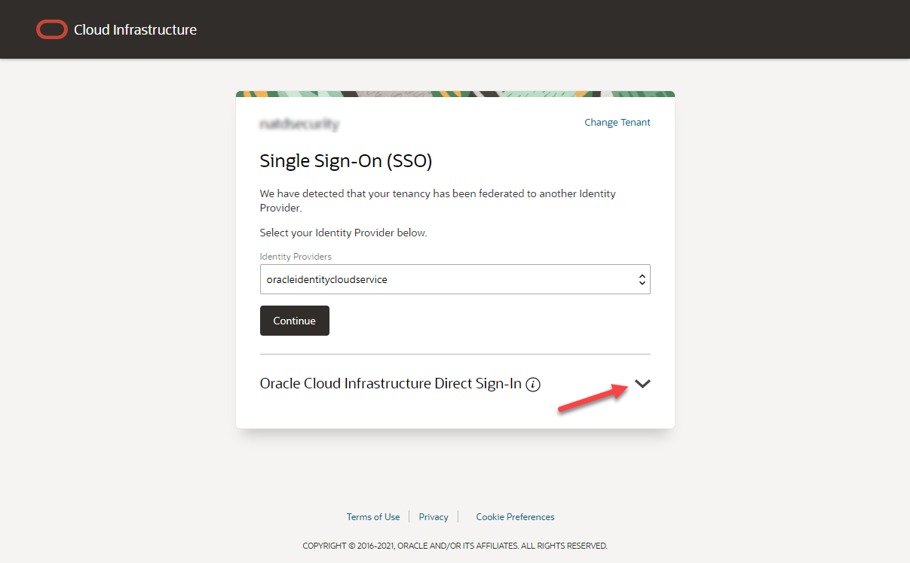
    
3.  Entrez vos informations d'identification de compte cloud et cliquez sur **Connexion**. Votre nom d'utilisateur est votre adresse électronique. Le mot de passe est celui que vous avez choisi lorsque vous êtes inscrit pour un compte.
    
    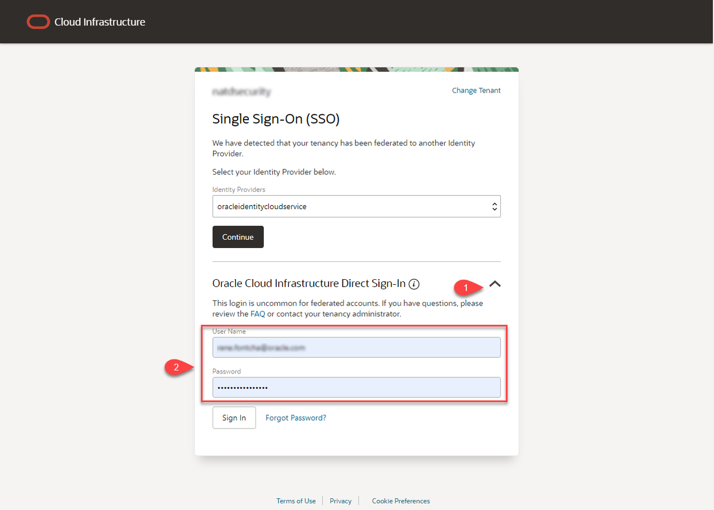
    
4.  Vous êtes maintenant connecté à Oracle Cloud !
    
    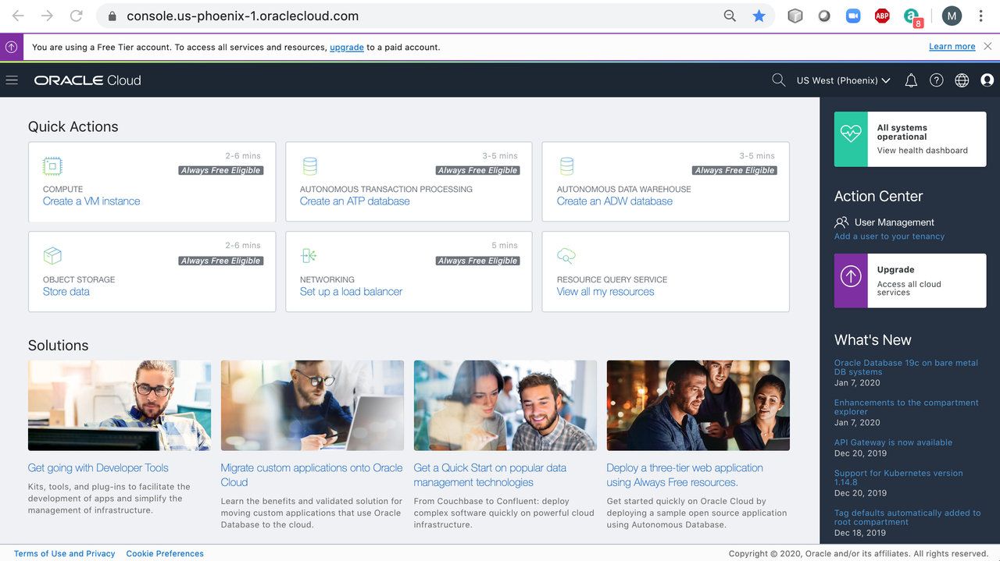
    

## Tâche 2 : lancement d'une instance GPU

1.  Une fois connecté, cliquez sur le bouton **Créer une instance de machine virtuelle** dans la section **Actions rapides**.
    
    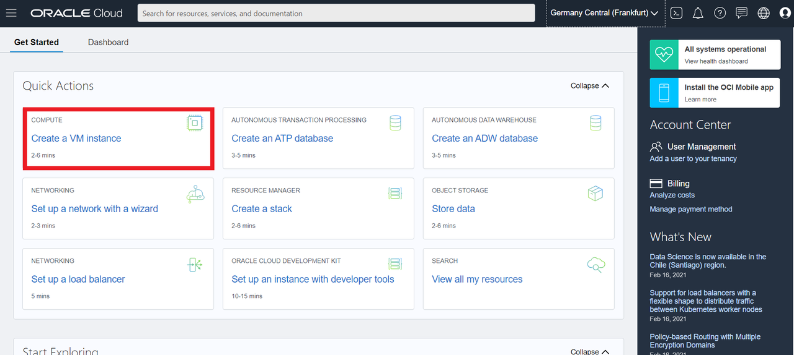
    

Vous pouvez également cliquer sur le menu Service en haut à gauche, puis sur **Compute** -> **Instances**. Une nouvelle page s'ouvre avec un bouton bleu **Créer une instance** sur lequel vous cliquez.

2.  Indiquez le nom de votre instance de calcul.
    
    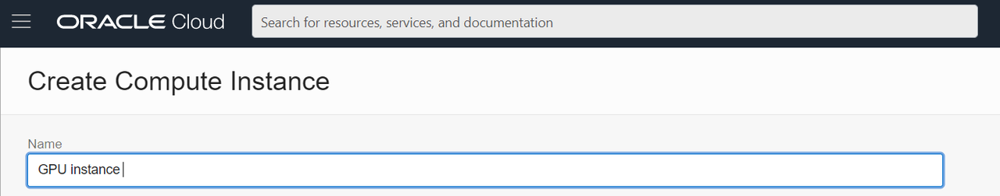
    
3.  Sélectionnez votre compartiment dans la liste déroulante.
    
    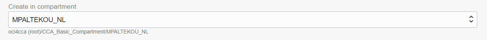
    
4.  Avant de sélectionner le domaine de disponibilité, sous **Gouvernance** -> **Limites, quotas et utilisation**, dans lequel des instances de GPU sont disponibles pour le domaine de disponibilité de la région sélectionnée. Sélectionnez le domaine de disponibilité dans lequel l'instance de calcul sera provisionnée.
    
    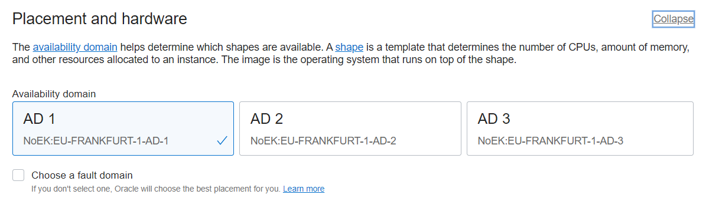
    
5.  Cliquez sur le bouton **Modifier l'image**.
    
    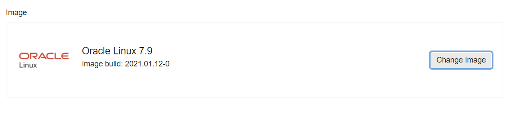
    
    Sélectionnez l'image à utiliser pour votre instance de calcul et cliquez sur le bouton **Sélectionner une image**. Nous allons sélectionner Ubuntu 18.04 qui est recommandé par Faceswap, mais tout autre système d'exploitation Linux et Windows peut également fonctionner.
    
    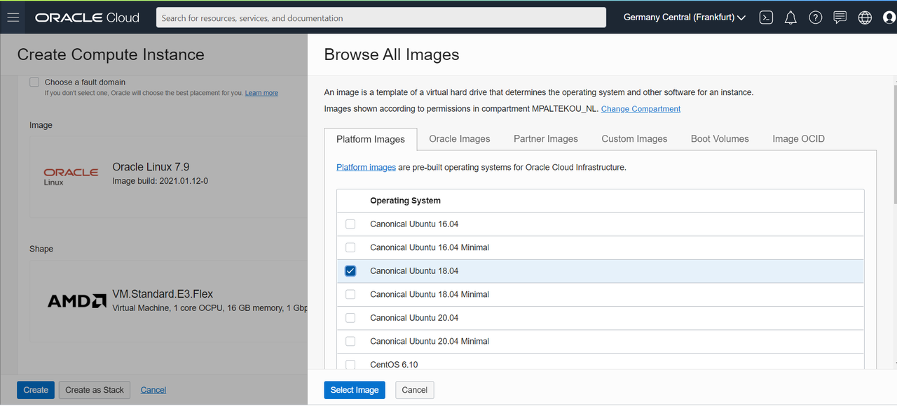
    
6.  Cliquez sur le bouton **Modifier la forme**.
    
    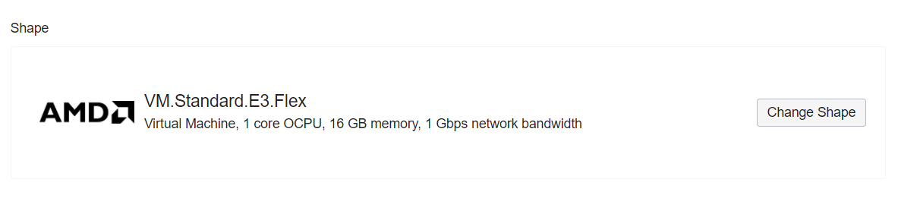
    
    Sélectionnez **Machine virtuelle** et **Spécialité et système hérité**. Vous y trouverez l'instance de GPU et la machine virtuelle **Toujours gratuit** VM.Standard.E2.1. Micro forme (si vous n'êtes pas propriétaire d'un compte PAYG pour exécuter des instances GPU).
    
    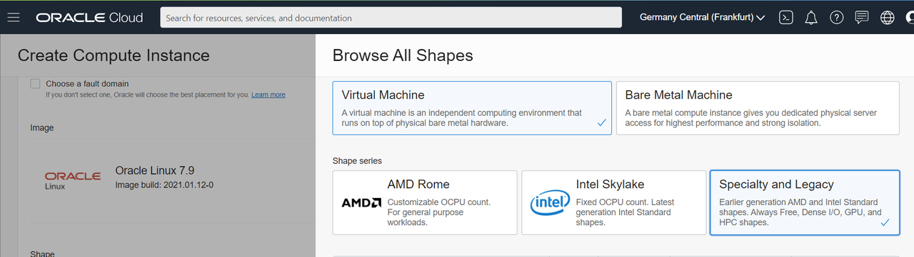
    
    Sélectionnez l'instance de GPU à provisionner, lisez et cochez la case _J'ai pris connaissance des documents suivants et je les accepte : Conditions d'utilisation d'Oracle et de Nvidia_, puis cliquez sur le bouton **Sélectionner une forme**. Dans notre cas, il s'agit du VM.GPU2.1 basé sur P100 (architecture GPU NVIDIA Pascal) avec 1 GPU. Vous pouvez également demander des limites de service pour les machines virtuelles et Bare Metal basées sur V100 (architecture GPU NVIDIA Volta) et A100 (architecture GPU NVIDIA Ampere).
    
    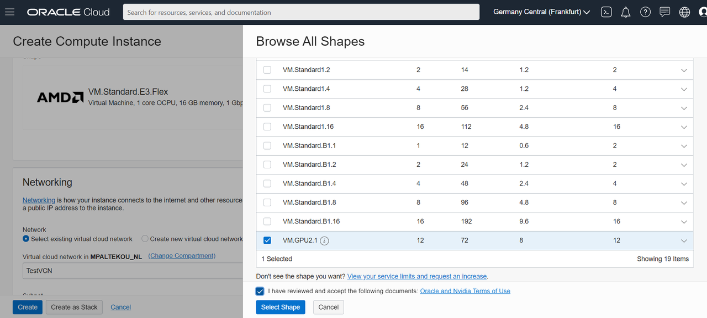
    
7.  Si vous avez déjà créé un VCN dans votre compartiment, vous sélectionnez l'VCN et le sous-réseau dans lesquels placer votre instance de calcul. Sinon, vous pouvez cliquer sur **Créer un réseau cloud virtuel**, sélectionner un nom et un compartiment pour votre VCN, ainsi qu'un nom pour votre sous-réseau public. Vous pouvez conserver le bloc CIDR par défaut ou l'ajuster. Vous pouvez choisir d'affecter une adresse IP publique à votre instance. L'affectation d'une adresse IP publique rend cette instance accessible à partir d'Internet. Si vous n'êtes pas sûr d'avoir besoin d'une adresse IP publique, vous pouvez en affecter une ultérieurement.
    
    
    
8.  Si vous souhaitez utiliser la paire de clés publique et privée SSH que vous avez créée dans l'_atelier 1 - Créer des clés SSH_, vous pouvez cliquer sur **Choisir des fichiers de clés publiques** et sélectionner les fichiers de clés publiques SSH ou cliquer sur **Coller des clés publiques** et coller les clés publiques SSH dans le champ. Vous pouvez également générer une clé publique et privée SSH sur OCI et l'enregistrer sur votre machine locale. Si vous ne fournissez pas de clés SSH, vous ne pourrez pas vous connecter à l'instance à l'aide de SSH.
    
    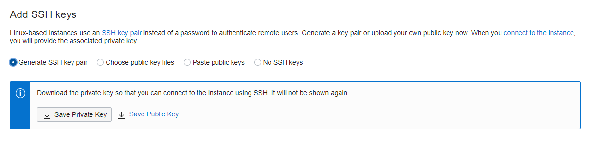
    
9.  L'étape finale consiste à spécifier la taille du volume d'initialisation, en choisissant si vous souhaitez utiliser le cryptage en transit et comment gérer les clés de cryptage. Vous pouvez choisir la taille de volume d'initialisation par défaut, à savoir 46,6 Go pour les seize systèmes Linux, ou l'augmenter à un maximum de 32 To. Vous pouvez ne pas cocher toutes les cases, puis cliquer sur **Créer** (pour finaliser la création de l'instance de calcul).
    

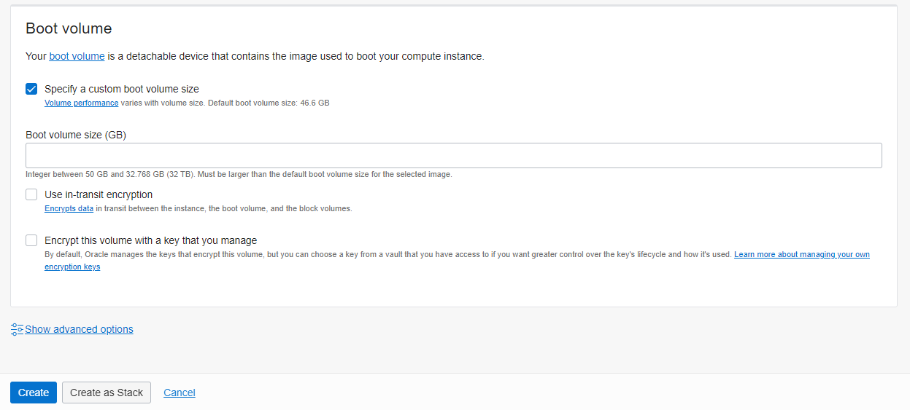

Au bout de quelques minutes, l'instance de calcul de GPU modifie son statut en **RUNNING**.

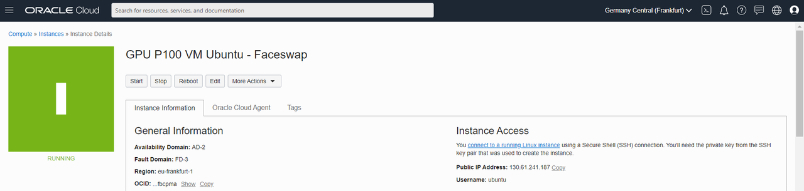

## **Accusés de réception**

*   **Created By/Date** - Maria Patelkou, architecte de solutions HPC, programme Proposition à la production d'Oracle, mars 2021
*   **Dernière mise à jour le/la date** - Maria Patelkou, architecte de solutions HPC, programme Proposition à la production d'Oracle, mars 2021