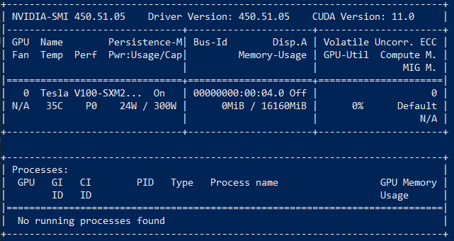

# Faceswap 설치

## 소개

이 실습에서는 컴퓨트 인스턴스에 Faceswap을 설치합니다. Faceswap 설명서에 [Faceswap 설치](https://forum.faceswap.dev/viewtopic.php?f=4&t=68)를 자세히 안내합니다.

예상 워크샵 시간: 30분

**참고:** GPU 인스턴스를 사용하는 경우 **1단계**에서 Tensorflow GPU 지원에 필요한 여러 드라이버 및 라이브러리를 설치할 수 있습니다. 필요한 버전의 Tensorflow에 대해 올바른 버전의 Cuda/cuDNN를 설치해야 합니다. 각 TensorFlow 릴리스에서 사용할 CUDA 및 cuDNN 버전을 확인하려면 [테스트된 빌드 구성](https://www.tensorflow.org/install/source#linux)을 참조하십시오. tensorflow-2.4.0의 경우 CUDA 11.0을 설치해야 합니다.

### 목표

*   선택 사항: GPU 인스턴스를 준비하여 Tensorflow GPU 지원 보장
*   Ubuntu 시스템에 Faceswap 설치

### 필요한 사항

*   랩 1부터 랩 3까지 완료

## 작업 1: CUDA Toolkit 설치(선택 사항)

이 단계에서는 CUDA SDK, GUI 도구 및 Nvidia 드라이버가 포함된 CUDA Toolkit을 설치합니다.

Faceswap 설치 중 **2단계**에 설치될 tensorflow-2.4.0에 필요한 CUDA Toolkit 11.0(CUDA 11.0 포함)을 설치합니다.

**참고:** Faceswap의 이후 릴리스의 경우 항상 설치할 tensorflow 버전과 해당 버전의 tensorflow에 대해 지원되는 CUDA 버전을 확인해야 합니다([테스트된 빌드 구성](https://www.tensorflow.org/install/source#linux) 참조).

1.  터미널에 다음 명령을 입력하여 _private-key_를 OpenSSH 개인 키로, _public ip_를 Ubuntu 인스턴스의 공용 IP 주소로 대체해야 하는 Ubuntu 컴퓨트 인스턴스에 액세스합니다.

       <copy>ssh -i private-key ubuntu@public_ip</copy>
    

2.  [CUDA Toolkit 11.0 다운로드 및 설치](https://developer.nvidia.com/cuda-11.0-download-archive?target_os=Linux&target_arch=x86_64&target_distro=Ubuntu&target_version=1804&target_type=deblocal)에 대한 Nvidia 개발자 설명서를 자세히 안내합니다.

    <copy>
    wget https://developer.download.nvidia.com/compute/cuda/repos/ubuntu1804/x86_64/cuda-ubuntu1804.pin
    sudo mv cuda-ubuntu1804.pin /etc/apt/preferences.d/cuda-repository-pin-600
    wget http://developer.download.nvidia.com/compute/cuda/11.0.2/local_installers/cuda-repo-ubuntu1804-11-0-local_11.0.2-450.51.05-1_amd64.deb
    sudo dpkg -i cuda-repo-ubuntu1804-11-0-local_11.0.2-450.51.05-1_amd64.deb
    sudo apt-key add /var/cuda-repo-ubuntu1804-11-0-local/7fa2af80.pub
    sudo apt-get update
    sudo apt-get -y install cuda-11.0
    </copy>
    

3.  다음 명령을 사용하여 GPU가 표시되고 CUDA 11.0이 성공적으로 설치되었는지 확인합니다.

       <copy>nvidia-smi</copy>
    

nvidia-smi 출력은 다음과 같습니다.

## 작업 2: Faceswap 설치

1.  Faceswap 설치 프로그램의 최신 버전을 다운로드합니다.

       <copy>wget https://github.com/deepfakes/faceswap/releases/latest/download/faceswap_setup_x64.sh</copy>
    

2.  다운로드 위치로 이동하여 다음 명령을 입력합니다.

       <copy>bash ./faceswap_setup_x64.sh</copy>
    

[Faceswap 설치 설명서](https://forum.faceswap.dev/viewtopic.php?f=4&t=68)의 구성 단계를 따르십시오.

## **확인**

*   **작성자/날짜** - Maria Patelkou, HPC 솔루션 아키텍트, Oracle Proposal to Production 프로그램, 2021년 3월
*   **최종 업데이트 수행자/날짜** - Maria Patelkou, HPC 솔루션 아키텍트, Oracle Proposal to Production 프로그램, 2021년 3월