# Faceswap ausführen

## Einführung

Nachdem wir unsere Compute-Instanz vorbereitet haben (siehe Übung 4), können wir fortfahren und Faceswap ausführen. In der Übung kopieren Sie Ihre Trainingsdaten in die Compute-Instanz, extrahieren die Flächen aus den Trainingsdaten, trainieren die GAN mit den extrahierten Gesichtern und konvertieren das Video mit der ausgelagerten Fläche.

Geschätzte Workshopzeit: 60 Minuten (Ausschluss des Modelltrainings)

### Ziele

*   Kopieren Sie Ihre Trainingsdaten (Fotos oder Videos mit den Gesichtern, die Sie austauschen möchten) in die Compute-Instanz
*   [Extrahieren](https://forum.faceswap.dev/viewtopic.php?f=25&t=27) Sie die Flächen aus den Fotos oder Videos
*   [Trainieren](https://forum.faceswap.dev/viewtopic.php?f=27&t=146) Sie die GAN mit den extrahierten Flächen
*   [Konvertieren](https://forum.faceswap.dev/viewtopic.php?f=24&t=1083) und tauschen Sie Gesicht A in Ihrem Quellvideo mit Gesicht B aus

### Was benötigen Sie?

*   Übung 4 zu Lektion 1 abschließen

## Aufgabe 1: Verbindung zum VNC-Desktop herstellen

1.  Erstellen Sie einen SSH-Tunnel zum VNC-Server mit dem folgenden Befehl (bei dem der Private Key der OpenSSH-Schlüssel ist und die private IP-Adresse aus der Ubuntu-Compute-Instanz public\_ip lautet):

    <copy>ssh -i private-key ubuntu@public_ip -C -L 5901:127.0.0.1:5901</copy>
    

2.  Stellen Sie mit dem VNC-Client eine Verbindung zu **127.0.0.1:5901** her. 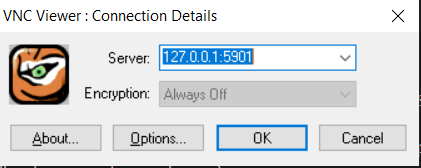
    
3.  Wenn Sie zur Eingabe eines Kennwortes aufgefordert werden, geben Sie das Kennwort ein, das während der VNC-Serverkonfiguration erstellt wurde. 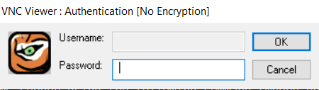
    

Der Remote-Ubuntu-Desktop wird geöffnet. 

## Aufgabe 2: Faceswap auf dem VNC-Desktop öffnen

1.  Öffnen Sie ein Terminal, indem Sie mit der rechten Maustaste auf den Desktop klicken und **Open Terminal here** auswählen. 
    
    Das Terminal wird auf Ihrem VNC-Desktop geöffnet.
    
    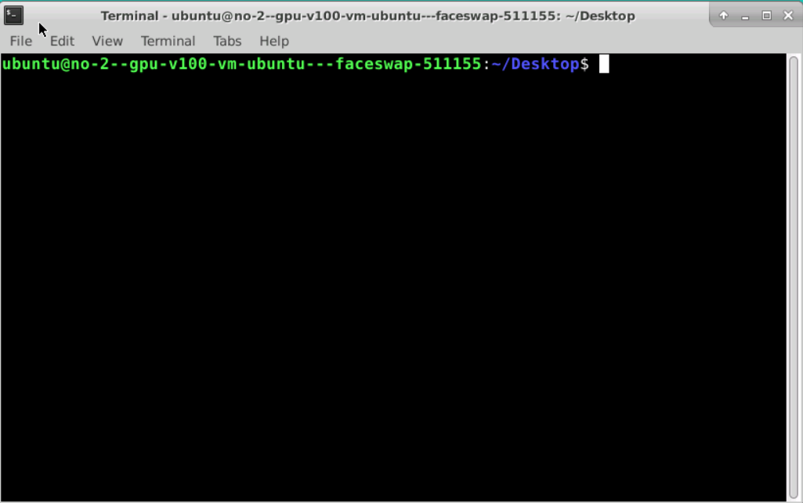
    

Wenn ein Terminal nicht geöffnet werden kann, führen Sie die folgenden Befehle im Terminal auf dem lokalen Rechner aus.

    <copy>sudo apt remove gnome-terminal</copy>
    

    <copy>sudo apt install gnome-terminal</copy>
    

2.  Navigieren Sie in den Ordner "facewap".

    <copy>cd cd ../faceswap/</copy>
    

Starten Sie die Faceswap-GUI, indem Sie den folgenden Befehl ausführen:

    <copy>bash faceswap_gui_launcher.sh</copy>
    

Die Faceswap-GUI wird geöffnet.

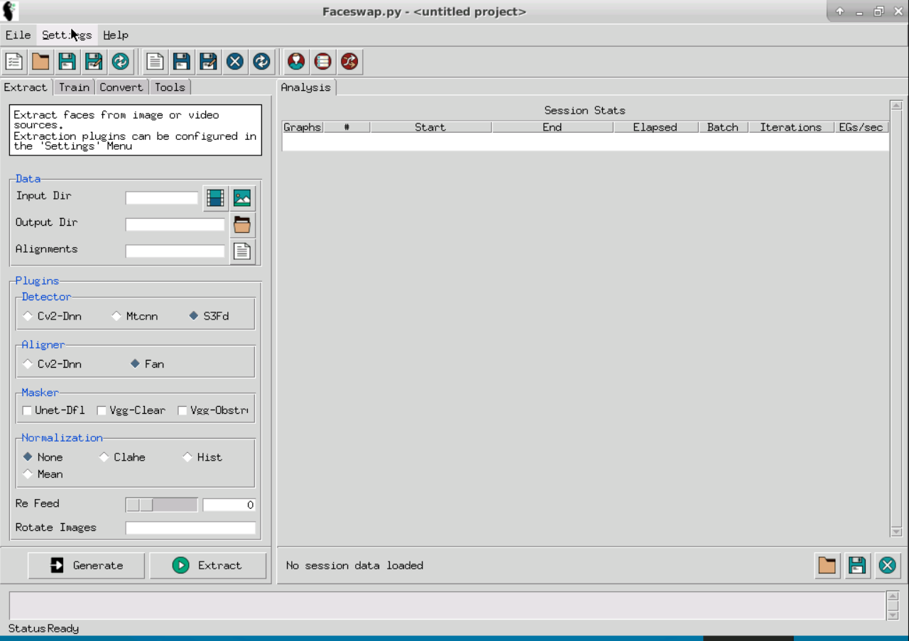

## Aufgabe 3: Trainingsdaten in die Compute-Instanz kopieren

Um die Faceswap GAN zu trainieren, müssen Sie Bilder oder ein Video von Person A und Person B vorlegen, von denen Sie Gesichter austauschen möchten. In diesem Beispiel kopieren wir zwei Videos von Person A und Person B von unserem lokalen Rechner in die Remote-Ubuntu-Instanz mit WinSCP.

1.  Laden Sie [WinSCP](https://winscp.net/eng/download.php) herunter, und installieren Sie sie auf dem lokalen Rechner.
    
2.  Öffnen Sie WinSCP auf Ihrem lokalen Rechner, und öffnen Sie den Ordner mit den Videos auf der linken Seite side.F. 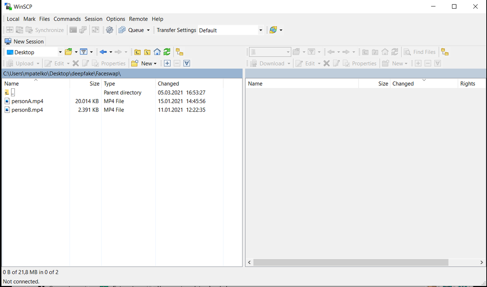
    
3.  Klicken Sie auf **Neue Site**. Ein neues Fenster wird angezeigt. 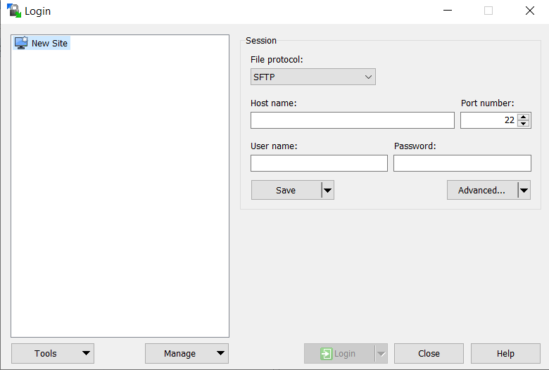
    
4.  Geben Sie die _IP-Adresse_ Ihrer Instanz in das Feld **hostname** und _Ubuntu_ in das Feld **user name** ein, wie unten dargestellt. 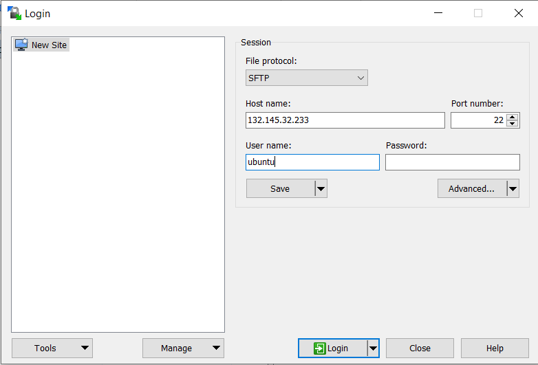
    
5.  Klicken Sie auf die Schaltfläche **Erweitert...**.
    
6.  Klicken Sie im linken Fensterbereich auf **Authentication** unter **SSH**.
    
7.  Klicken Sie auf die drei Punkte, und wählen Sie die SSH-Private-Key-Datei in Ihrem Ordner aus, wie unten gezeigt. 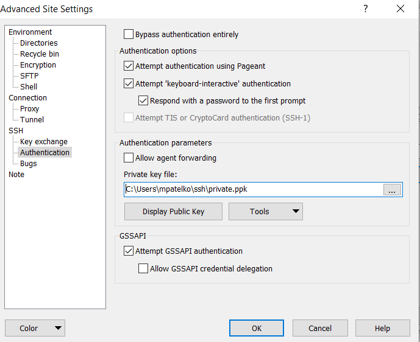
    
8.  Klicken Sie auf **OK**.
    
9.  Klicken Sie auf **Anmelden**.
    
10.  Ein Warnbildschirm wird angezeigt. Klicken Sie auf **Yes**. 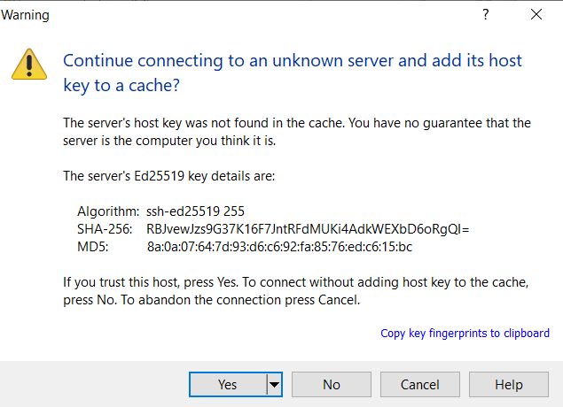
    
11.  Der Ordner mit lokalen Dateien wird auf der linken Seite und der Ordner mit den Remote-Dateien auf der rechten Seite des Tools WinSCP angezeigt. 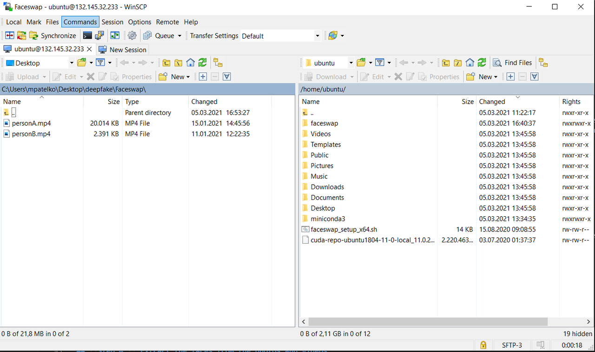
    
12.  Erstellen Sie den Ordner **src** in Ihrem Remote-Ordner, indem Sie mit der rechten Maustaste in das Feld auf der rechten Seite klicken, **Neu -> Verzeichnis** auswählen und den Namen des Ordners **src** eingeben.
    
13.  Wählen Sie Ihre beiden Videos auf der linken Seite (lokaler Rechner), und ziehen Sie sie in den Ordner **src** auf der rechten Seite (Remote-Rechner).
    

## Aufgabe 4: Extrahieren Sie die Gesichter aus den Fotos und Videos

Der erste Schritt besteht darin, die Gesichter aus Video A und Video B zu extrahieren.

1.  Wählen Sie in der Faceswap-GUI die Registerkarte **Extract** (Extrahieren).
    
2.  Im Feld **Daten** wird **Eingabeverzeichnis** angezeigt. Dort können Sie entweder das Verzeichnis auswählen, in dem sich das Eingabevideo oder die Eingabebilder befinden. Wir wählen ein Eingabevideo aus, indem wir auf die Schaltfläche "Video" (erste Schaltfläche, links) klicken und das Eingabevideo von Person A aus dem Ordner **"src"** auswählen, das wir gerade in Schritt 3 erstellt und aufgefüllt haben.
    

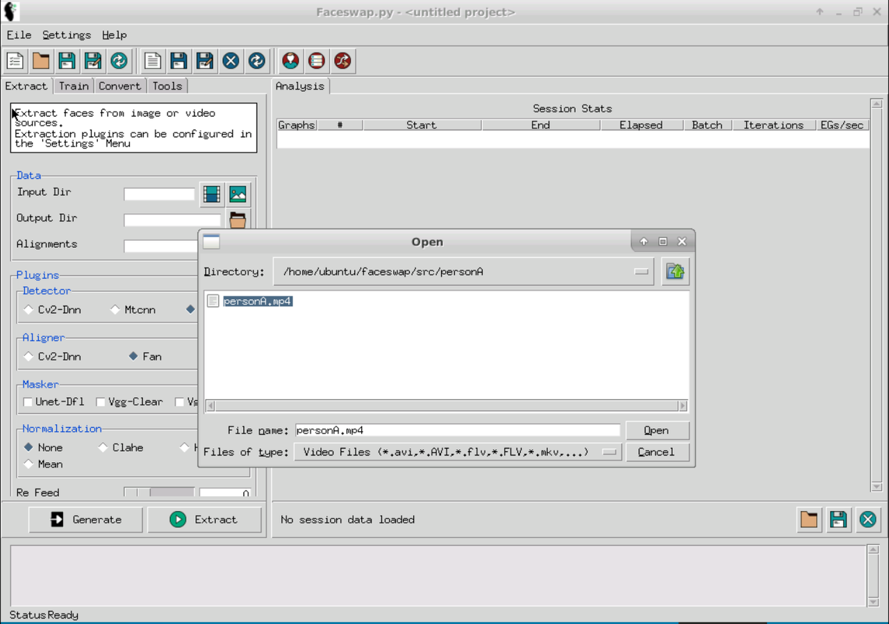

**Hinweis:** Wenn Sie Flächen aus Eingabebildern extrahieren, stellen Sie sicher, dass zwischen 1000 und 10.000 Bilder vorhanden sind.

3.  Klicken Sie auf die Ordnerschaltfläche neben **Ausgabeverzeichnis**. Wählen Sie den Ordner aus, in dem die extrahierten Gesichtsbilder des Quellvideos gespeichert werden. Sie können das Verzeichnis z. B. _faceswap/faces/personA_ aufrufen und auf **OK** klicken.

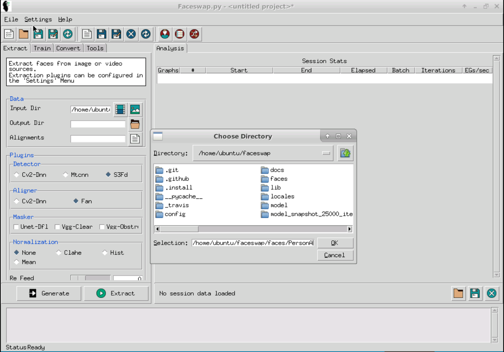

4.  Optional: Wenn Sie mehr über die Extraktions-Plug-ins lesen und diese verwenden möchten, besuchen Sie bitte den [Faceswap Extraction Guide](https://forum.faceswap.dev/viewtopic.php?t=27). In diesem Beispiel bleiben die Standard-Plug-ins erhalten.
    
5.  Klicken Sie auf **Extrahieren**. Die extrahierten Flächen aus dem Video werden auf der Registerkarte **Vorschau** auf der rechten Seite angezeigt. Im unteren Feld wird der Status des Python-Extraktionsskripts angezeigt, z.B. die initialisierten Plug-ins, gefundene Bilder, erkannte Flächen und bei Fehlern.
    

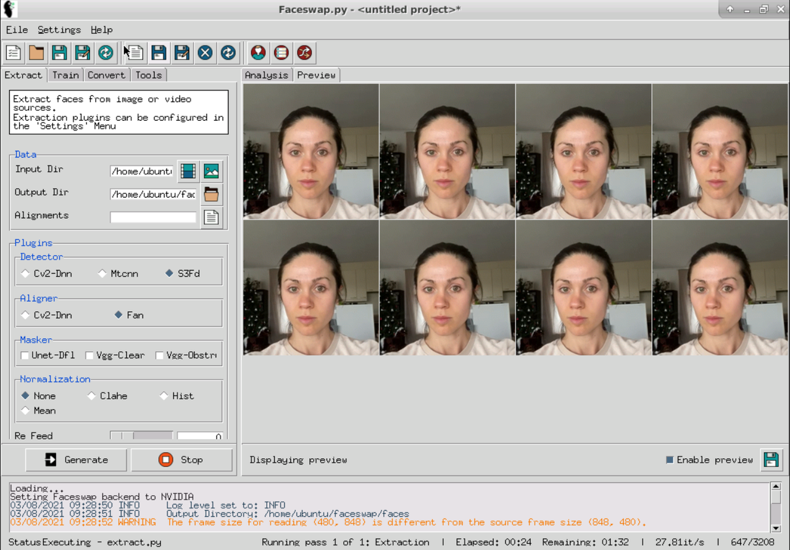

6.  Wiederholen Sie 1.-5. aus **Schritt 4** für die Gesichtsextraktion von Person B.
    
7.  Optional: Falls Sie die GUI nicht verwenden möchten, können Sie die Gesichtsextraktion im Terminal mit dem folgenden Befehl ausführen (nur die Eingabe- und Ausgabeverzeichnisse und Plug-ins anpassen, falls Sie andere Plug-ins verwenden möchten):
    

       <copy>/home/ubuntu/miniconda3/envs/faceswap/bin/python /home/ubuntu/faceswap/faceswap.py extract -i /home/ubuntu/faceswap/src/personA/personA.mp4 -o /home/ubuntu/faceswap/faces/personA -D s3fd -A fan -nm none -rf 0 -min 0 -l 0.4 -sz 512 -een 1 -si 0 -L INFO</copy>
    

## Aufgabe 5: GAN trainieren

Nachdem wir die Gesichter für Person A und Person B aus den Videos extrahiert haben, können wir die Faceswap GAN trainieren.

1.  Wählen Sie in der Faceswap-GUI die Registerkarte **Train** (Train).
    
2.  Im Feld **Faces** wird **Input A** angezeigt, in dem Sie das Verzeichnis der extrahierten Flächen von Person A auswählen (in unserem Fall _faceswap/faces/personA_).
    

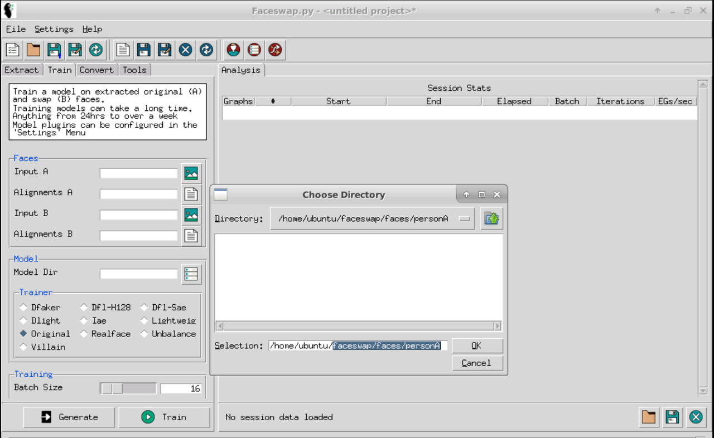

3.  Im Folgenden wird die Zeile **Ausrichtungen A** angezeigt. Die Ausrichtungsdatei enthält Informationen über alle Gesichter, die sie in jedem Rahmen findet, insbesondere dort, wo das Gesicht ist und wo die Punktmarken sind (z.B. Augen, Nase, Lippen). Sie wird während der Extraktionsphase erstellt und im Quellordner des Videos der Person A gespeichert. Klicken Sie auf die Schaltfläche "Datei", und wählen Sie die Ausrichtungsdatei für Person A im Ordner **src** aus, wie unten dargestellt.

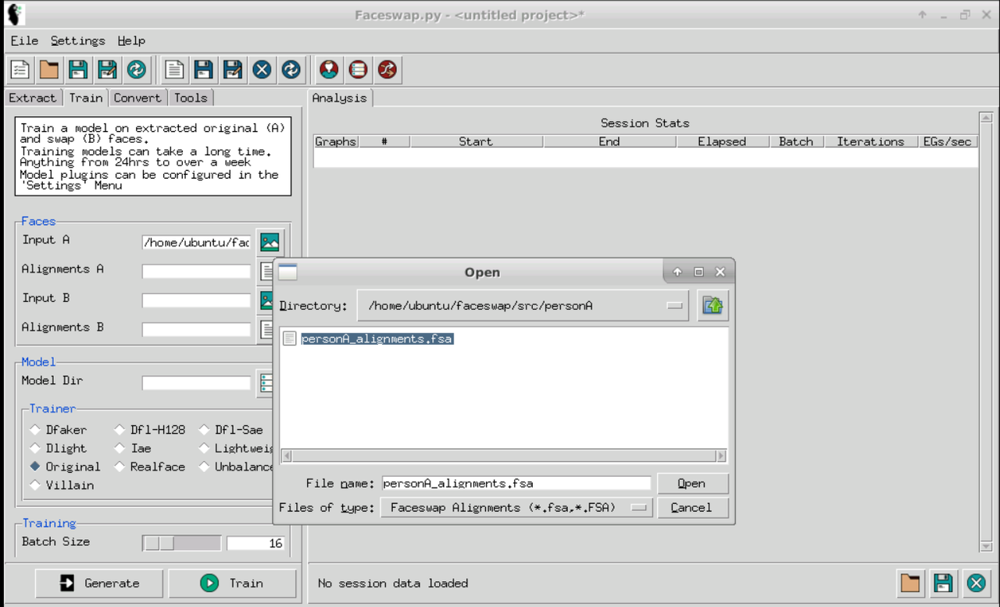

4.  Wiederholen Sie die Punkte 1. und 2. für Person B.
    
5.  Klicken Sie im Feld **Modell** auf die Ordnerschaltfläche neben **Modellverzeichnis**. Wählen Sie den Ordner aus, in dem das Trainingsmodell gespeichert wird. Sie können das Verzeichnis z. B. _faceswap/model_ aufrufen und auf **OK** klicken.
    
6.  Optional: Weitere Informationen zu Trainer- oder Datenerweiterungsoptionen sowie deren Verwendung finden Sie im [Faceswap Training Guide](https://forum.faceswap.dev/viewtopic.php?f=27&t=146). In diesem Beispiel bleiben die Standard-Plug-ins erhalten.
    
7.  Klicken Sie auf die Schaltfläche **Trainieren**, um die Schulung zu starten.
    

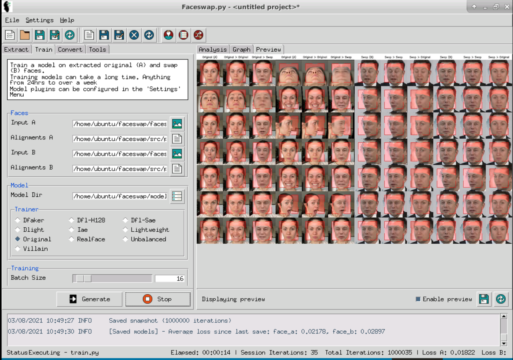

In der Registerkarte **Vorschau** auf der rechten Seite sehen Sie die ausgetauschten Flächen in den Videoframes von Person A und Person B.

Die Registerkarte **Diagramm** enthält ein Diagramm, das den Verlust im Zeitverlauf anzeigt. Sie wird jedes Mal aktualisiert, wenn das Modell gespeichert wird, kann jedoch aktualisiert werden, indem Sie auf die Schaltfläche "Aktualisieren" klicken. Für jede Menge von Flächen, die in das Modell eingespeist werden, betrachtet die GAN das Gesicht, das sie versucht hat, es neu zu erstellen und mit dem tatsächlichen Gesicht zu vergleichen, das eingespeist wurde. Je nachdem, wie gut es seiner Meinung nach getan hat, wird es sich einen Score geben (der Verlustwert).

8.  Optional: Falls Sie die GUI nicht verwenden möchten, können Sie das Modelltraining im Terminal mit dem folgenden Befehl ausführen (nur die Eingabeverzeichnisse, Ausrichtungsdateien, das Modellverzeichnis und die Traineroption anpassen, falls Sie eine andere Traineroption verwenden möchten):

       <copy>/home/ubuntu/miniconda3/envs/faceswap/bin/python /home/ubuntu/faceswap/faceswap.py train -A /home/ubuntu/faceswap/faces/personA -ala /home/ubuntu/faceswap/src/personA/personA_alignments.fsa -B /home/ubuntu/faceswap/faces/personB -alb /home/ubuntu/faceswap/src/personB/personB_alignments.fsa -m /home/ubuntu/faceswap/model -t original -bs 16 -it 1000000 -s 250 -ss 25000 -ps 100 -L INFO</copy>
    

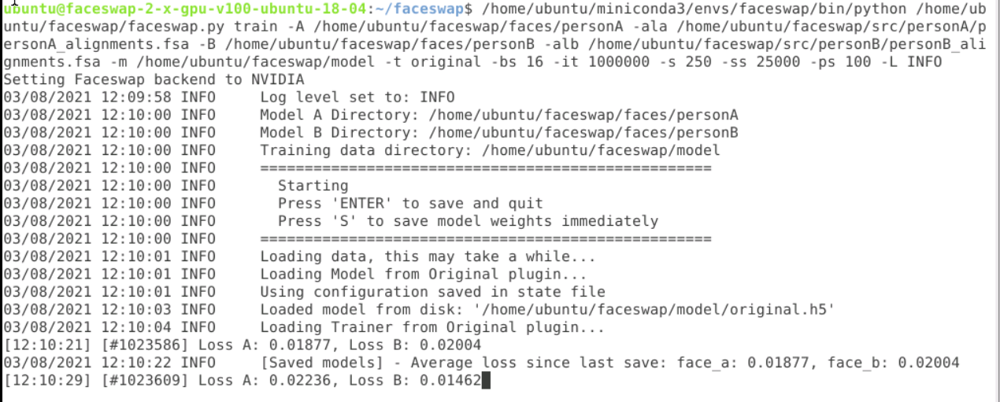

Der beste Weg zu wissen, ob ein Modell das Training abgeschlossen hat, ist, die Vorschau zu sehen. Letztendlich zeigen diese, wie der eigentliche Swap aussehen wird. Sie können auch die Verlustwerte prüfen. Je näher die Verlustwerte auf Null liegen, desto höher ist die Wahrscheinlichkeit eines abgeschlossenen Trainings.

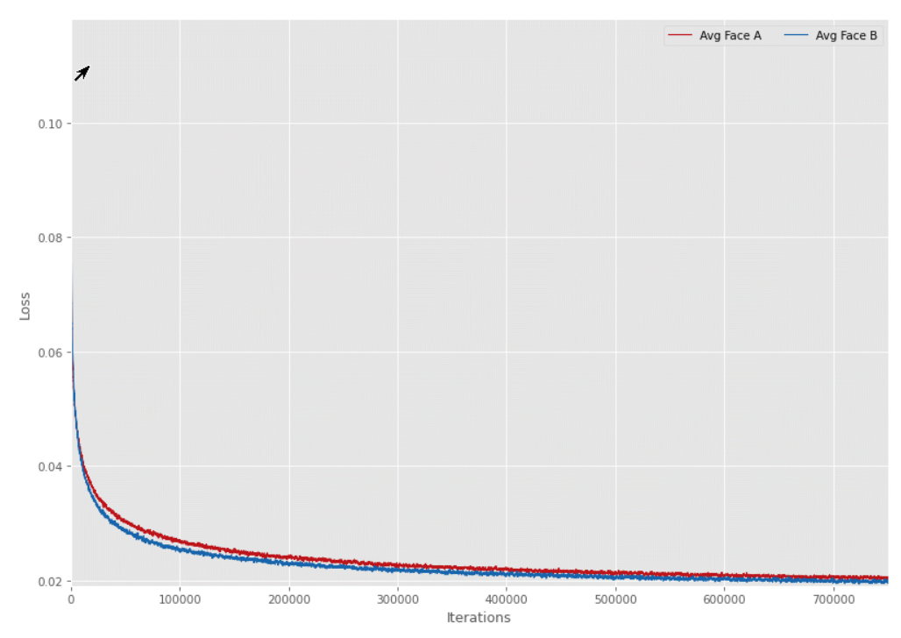

In der Registerkarte **Analyse** können Sie den Wert _EGs/sec_ in der letzten Spalte prüfen. Dadurch erhalten Sie die Anzahl der durch das Modell pro Sekunde verarbeiteten Flächen. Je leistungsstärker Ihre (GPU-)Cores sind, desto höher ist die _EGs/Sek_ und desto schneller wird das Modell zusammengeführt.

9.  Prüfen Sie die GPU-Nutzung während des Trainings mit dem Befehl nvidia-smi. 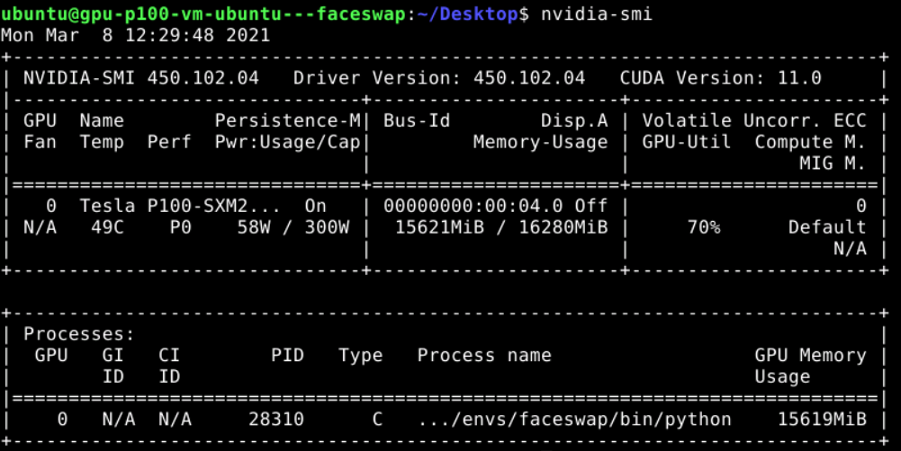
    
    Es zeigt Ihnen die flüchtige GPU-Auslastung.
    
10.  Optional: Sie können die Anwendungsperformance steigern, indem Sie die Core- und Speicheruhrenraten von GPU erhöhen. Bitte besuchen Sie den Blog-Beitrag von Nvidia zum [Nvidia GPU-Boost](https://developer.nvidia.com/blog/increase-performance-gpu-boost-k80-autoboost/) für weitere Informationen.
    

## Aufgabe 6: Konvertieren Sie Ihr Video mit dem ausgetauschten Gesicht

Wenn Ihr Training abgeschlossen ist, können Sie Ihr Video konvertieren und das Gesicht A in Ihrem Quellvideo mit Gesicht B austauschen.

1.  Wählen Sie in der Faceswap-GUI die Registerkarte **Convert** (Konvertieren).
    
2.  Im Feld **Daten** wird das **Eingabeverzeichnis** angezeigt, in dem Sie das Verzeichnis auswählen, in dem sich das Eingabevideo mit der Person befindet, von der aus Sie das Gesicht austauschen möchten. In unserem Fall wird das Eingabevideo unter _/faceswap/src/personA_ gespeichert.
    
3.  Klicken Sie auf die Ordnerschaltfläche neben **Ausgabeverzeichnis**. Wählen Sie den Ordner aus, in dem das Ausgabevideo gespeichert wird. Sie können das Verzeichnis z. B. _/faceswap/outputvideo_ aufrufen und auf **OK** klicken.
    
4.  Klicken Sie auf die Schaltfläche "Datei" neben **Ausrichtungen**, und wählen Sie die Ausrichtungsdatei der Person aus, von der aus Sie das Gesicht austauschen möchten (in unserem Fall Person A). Wenn sich die Ausrichtungsdatei im selben Verzeichnis wie das **Eingabeverzeichnis** befindet, können Sie das Feld leer lassen.
    
5.  Optional: Das **Referenzvideo** ist nur erforderlich, wenn Sie von Bildern in Videos konvertieren. In unserem Fall werden wir es leer lassen.
    
6.  Klicken Sie im Feld **Modell** auf die Ordnerschaltfläche neben **Modellverzeichnis**. Wählen Sie den Ordner aus, in dem das Trainingsmodell gespeichert wird. In unserem Fall ist dies das Verzeichnis _faceswap/model_. Klicken Sie auf **OK**.
    
7.  Klicken Sie auf **Umwandeln**.
    

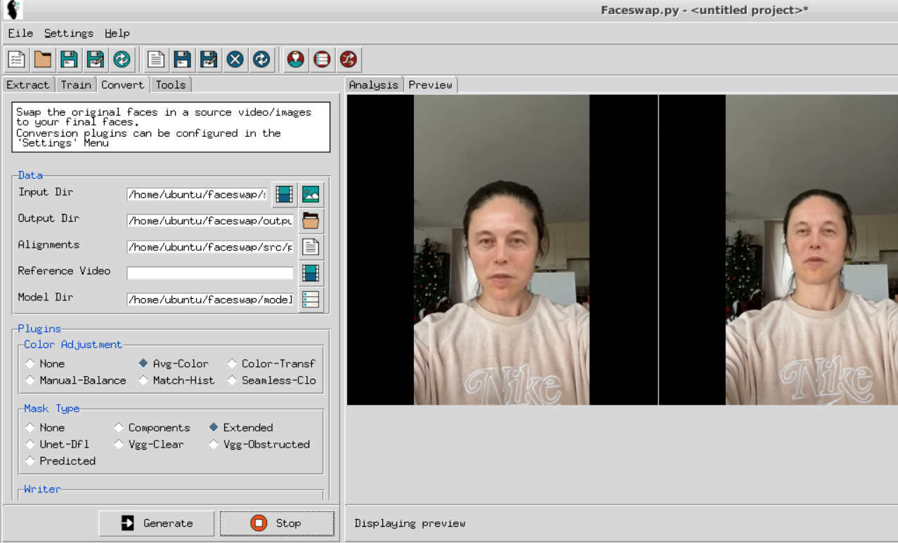

8.  Optional: Wenn Sie die grafische Benutzeroberfläche nicht verwenden möchten, können Sie die Konvertierung im Terminal mit dem folgenden Befehl ausführen (nur die Eingabe- und Ausgabeverzeichnisse, Ausrichtungsdatei, Modellverzeichnis und Plug-ins anpassen, falls Sie andere Plug-ins verwenden möchten):

       <copy>/home/ubuntu/miniconda3/envs/faceswap/bin/python /home/ubuntu/faceswap/faceswap.py convert -i /home/ubuntu/faceswap/src/personA/personA.mp4 -o /home/ubuntu/faceswap/outputvideo -al /home/ubuntu/faceswap/src/personA/personA_alignments.fsa -m /home/ubuntu/faceswap/model -c avg-color -M extended -w opencv -osc 100 -l 0.4 -j 0 -L INFO</copy>
    

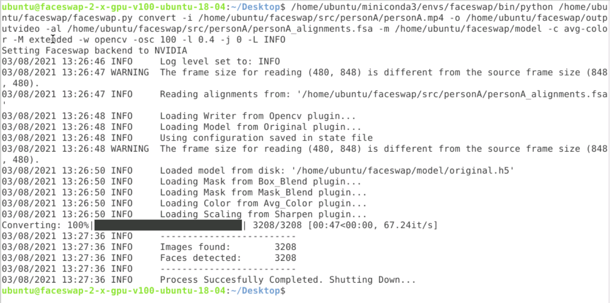

9.  Im Verzeichnis _/faceswap/outputvideo_ finden Sie die Bilder des Eingabevideos von Person A mit der ausgelagerten Fläche von Person B. 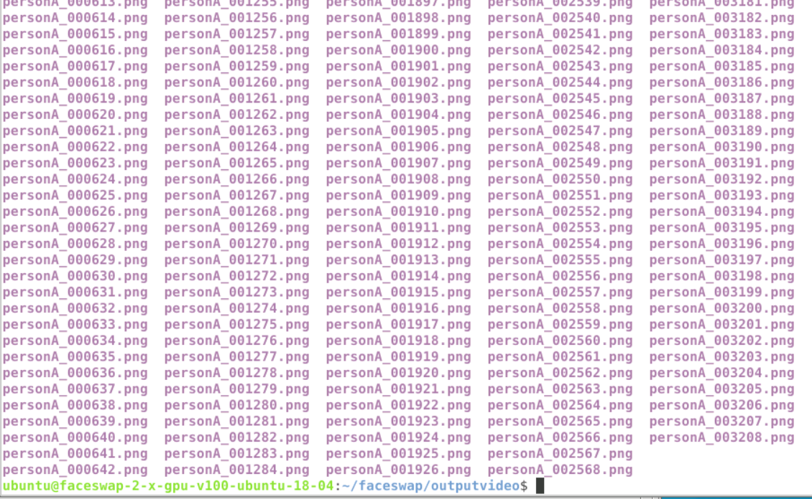
    
    Wir verwenden ffmpeg, um ein Video aus den einzelnen Frames zu erstellen.
    
    Installieren wir ffmpeg zuerst.
    
        <copy>sudo apt install ffmpeg</copy>
        
    
    Jetzt können Sie ein Video mit ffmpeg erstellen, um die einzelnen Frames in einem Video zu kombinieren, in dem alle personA-Frames, die im Verzeichnis _outputvideo_ enthalten sind, in einer Schleife durchlaufen werden, wobei _%nd_ für eine sequenzielle n-stellige Zahl steht. In unserem Fall n = 6.
    
        <copy>ffmpeg -i personA_%6d.png -c:v libx264 -vf "fps=25,format=yuv420p" output.mp4</copy>
        
10.  [Ausgabevideo](https://www.youtube.com/watch?v=b-uKJ89QSnE) ansehen
    

## **Bestätigungen**

*   **Erstellt von/Datum** - Maria Patelkou, HPC Solution Architect, Oracle Proposal to Production-Programm, März 2021
*   **Zuletzt aktualisiert von/Datum** - Maria Patelkou, HPC Solution Architect, Oracle Proposal to Production-Programm, März 2021