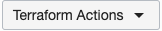

# Stack ausführen

## Einführung

In dieser Übung führen Sie den Stack aus.

Geschätzte Übungszeit: 2 Minuten

## Aufgabe: Stack ausführen

Nachdem der Stack erstellt wurde, können Sie Jobs ausführen.

1.  Wählen Sie den erstellten Stack aus.
    
2.  Führen Sie im Dropdown-Menü "Terraform-Aktionen" den Befehl "Anwenden" aus, um die GPU-Infrastruktur zu starten. 
    

## Bestätigungen

*   **Autor** - Leistungsstarkes Compute-Team
*   **Mitwirkende** - Chris Iwicki, Harrison Dvoor, Gloria Lee, Selene Song, Bre Mendonca, Samrat Khosla
*   **Zuletzt aktualisiert von/Datum** - Samrat Khosla, Oktober 2020