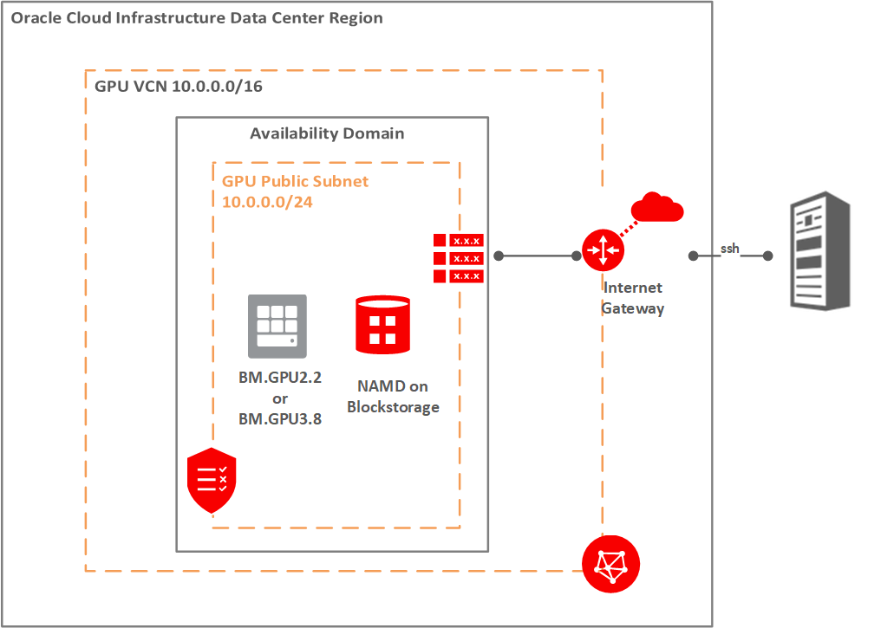

# NAMD 简介

此 Runbook 提供了在 Oracle Cloud Infrastructure 上部署 GPU 计算机、安装 NAMD 以及使用 NAMD 软件运行模型的步骤。

NAMD 是一种分子动力软件，模拟生物分子中原子在预定义的一组条件下运动。它用于识别这些生物分子的行为，当暴露在温度、压力和其他输入的变化，模仿生物体中遇到的实际条件时。NAMD 可用于建立蛋白质折叠、蛋白质 -ligand 绑定以及细胞膜传输的模式，使其成为药物研究和发现非常有用的应用。

NAMD 基于 Charm++ 和 Converse 构建，可以在高性能计算机上运行以执行并行处理。由伊利诺伊大学开发。有关详细信息，请参阅[此处](http://charm.cs.illinois.edu/research/moldyn)。

## **体系结构**

此运行手册的体系结构非常简单，单个计算机在具有公共子网的 OCI VCN 中运行。由于使用 GPU 实例，块存储将附加到实例并与 NAMD 应用程序一起安装。该实例位于公共子网中，并分配有一个公共 IP，可以通过 ssh 访问该 IP。

## 确认

*   **作者** - 高性能计算团队
*   **贡献者** - Chris Iwicki、Harrison Dvoor、Gloria Lee、Selene Song、Bre Mendonca、Samrat Khosla
*   **上次更新者/日期** - Samrat Khosla，2020 年 10 月