# Lab 1: Deploy the HPC Stack on OCI

## Introduction

In this lab you will deploy a terraform stack using the resource manager on OCI. This by default will create a VCN, domain, compute VM components, and an optional cluster network. 

**Estimated Time:** 10 Minutes

Note: Deploying the terraform stack takes around 10 Minutes, However the actual infrastructure deployment takes around 40 min to complete.

### Prerequisites

It is assumed that you have access to or familiarity with following components:

- Familiarity with Oracle Cloud.
- An Oracle Cloud Account.
- The ability to create and delete resources in your tenancy.
- Familiarity with OCI components and features.
- A compartment to deploy the solution in.
- Ability to access and download a file from GitHub.

### Objectives

In this lab, you will:

- Download the terraform folder.
- Add the terraform stack using resource manager.
- Configure the variables for the terraform stack.
- Review the details and deploy the stack.

## Task 1: Download the terraform folder from OCI

In order to deploy the terraform stack you need to download the folder with the terraform scripts from OCI.

### 1. Download the .zip file

Click on the link below to go to download the Terraform .zip file locally.

[Terraform .zip file](https://objectstorage.us-ashburn-1.oraclecloud.com/p/3abybTOXKsi1RHNEndUEwScizXlI1es2EAOk4H-y7-31kUHllf2er6IvA3NoMAZA/n/idmsdo7nrqrp/b/HPC-OOD-LiveLab-Bucket/o/Terraformhpc-ood-stack-final.zip?download=1)

## Task 2: Deploy the stack on OCI

### 1. Open the stacks page

First log in to your OCI console and select the hamburger dropdown menu.

Then use the search bar to look up "**Stacks**"

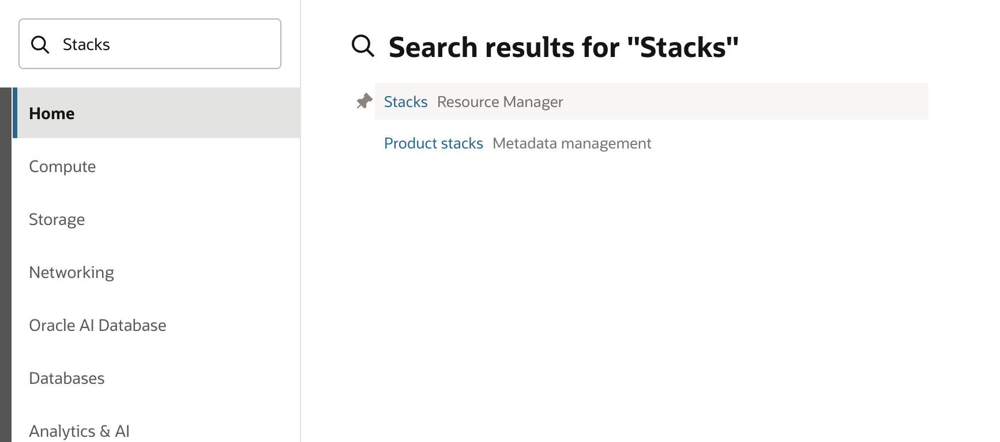

### 2. Create Stack

Make sure you have the correct **compartment** selected then select "**Create stack**".

### 3. Stack Information

Leave **My configuration** at the top selected and then drag and drop the terraform folder into the **Drop a folder section**.

When you have dropped the folder you can select **Next** at the bottom.

We now will begin to configure all the variables necessary to deploy the stack.

### 4. Cluster configuration

 | Variable | Needed Input | 
  | --- | --- | 
  |Target compartment | Select the desired compartment to store the stack.
  |ssh key| Paste, select, or create a new desired ssh key.
  | **Use cluster name:** | ***Unselected***
  | **Configure LDAP authentication from controller:** | ***Enabled***

***Note: Make sure if you create a new key that you save the public and private copies localy for later***

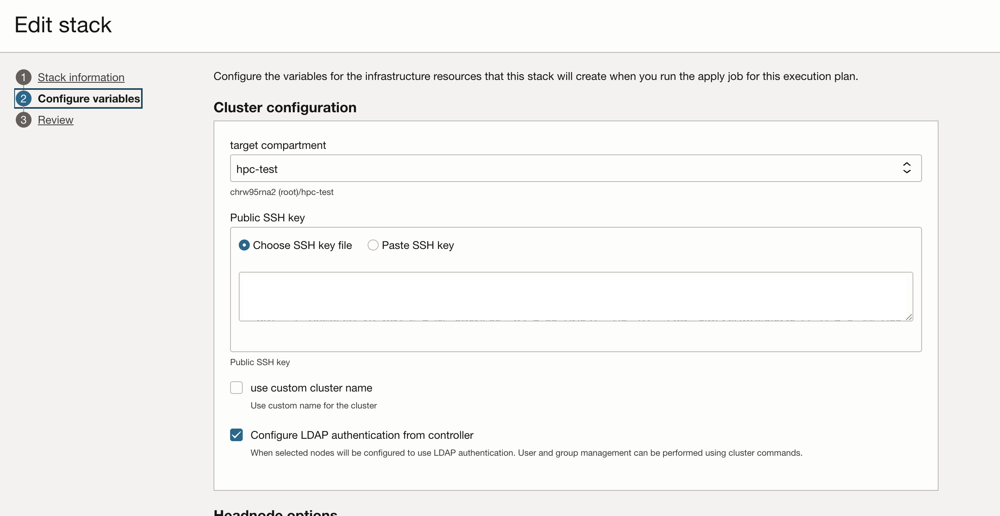

### 5. Headnode Operation

 | Variable | Needed Input | 
  | --- | --- | 
  | **Availibility Domain:** | Choose any domain.
  | **Controller Shape:** | ``BM.Optimizied3.36``.
  | **Size of the boot volume in GB:** | Anything greater than 1TB.
  | **Enable boot volume backup:** | ***Unselected***
  | **Use marketplace image:** | ***Unselected***
  | **Use unsupported image:** | ***Unselected***
  | **Controller image compartment:** | Same as original compartment selected in previous step.
  | **Controller Image ID:** | ``Oracle-Linux-8.10-2025.08.31-0`` or any similar release date.
  | **Default username for controller:** | You can leave this as opc,

***NOTE: IF YOU ARE ON A FREE TIER ACCOUNT YOU MAY NEED TO SELECT A FLEX VM SHAPE IF BARE METAL ISNT AVAILIBLE.***
	
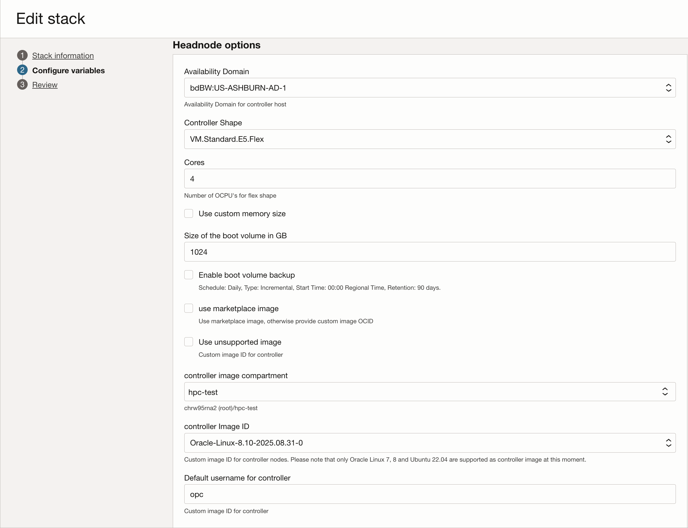

### 6. Compute node options

 | Variable | Needed Input | 
  | --- | --- | 
  | **Availibility Domain:** | Choose any domain.
  | **Controller Shape:** | ``BM.Optimizied3.36``.
  | **Size of the boot volume in GB:** | Anything greater than 1TB.
  | **Enable boot volume backup:** | ***Unselected***
  | **Use marketplace image:** | ***Unselected***
  | **Use unsupported image:** | ***Unselected***
  | **Controller image compartment:** | Same as original compartment selected in previous step.
  | **Controller Image ID:** | ``Oracle-Linux-8.10-2025.08.31-0`` or any similar release date.
  | **Default username for controller:** | You can leave this as opc
  | - **Multiple ADs:** |	***Unselected***
  | - **Availability Domain:** |	Choose the same AD as your selected headnode.
  | - **Use cluster network:** |	***Enabled***
  | - **Use compute cluster rather than cluster network:** |   ***Unselected***
  | - **Shape of the Compute Nodes:** |	``BM.Optimized3.36``
  | - **Initial cluster size:**  | 	You can change this if you like, in this lab we will use the default "2."
  | - **Hyperthreading enabled:** | ***Enabled***
  | - **Size of the boot volume in GB:** | 	``500``
  | - **Use marketplace image:** | 	***Unselected***
  | - **Default username for compute hosts:** |	You can change this if you like, in this lab we will use the default "opc."
  | - **Use unsupported image:** | 	***Unselected***
  |- **compute image compartment:**  |	You can leave this as the same compartment as where your stack is deploying.
  | - **Image:** | 	``Oracle-Linux-8.10-2025.08.31-0`` or any similar release date.
  |- **Modify BIOS options:**  |	***Unselected***
  | - **Change hostname:** |	***Enabled***   *(Note: You can change this if you'd like)*

***NOTE: IF YOU ARE ON A FREE TIER ACCOUNT YOU MAY NEED TO SELECT A FLEX VM SHAPE IF BARE METAL ISNT AVAILIBLE.***

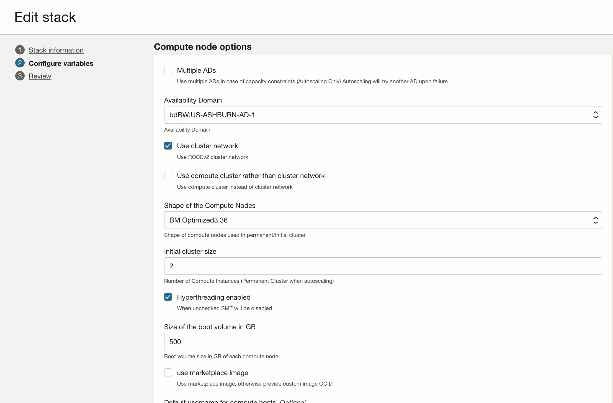

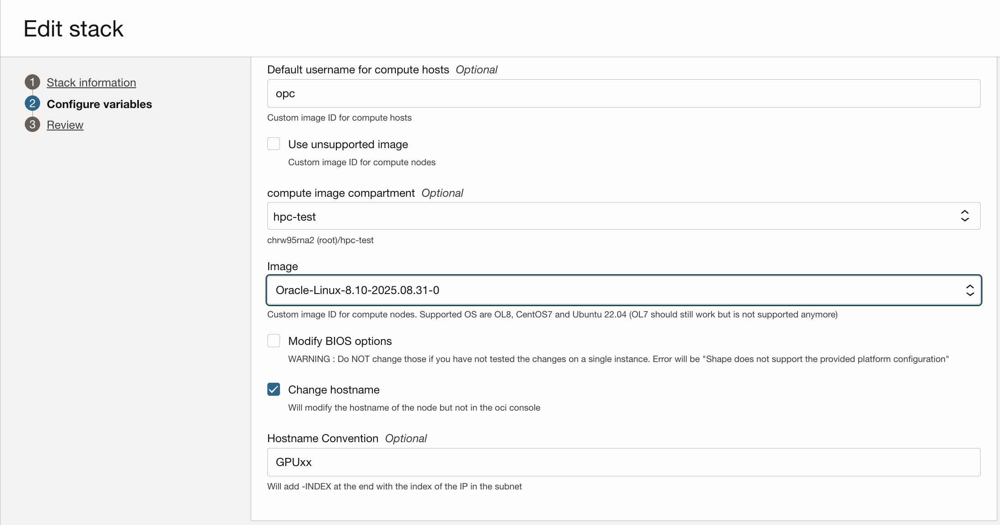

### 7. Additional Login Node
 | Variable | Needed Input | 
  | --- | --- | 
  |  - **Default username for login node:**|	**opc**
  | - **Additional block volume for login node:** |	***Unselected***

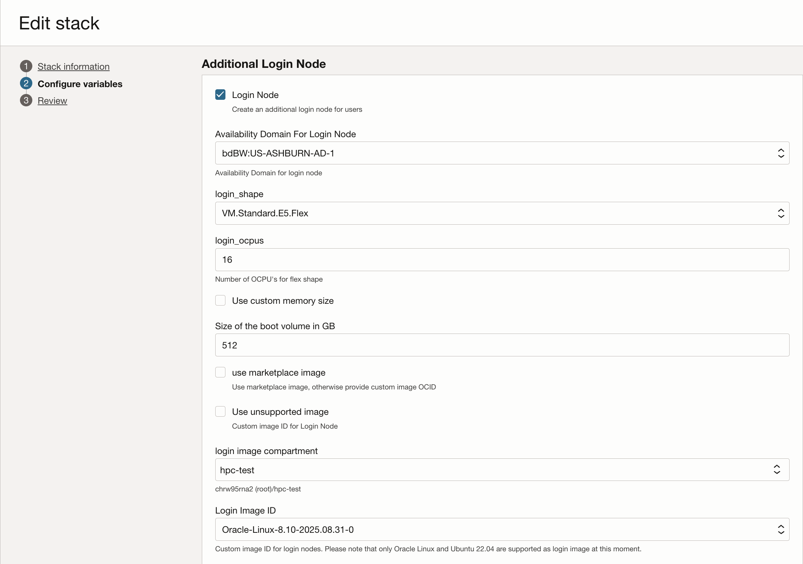

### 8. Cluster Monitoring
 | Variable | Needed Input | 
  | --- | --- | 
  | - **Install HPC Cluster Monitoring Tools:** |	***Enabled***
  | - **Install HPC Cluster alerting Tools:** |	***Enabled***
  | - **Monitoring Node:** |	***Unselected***

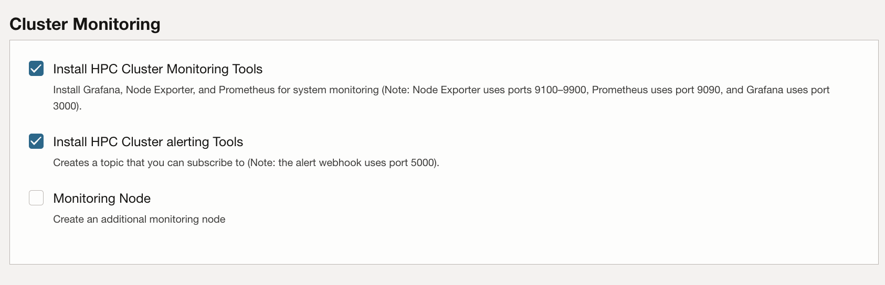

### 9. Autoscaling
 | Variable | Needed Input | 
  | --- | --- | 
  | - **Scheduler based autoscaling:** |	***Unselected***
  | - **RDMA Latency check:** |	***Enabled***

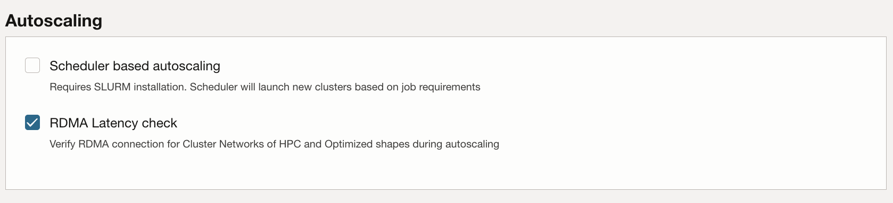

### 10. API authentication, needed for autoscaling

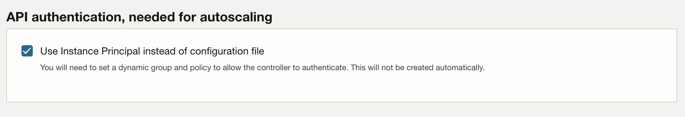

### 11. File systems

You can leave all the options: ***Unselected***

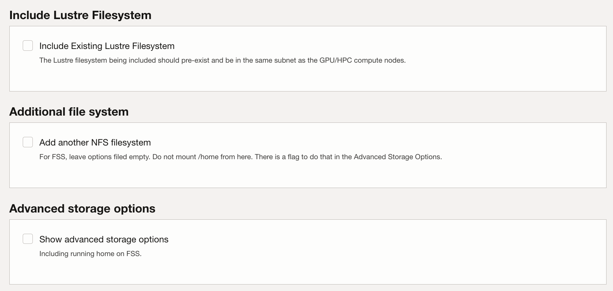

### 12. Network options

You can choose to create a new VCN with this stack (Recommended).

You don't need to make any changes to the default network.

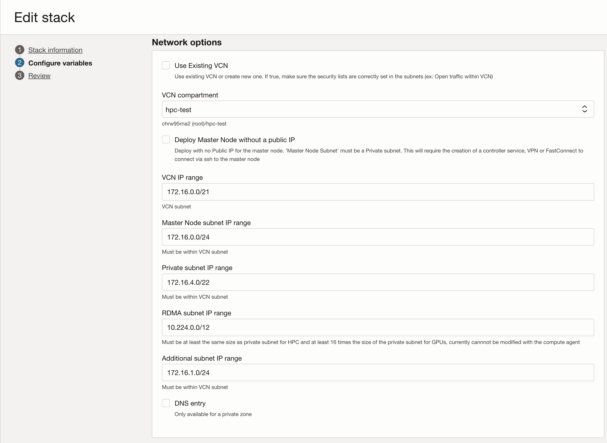

You can also choose to re-use another VCN.

`Warning: Not all VCN configurations will be compatible with the stack. This may cause the stack to fail deployment.`

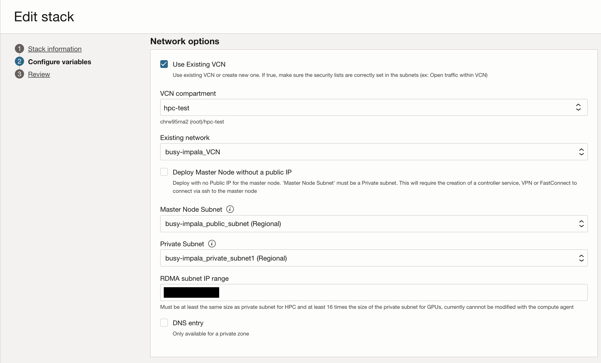

### 13. Software
 | Variable | Needed Input | 
  | --- | --- | 
  | - **Sudo Access:** |	***Enabled***
  | - **Name of the group with privileges:** |	This can be whatever you like.
  | - **Install SLURM:** |	***Enabled***
  | - **Create a back-up Slurm Controller:** |	***Unselected***
  | - **Create Rack aware topology:** |	***Enabled***
  | - **Queue Name:** |	This can be whatever you like.
  | - **Install Spack package manager:** |	***Enabled***
  | - **Install Nvidia Enroot for containerized GPU workloads:** |	***Enabled***
  | - **Install Nvidia Pyxis plugin for Slurm:** |	***Enabled***
  | - **Enable PAM:** |	***Unselected***
  | - **Enable Limits for Slurm jobs:** |	***Unselected***
  | - **Turn on Healthchecks for GPU nodes:** |	***Enabled***

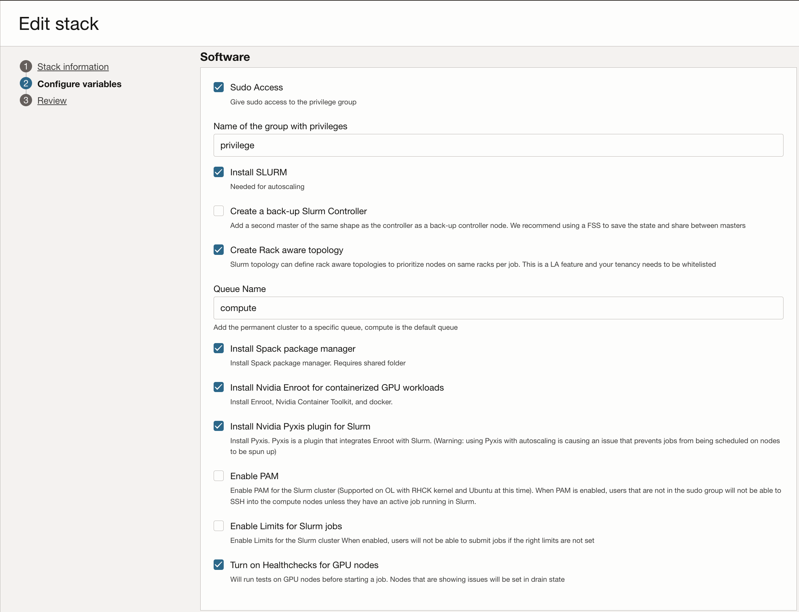

### 14. Debug and other settings
 | Variable | Needed Input | 
  | --- | --- | 
  | - **Debug** |	***Enabled***
  | - **Active** |	***Enabled***
  | - **allowed_grants** |``authorization_code``
  |  |	``client_credentials``
  | - **client_ip checking** |	``anywhere``
  | - **client_type** |	``confidential``
  | - **csr_access** |	``none``
  | - **existing_domain ocid** | ``Optional`` 
  | - **force_delete** |	***Unselected***
  | - **influxdb** |	***Enabled***
  | - **is_oauth client** |	***Enabled***
  | - **ood_display name** |	``od_app``
  | - **ood_schemas** |  ``urn:ietf:params:scim:schemas:oracle:idcs:App``
  | - **ood_user email** | 	Input your email. This address will recieve the new login email.
  | - **ood_user password** |	Choose a password.
  | - **ood_username**	 |	``ood_user``
  | - **schemas** |	``urn:ietf:params:scim:schemas:oracle:idcs:Settings``
  | - **setting_id** |	``Settings``
  | - **show_in_my_apps** |	***Enabled***
  | - **timezone** | Whatever you prefer. You can leave as default.
  | - **use_existing idcs** |	Choose whether to use an existing IDCS domain (true) or create a new one (false). In this lab we will create a new one.
  | - **user_schemas** |	``urn:ietf:params:scim:schemas:core:2.0:User``

	Once you complete this step you can click next at the bottom.

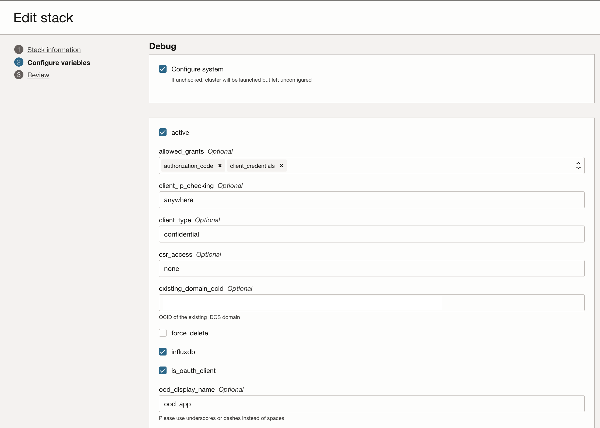

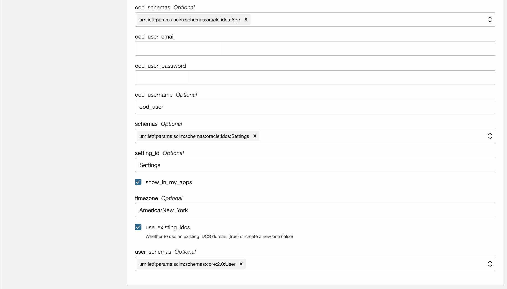
 
### 15. Final Step

Once you complete the prevous step and click next you hould see the review screen.

If all the information looks correct you can scroll all the way to the bottom and enable the run apply option.

This will automatically deploy your stack right away.

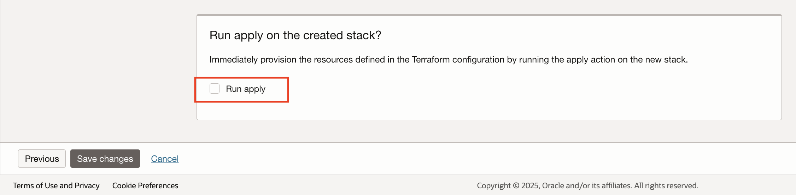

Now click "**Save Changes**" at the bottom and wait for your new HPC stack to deploy.

If your deployment is successful you should see the RMJ (Resource Manager Job) tile turn green.

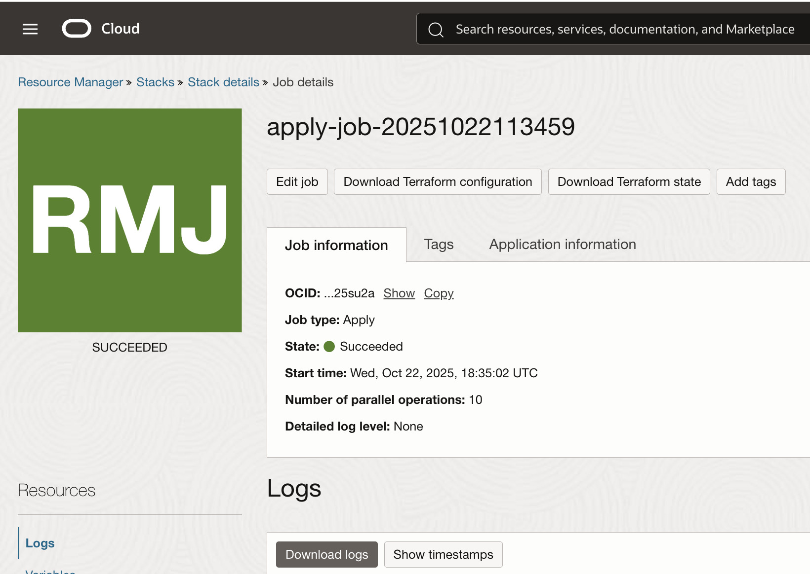

If you click on stack details at the top you will also see a confirmation that your stack successfully deployed and that all of your resources are created.

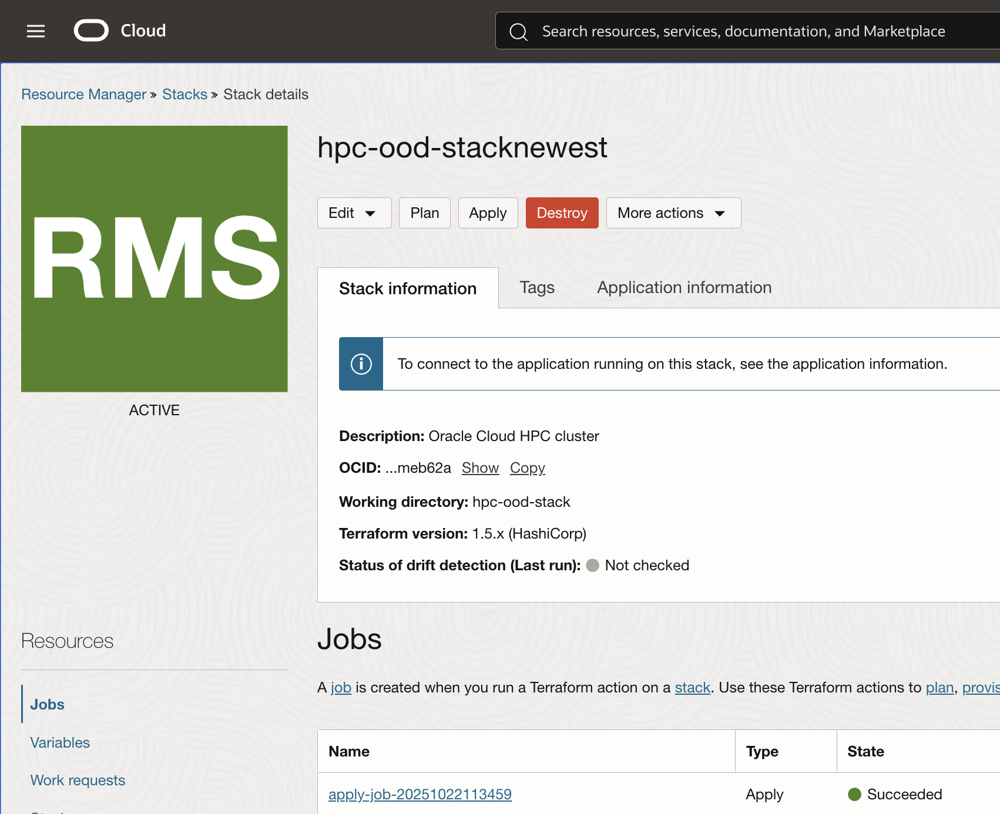

## Lab Completed

Congratulations! You have completed your deployment of the HPC terraform stack.

If you encounter a failure make sure you first destroy the stack before you delete anyting.

If you do not destroy the stack before redeploying, or deleting the stack, you may encounter some issues.

That concludes this section. You may now **proceed to the next lab**, where you will log into the Open OnDemand application.

## Learn More

* [Terraform Documentation](https://docs.oracle.com/en-us/iaas/Content/dev/terraform/home.htm)

* [Information on Resource Manager](https://www.oracle.com/cloud/cloud-native/resource-manager/)

* [Resource Manager Documentation](https://docs.oracle.com/en-us/iaas/Content/ResourceManager/home.htm)

## Acknowledgements

* **Author:** Chris Wegenek
, Cloud Engineering 
* **Contributors:**
Germain Vargas, Cloud Engineering

* **Last Updated By/Date:** Chris Wegenek
, Cloud Engineering, March 2026