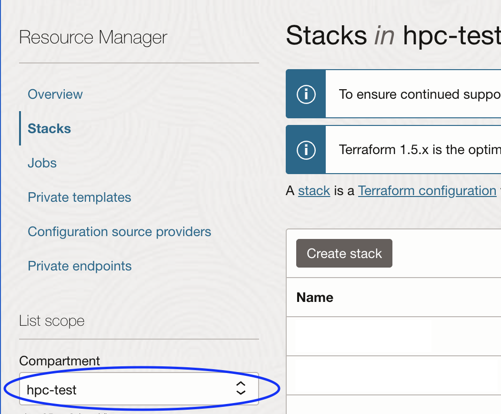
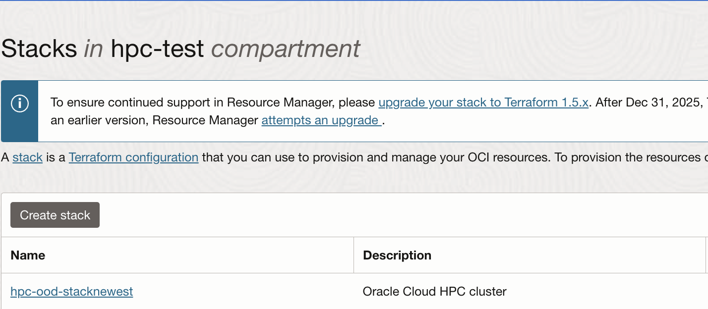
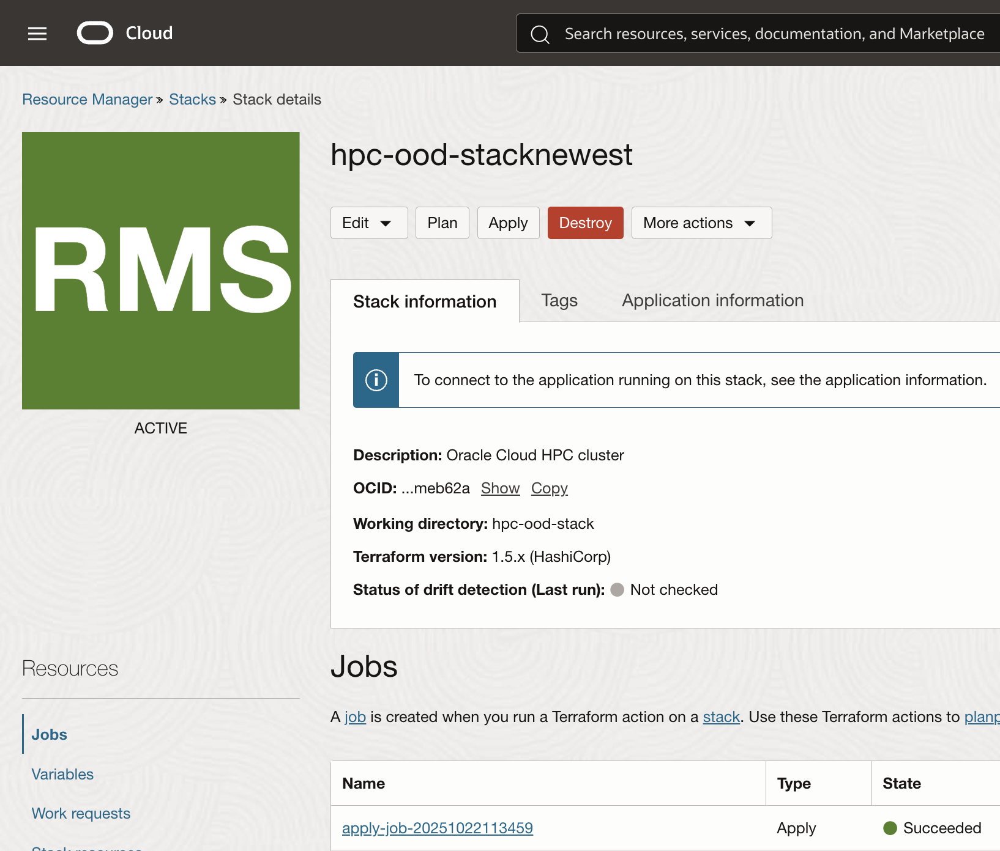
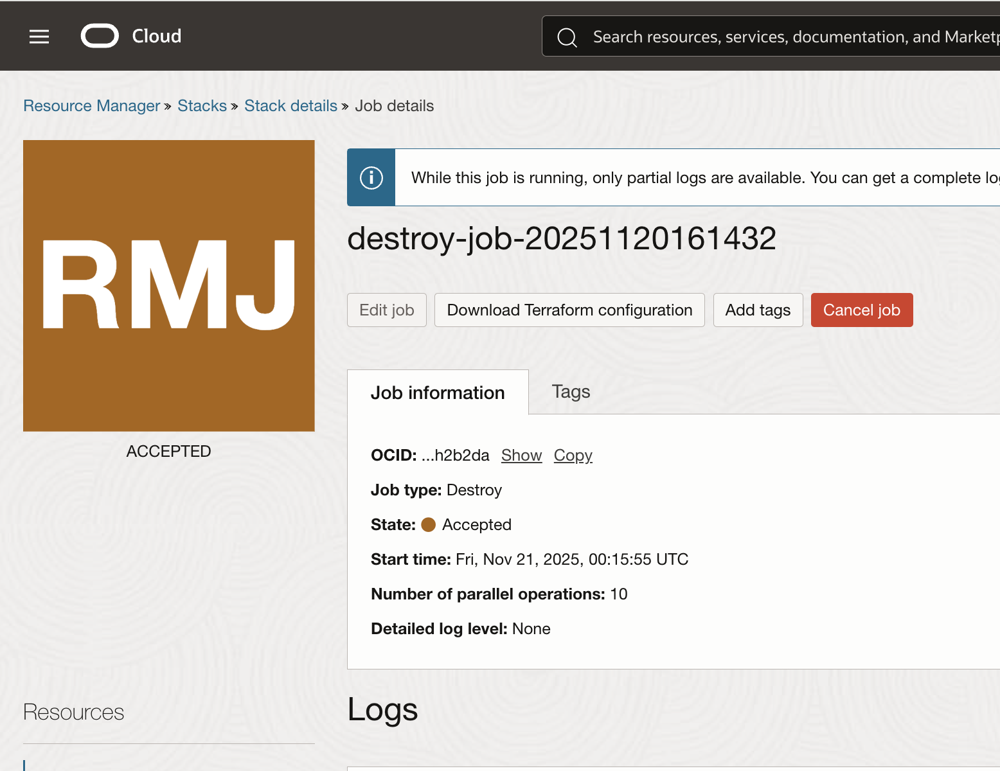
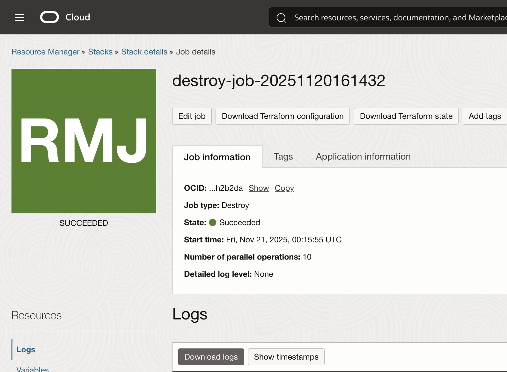

# Lab 4: Destroy the HPC Stack on OCI

## Introduction

In this lab you will destroy the terraform stack you created using the resource manager on OCI. This by default will destroy all compnents created by the stack including the VCN, domain, compute VM components, and an the cluster network. 

**Estimated Time:** 2 Minutes

Note: Destroying the terraform stack takes around 2 minutes, However the actual infrastructure deployment takes around 20-30 min to delete.

### Prerequisites

It is assumed that you:

- Have the ability to create and delete resources in your tenancy.
- Have already created and deployed a stack and have not manually deleted any components that were created.

### Objectives

In this lab, you will:

- Access the stack.
- Destroy the stack using resource manager.
- Confirm the stack was destroyed.
- (Optional) Delete the stack.

## Task 1: Destroy the terraform stack 

Now we will go to the resorce manager stacks screen and destory the stack.

### 1. Open the stacks page

First log in to your OCI console and select the hamburger dropdown menu.

Then use the search bar to look up "**Stacks**"

### 2. Select compartment

Make sure you have the **compartment** where you created the stack selected.

### 3. Selct the stack

Select the stack that you would like to delete by clicking on its name.

### 4. Destroy the stack

Now that you are viewing your stack you should be able to see that your last job run was an "apply-job."

This means that resources were deployed and now you can run a destroy job that will destroy and resouces that were created, whether the apply job was fully successful or not.

To destroy your stack all you need to do is click the red **"Destroy"** button and then select the gray **"Destroy"** button on the bottom of the the pop-up screeen.

Once your stack starts the destroy process you will automatically go the job details page and see that your job was accepted.

Once your stack succesfully is destroyed you will see the orange tile turn green.

## Task 2 (Optional): Editing the stack configuration

If you would like to make a change to the stack before deploying again you can click the **"Edit"** button, and the apply the stack.

## Task 3(Optional): Redeploying the stack configuration

If you would like to redeploy the stack, and you didn't delete it, you can simply click the **"Apply"** button near the red **"Destroy"** button to deploy the stack again.

## Task 4 (Optional): Deleting the stack configuration

If you have no further use for the stack and would like to perminantly delete the stack you can remove it from your resource manager now that you destroyed all of the resources.

To delete the stack configuration perminantly you need to click the **"More actions"** dropdown button next to the red **"Destroy"** button.

Then click **"Delete stack"** at the bottom of the list of options.

No other tasks need to be completed and the stack configuration should be deleted shortly.

## Lab Completed

Congratulations! You have completed destroying the HPC terraform stack.

This concludes the LiveLab thank you for participating.

## Learn More

## Acknowledgements

* **Author:** Chris Wegenek, Cloud Engineering 
* **Contributors:**
Germain Vargas, Cloud Engineering

* **Last Updated By/Date:** Chris Wegenek
, Cloud Engineering, March 2026