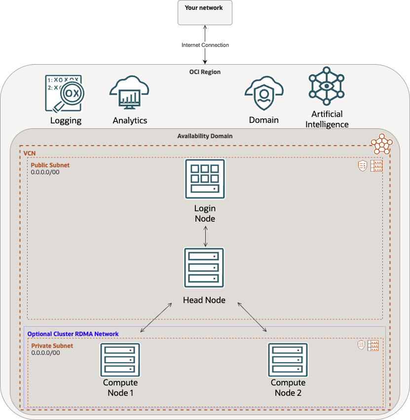

# How to deploy an HPC cluster on OCI using a Terraform Stack.

**Estimated time:** 2 Hours

## Workshop Introduction

The workshop will showcase how to deploy an Oracle Cloud HPC stack in an OCI tenancy and how to log into Open on Demand (OOD) running on the cluster, check metrics, and destroy the stack when you are done.

We will cover following topics as part of the upcoming labs.

- HPC stack prerequisites.
- Deploying the stack on OCI using terraform.
- Accessing OOD.
- Accessing grafana.
- Viewing metrics for the cluster.
- Destroying the stack.

### Architecture

As part of the workshop, we will be deploying a terraform script that utilizes a VCN, a domain, and deploys the cluster. The total number of VMs in the cluster can vary due to input criteria. The following image showcases the logical architecture of the target lab.

### Prerequisites

The lab makes following assumptions:

- Familiarity with Oracle Cloud.
- An Oracle Cloud Account.
- Familiarity with OCI components and features.
- Ability to access and download a file from GitHub.
- A working tenancy with the ability to deploy the needed infrastructure.

## Task 1: See if you are prepared to start the first lab.

If you already have an active cloud account, and tenancy, that you can currently use then you can proceed to lab 1.

If you do not have an activated account, or a tenancy provisioned (paid or free tier), then you can follow the "Getting Started" lab to help you prepare for lab 1.

## Learn More

* [Oracle Cloud](https://www.oracle.com/cloud/)

* [Oracle Cloud HPC Overview](https://www.oracle.com/cloud/hpc/)

* [Terraform Documentation](https://docs.oracle.com/en-us/iaas/Content/dev/terraform/home.htm)

* [OOD Documentation](https://osc.github.io/ood-documentation/latest/faqs.html)

## Acknowledgements

* **Author:** Chris Wegenek, Cloud Engineering
* **Contributors:**
    - Germain Vargas, Cloud Engineering
    - Rafael Marcelino Koike, Cloud Engineering

* **Last Updated By/Date:** Chris Wegenek, Cloud Engineering March 2026