# Lab 2: Logging into the OOD Application

## Introduction

In this lab you will log into the Open on Demand ("OOD") application created by the terraform stack using the domain that was created. This will give you access to all of the HPC servers created and alow you to use the OOD application to manage them.

**Estimated Time:** 15 Minutes


### Prerequisites

It is assumed that you:

- Have the ability to access the resources in your tenancy.
- Have already created and deployed the HPC stack successfully, and have not manually deleted any components that were created.
- You have entered your email in Lab 1, Task 2, Step 14.


### Objectives

In this lab, you will:

- Access the activate profile email.
- Configure the domain.
- Access the HPC management application, "Open On Demand (OOD)."

## Task 1: Find the activate profile email

While the stack successfully deployed and created the domain, a welcome email should have been sent to the email you entered in Lab 1, Task 2, Step 14.

``Note: if you used a preexisting Domain then you can skip this task.``

### 1. Find the email

Log into your email and find the "Activate your profile in account..." email.

Click the "**Activate Your Account**" button.

Then reset your password and return to the OCI dashboard for the next step.

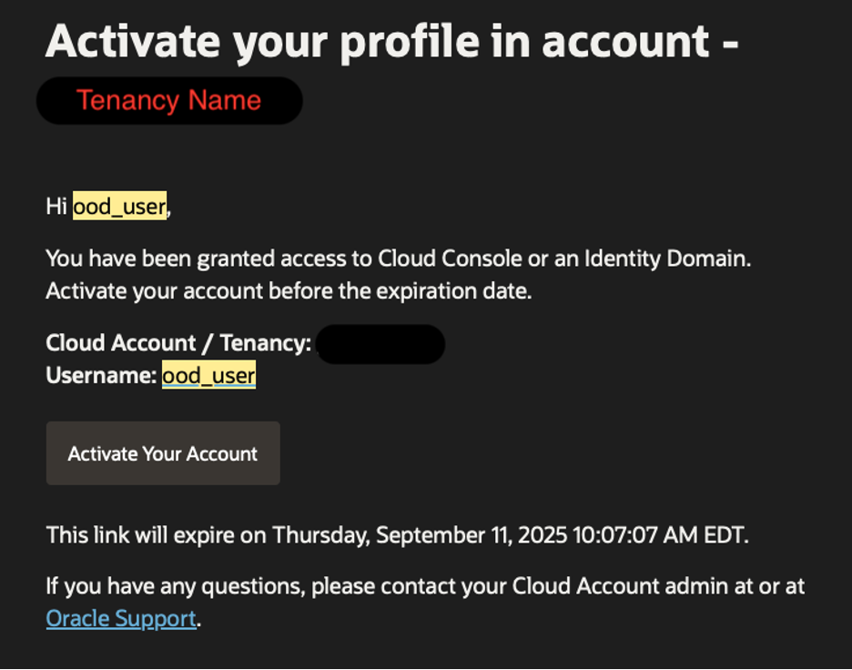

## Task 2:  Configure the Domain

### 1. First log in to your OCI console and select the hamburger dropdown menu.

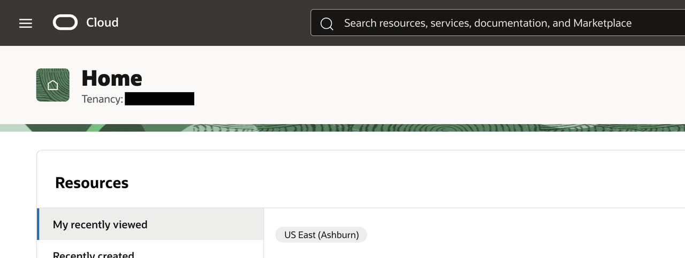

Then use the search bar to look up "**Domains**"

Click on "**Domains**" with "Identity" after it

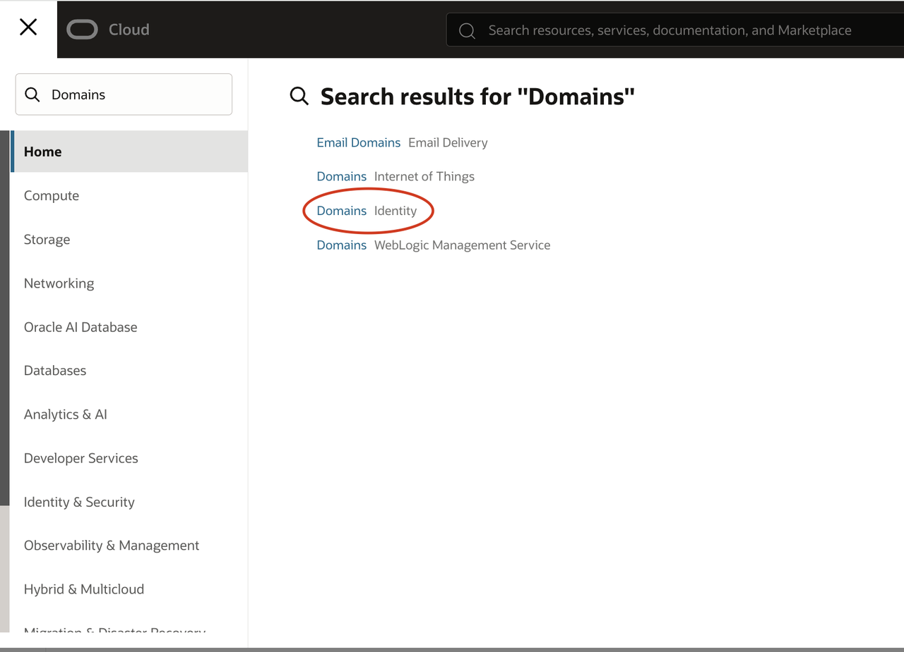

### 2. Select your domain

Make sure you have the **compartment** where you created the domain.

Then once you see your domain click on its name in the blue text.

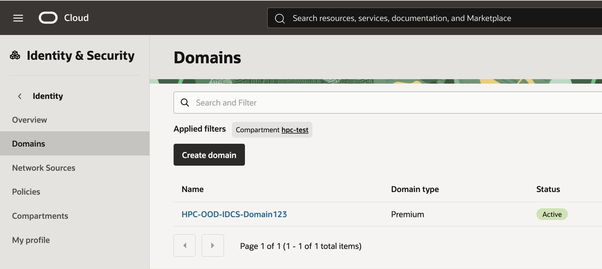

### 3. Open the integrated application

From the main domain details screen select the integrated applications tab.

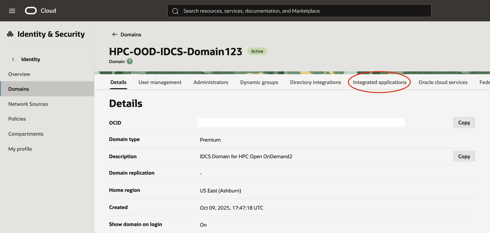

Then from there select the name of your integrated application in blue text.

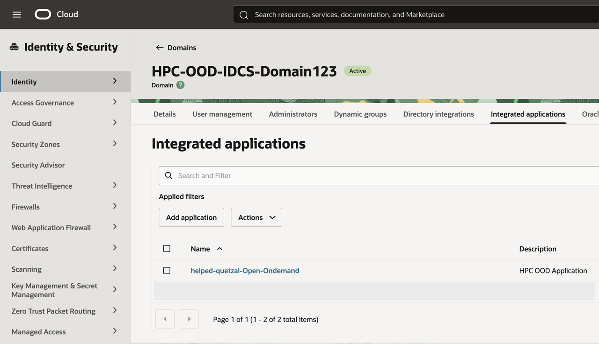

### 4. Select Oath configuration and fill in the details

From the details screen of your integrated application select the "**Oath configuration**" tab.

Then click on the "**Edit Oauth configuration**" button near the top.

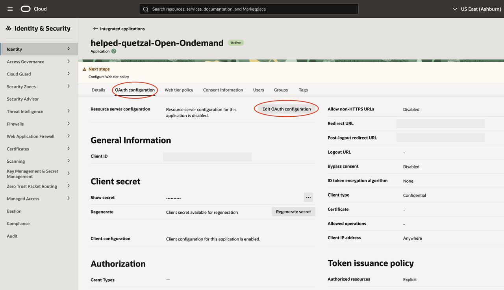

Next you will need to scroll down to the bottom of the popup menu and switch on the "**Add app roles**."

Then click the black "**Add app roles**." button.

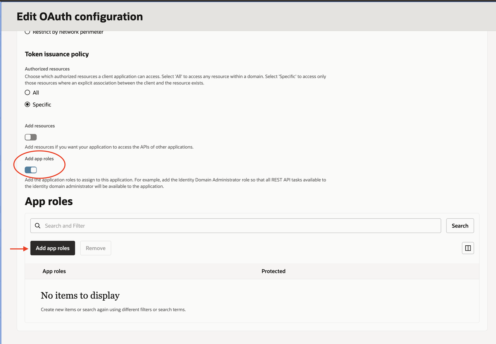

Then you want to seach and add roles for:
   
```
<copy>Me</copy>
```
```
<copy>Identity Domain Administrator</copy>
```
```
<copy>Signin</copy>
```
Then click the black "**Add**." button in the bottom right.

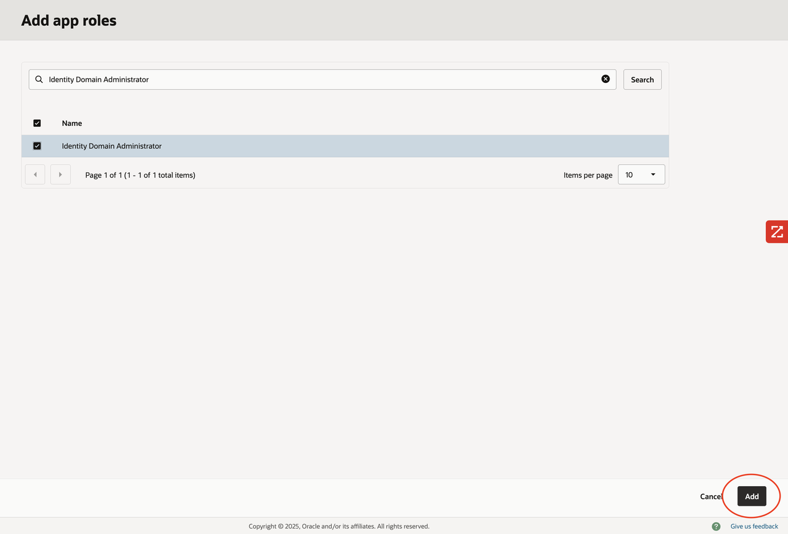

Once you are back to the previous screen you can click submit.

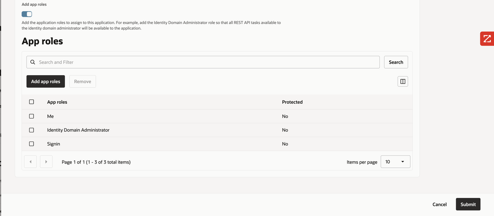

### 5. Log into the application

Log in to your user profile using the Post-logout redirect URL link.

To log in you will use your ood user name and ood password you entered in Lab 1: Task 2, Step 14. 

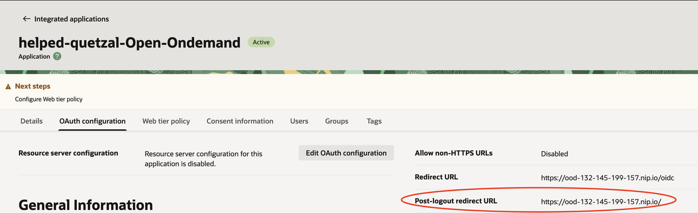

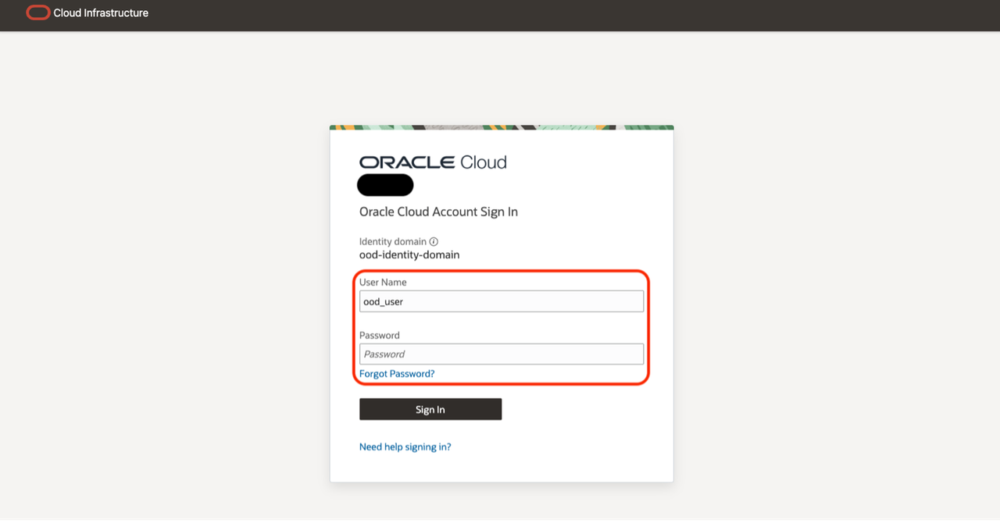

``Note: If you have forgotten, all information can be gathered in the stack under "Application Information".``

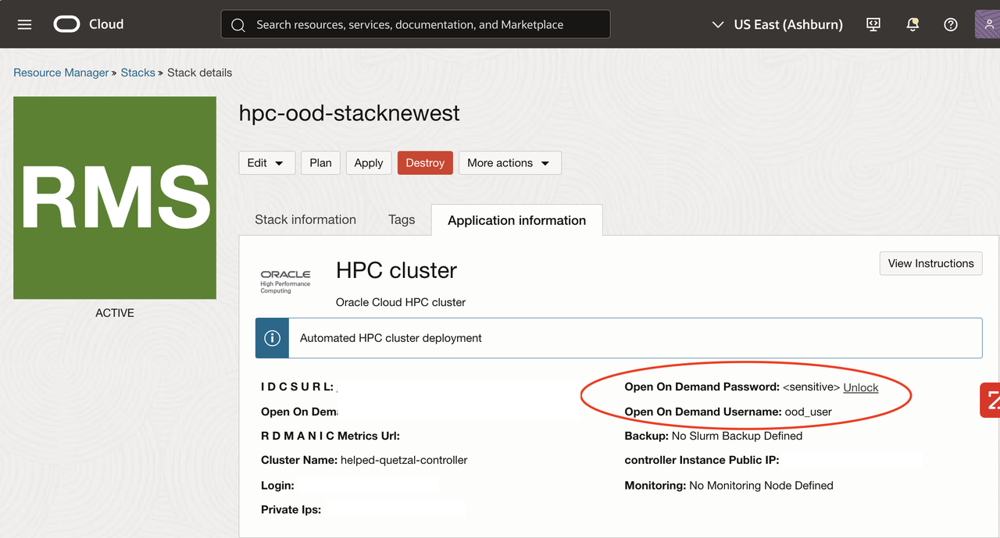

### 6 Allow authentication

Click the green box that says "**Allow**."

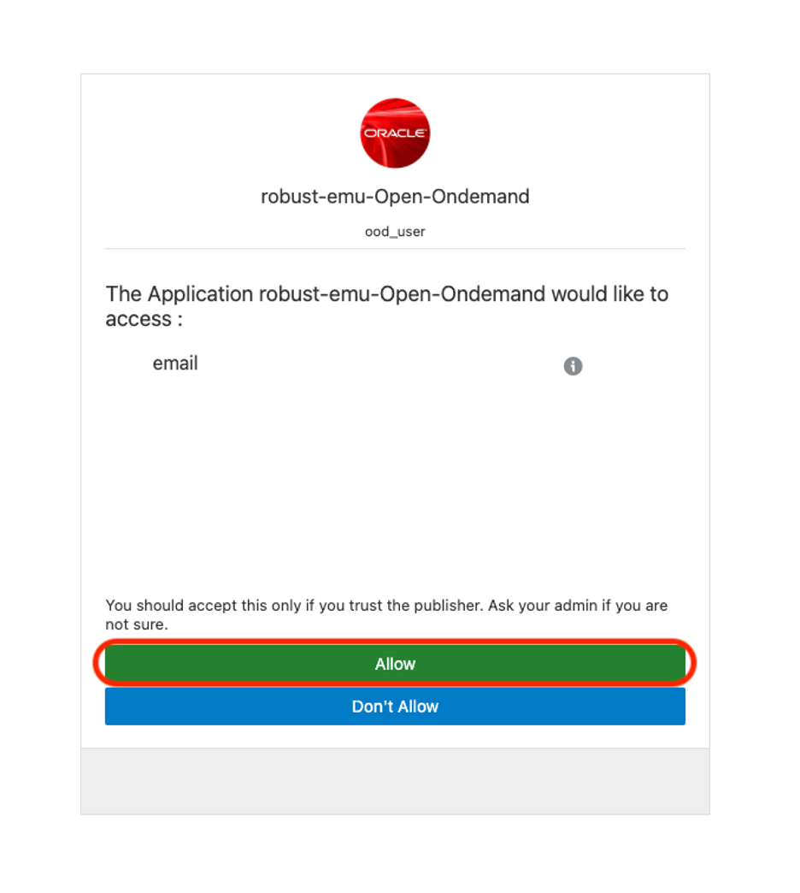

You should now see the home page for Open On Demand (OOD).

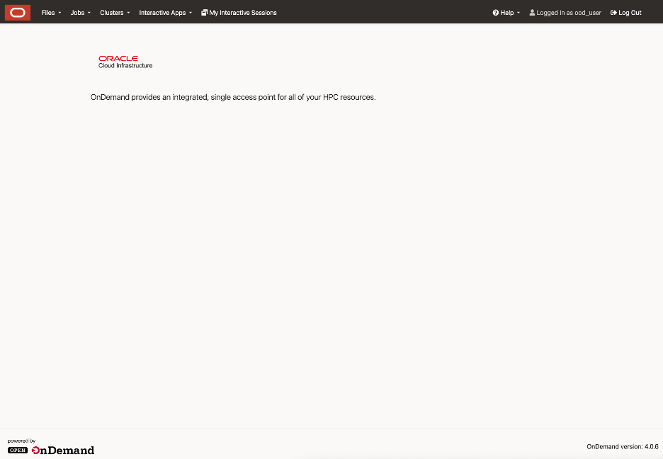

## Lab Completed

Congratulations! You have successfully deployed the HPC Stack and Open Ondemand!

From this applciation you can deploy and run workloads on your HPC Lab as well as manage and view reports on the performance.

That concludes this section, you may now **proceed to the next lab**.

## Learn More

* [OOD Documentation](https://osc.github.io/ood-documentation/latest/faqs.html)

## Acknowledgements

* **Author:** Chris Wegenek
, Cloud Engineering 
* **Contributors:**
Germain Vargas, Cloud Engineering

* **Last Updated By/Date:** Chris Wegenek
, Cloud Engineering, March 2026