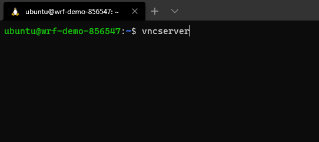
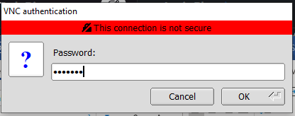
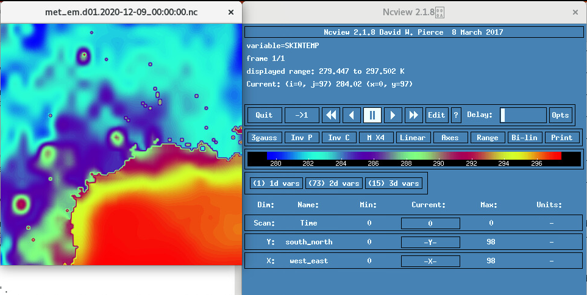
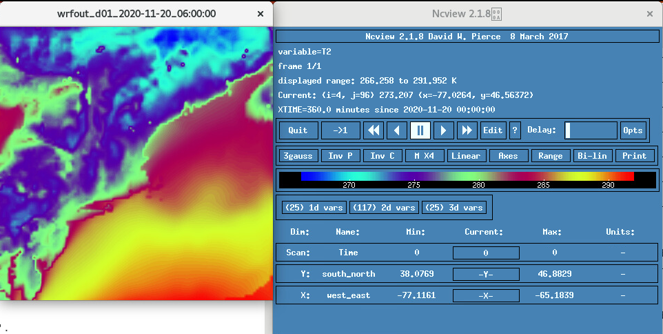

# Modification des données d'expérience avec WRF

## Présentation

Ce guide est plus petit que le guide d'installation, d'installation et d'exécution de WRF. Il est destiné à être utilisé une fois que vous avez terminé l'installation, l'installation et le guide d'exécution de WRF ou que vous avez utilisé le lien de téléchargement pour commencer à utiliser une image personnalisée avec WRF 4.1.5 et WPS 4.1 déjà configurés.

Temps de laboratoire estimé : 45 minutes

### Objectifs

Dans cet atelier, vous allez découvrir :

*   Création d'un domaine WRF avec Geogrid
*   Télécharger les données GFS et exécuter Ungrib et Metgrid
*   Exécuter WRF avec des données réelles

### Prérequis

Cet exercice suppose que vous avez :

*   Un compte de niveau gratuit ou de cloud payant Oracle
*   Accès à une instance de CPU Ubuntu 18.04 tel que décrit dans les exercices 1 et 2
    *   Notez que nous allons utiliser la **forme VM.Standard2.16**. Vous pouvez utiliser une forme plus petite si vous le souhaitez.
*   Consultez le guide d'installation, d'installation et d'exécution de WRF ou téléchargez l'image personnalisée fournie ici ou [ici](https://objectstorage.us-ashburn-1.oraclecloud.com/p/lRqMYYN5VTdSgBz9f8nv7Tz5mzMGMqr7wlN2Y_q6g6GHmTdc9GX8lokgmTui81BA/n/hpc_limited_availability/b/Demo_Materials/o/WRF_DEMOV2).
    *   **Remarque** : le mot de passe Ubuntu est ppkkego et le mot de passe vnc est ppkkego  
        Ils peuvent être modifiés à l'aide des commandes suivantes dans le terminal distant :
        
            <copy>
            sudo passwd ubuntu
            sudo vncpasswd
            </copy> 
            

## Tâche 1 : connexion au bureau Gnome

Nous utiliserons [TigerVNC Viewer](https://tigervnc.org/) pour nous connecter à notre instance.

1.  Ouvrir un terminal local
    
    Exécutez la commande suivante avec les informations relatives à votre instance : ssh -L 5901:localhost:5901 ubuntu@IPADDRESS 
    
2.  Démarrage d'une session de serveur virtuel  
    serveur virtuel  
    
    
3.  Ouvrir le visualiseur TigerVNC
    
    Serveur VNC : localhost:1  
    Cliquez ensuite sur connect  
    
    
4.  Entrez votre mot de passe VNC  
    puis cliquez sur OK  
    
    
5.  Un bureau gnome vous sera enfin présenté et vous devriez continuer à travailler d'ici.  
    
    

## Tâche 2 : Créer une zone/un domaine géographique

1.  Nous devons ajuster le fichier namelist.wps à zéro à un emplacement de votre choix. Ce sera une petite grille (10 000 x 10 000 mètres) avec Houston Texas USA comme point central.
    
        <copy>
        cd ~/WRF/WPS-4.1
        vi namelist.wps
        </copy>
        
    
    **Veuillez changer toutes les valeurs ci-dessous à votre goût en fonction de votre expérience**.
    
    *   `max_dom` Entier indiquant le nombre total de domaines, y compris le domaine parent, dans la simulation. La valeur par défaut est 1.
    *   `e_we` : entiers indiquant la dimension ouest-est complète de la grille. Aucune valeur par défaut.
    *   `e_sn` : entiers indiquant la dimension Sud-Nord complète de la grille. Aucune valeur par défaut.
    *   `dx` : valeur réelle indiquant la distance de la grille (en mètres) dans la direction X où le facteur d'échelle de la carte est 1.
    *   `dy` : valeur réelle indiquant la distance de la grille (en mètres) dans la direction Y où le facteur d'échelle de la carte est 1.
    *   `ref_lat` : valeur réelle indiquant la partie latitude d'un emplacement (latitude, longitude) dont l'emplacement (i,j) dans le domaine de simulation est connu.
    *   `ref_lon` : valeur réelle indiquant la partie de longitude d'un emplacement (latitude, longitude) dont l'emplacement (i, j) dans le domaine de simulation est connu.
    *   `truelat1` : Valeur réelle spécifiant la première latitude réelle pour la projection conforme de Lambert, ou la seule vraie latitude pour le Mercator et les projections stéréographiques polaires.
    *   `truelat2` : valeur réelle indiquant la deuxième latitude réelle pour la projection conique conforme de Lambert.
    *   `stand_lon` : valeur réelle indiquant la longitude parallèle à l'axe des y dans les projections stéréographiques conformes et polaires de Lambert. Pour la projection régulière de latitude-longitude, cette valeur donne la rotation autour des pôles géographiques de la terre.
    *   `geog_data_path` : chaîne de caractères indiquant le chemin, relatif ou absolu, du répertoire dans lequel les répertoires de données géographiques peuvent être trouvés.
    
        <copy>
        &share  
        wrf_core = 'ARW',  
        max_dom = 1,  
        start_date = '2006-08-16_12:00:00','2006-08-16_12:00:00',  
        end_date   = '2006-08-16_18:00:00','2006-08-16_12:00:00',  
        interval_seconds = 21600  
        io_form_geogrid = 2,  
        /  
        &geogrid  
        parent_id         =   1,   1,  
        parent_grid_ratio =   1,   3,  
        i_parent_start    =   1,  31,  
        j_parent_start    =   1,  17,  
        e_we              =  100, 112,  
        e_sn              =  100,  97,  
        !  
        !!!!!!!!!!!!!!!!!!!!!!!!!!!!!!!!!!!!!!!!!!!!!! IMPORTANT NOTE !!!!!!!!!!!!!!!!!!!!!!!!!!!!!!!!!!!!!!!!!!!!!!  
        ! The default datasets used to produce the MAXSNOALB and ALBEDO12M  
        ! fields have changed in WPS v4.0. These fields are now interpolated  
        ! from MODIS-based datasets.  
        !  
        ! To match the output given by the default namelist.wps in WPS v3.9.1,  
        ! the following setting for geog_data_res may be used:  
        !  
        ! geog_data_res = 'maxsnowalb_ncep+albedo_ncep+default','maxsnowalb_ncep+albedo_ncep+default',  
        !  
        !!!!!!!!!!!!!!!!!!!!!!!!!!!!!!!!!!!!!!!!!!!!!! IMPORTANT NOTE !!!!!!!!!!!!!!!!!!!!!!!!!!!!!!!!!!!!!!!!!!!!!!  
        !  
        geog_data_res = 'default','default',  
        dx = 10000,  
        dy = 10000,  
        map_proj = 'lambert',  
        ref_lat   =  41.87,  
        ref_lon   = -87.62,  
        truelat1  =  41.87,  
        truelat2  =  41.87,  
        stand_lon = -87.62,  
        geog_data_path = '~/WRF/GEOG/'  
        /  
        </copy>
        
    
    **Pour quitter, appuyez simplement sur esc, puis sur Maj : suivi de wq enter**  
    **Toutes ces modifications concernent une zone géographique où Houston TX est l'épicentre.**
    
2.  Maintenant que nous avons mis les informations pour notre zone géographique d'intérêt (ce guide utilise Houston TX USA comme point central) permet d'utiliser ncview pour vérifier que nous avons le bon emplacement après avoir exécuté le programme geogrid.
    
        <copy>
        ./geogrid.exe
        ncview geo_em.d01.nc
        </copy>
        
3.  Utilisez la variable 2d pour vérifier le masque de terrain afin de vérifier l'emplacement. Si l'image est satisfaite, nous créons le domaine.
    
    
    

## Tâche 3 : Ajout de données météorologiques à la zone géographique/domaine

Après avoir configuré notre zone géographique ou notre domaine. Nous devons maintenant obtenir des données météorologiques pour se superposer au domaine.

1.  Dans un navigateur Web, accédez à https://nomads.ncep.noaa.gov/pub/data/nccf/com/gfs/prod/
    
2.  Cliquez sur le lien avec la date la plus récente (ex gfs.20201120/ car aujourd'hui est le 20 novembre 2020)
    
3.  Choisissez 00  
    `Don’t actually download anything.` Pour cela, nous allons créer un script. Nous allons à la résolution inférieure pour une taille de données plus facile à gérer pour cet atelier. Par conséquent, 0p50 au lieu de 0p25. Utilisez 0p25 si vous disposez d'un stockage supplémentaire et que vous souhaitez une résolution plus élevée/des données plus fiables. Vous devez télécharger le nombre de fichiers pour la durée d'exécution souhaitée. Chaque fichier correspond à une heure de données à un intervalle donné. EX si vous souhaitez exécuter pendant six heures, vous avez besoin de gfs.t00z.pgrb2.0p50.f000, gfs.t00z.pgrb2.0p50.f003 et gfs.t00z.pgrb2.0p50.f006. 0p25 est en étapes d'une heure et 0p50 en étapes de 3 heures. Pour le tutoriel, nous utiliserons seulement 6 heures de données. N'hésitez pas à en utiliser davantage lorsque vous serez plus à l'aise avec WRF ultérieurement.
    
4.  Permet d'accéder au répertoire correct et de modifier le script pré-créé pour télécharger les données.
    
        <copy>
        cd ~/WRF
        cd scripts
        vi download_gfs.sh
        </copy>
        
    
    Le script sera le suivant :  
    Vous devez simplement modifier `year`, `month` et `day` pour les données à télécharger.
    
        <copy>
        #!/bin/bash  
        
        inputdir=/home/ubuntu/WRF/GFS  
        rm -rf $inputdir  
        mkdir $inputdir  
        
        year=2020  
        month=12  
        day=09  
        cycle=00  
        
        for ((i=000; i<=006; i+=3))  
        do  
                ftime=`printf "%03d\n" "${i}"`  
                server=https://nomads.ncep.noaa.gov/pub/data/nccf/com/gfs/prod  
                directory=gfs.${year}${month}${day}/${cycle}  
                file=gfs.t${cycle}z.pgrb2.0p50.f${ftime}  
                url=${server}/${directory}/${file}  
                echo $url  
                wget -O ${inputdir}/${file} ${url}  
        done
        </copy>  
        
    
    **Pour quitter, appuyez simplement sur esc, puis sur Maj : suivi de wq enter**  
    **Ce script télécharge les heures SIX de données pour la date 12/09/20 à la résolution 0p50. Veuillez ajuster pour répondre à vos besoins.**
    
5.  Les commandes suivantes rendent le script exécutable et l'exécutent pour télécharger les données :
    
        <copy>
        chmod +x download_gfs.sh
        ./download_gfs.sh
        </copy>
        
6.  Maintenant que nous avons téléchargé nos données, passons par le processus de superposition sur notre domaine. Nous utiliserons ungrib et une métropole pour y parvenir. Nous allons décomposer cela en deux sections : une section de configuration et une section d'exécution.
    
    **Configurer :**
    
        <copy>
        cd ~/WRF/WPS-4.1
        rm ./Vtable
        ln -s ungrib/Variable_Tables/Vtable.GFS ./Vtable
        ./link_grib.csh ~/WRF/GFS/
        vi namelist.wps 
        </copy> 
        
    
    **Modifiez toutes les valeurs ci-dessous en fonction des fichiers téléchargés**.
    
    *   `start_date` sous la forme : Année-Mois-Jour\_heure:minute:seconde
    *   `end_date` sous la forme : Année-Mois-Jour\_heure:minute:seconde
    *   `interval seconds` : nombre entier de secondes entre les fichiers d'entrée météorologique variables dans le temps. Aucune valeur par défaut.
    
        <copy>
        &share  
        wrf_core = 'ARW',  
        max_dom = 1,  
        start_date = '2020-12-09_00:00:00',         # start time  
        end_date   = '2020-12-09_06:00:00',         #6 hours later than start time  
        interval_seconds = 10800                    #3 hours worth of seconds interval between steps  
        io_form_geogrid = 2,  
        /
        </copy>
        
    
    **Pour quitter, appuyez simplement sur esc, puis sur Maj : suivi de wq enter**
    
    **Exécuter :**
    
        <copy>
        ./ungrib.exe
        rm ./METGRID.TBL 
        ln -s metgrid/METGRID.TBL.ARW ./METGRID.TBL
        ./metgrid.exe
        </copy>
        
7.  Nous pouvons consulter les résultats en utilisant ncview et en regardant skintemp pour voir la valeur des données téléchargées.
    
        <copy>
        ncview met_em.d01.2020-12-09_00\:00\:00.nc 
        </copy>
        
    
    
    

## Tâche 4 : Exécuter Real et WRF

1.  Nous avons réduit les données pour représenter un emplacement géographique et nous y avons ajouté des données météorologiques ; il est enfin temps d'exécuter WRF en utilisant des données réelles.
    
        <copy>
        cd ~/WRF/WRF-4.1.5
        cd run
        rm met_em*
        ln -s ../../WPS-4.1/met_em* .  
        vi namelist.input
        </copy>
        
2.  Dans le fichier namelist.input, nous devons modifier le contenu pour refléter notre zone géographique/domaine, ainsi que notre date et intervalle.  
    **Veuillez modifier toutes les valeurs de votre choix en fonction de votre expérience**.
    
    *   `run_days` : durée d'exécution en jours.
    *   `run_hours` : durée d'exécution en heures. **Remarque :** s'il s'agit de plus d'1 jour, vous pouvez utiliser run\_days et run\_hours ou simplement run\_hours. Par exemple, si la longueur d'exécution totale est de 36 heures, vous pouvez définir run\_days = 1, run\_hours = 12 ou run\_days = 0 et run\_hours = 36.
    *   `run_minutes` : durée d'exécution en minutes.
    *   `run_seconds` : durée d'exécution en secondes.
    *   `start_year` : année de début à 4 chiffres.
    *   `start_month` : mois de début à 2 chiffres.
    *   `start_day` : jour de début à 2 chiffres.
    *   `start_hour` : heure de début sur 2 chiffres.
    *   `end_year` : année de fin à 4 chiffres.
    *   `end_month` : mois de fin à 2 chiffres.
    *   `end_day` : jour de fin à 2 chiffres.
    *   `end_hour` : heure de fin sur 2 chiffres.
    *   `interval_seconds` : intervalle entre les données réelles entrantes, qui sera l'intervalle entre le fichier de conditions de limite latérale.
    *   `e_we` : index de fin dans la direction x (west\_east) (dimension décalée).
    *   `e_sn` : index de fin dans la direction y (sud-nord) (dimension décalée).
    *   `e_vert` : index de fin dans la direction z (verticale) (dimension décalée - fait référence à des niveaux complets).
    *   `dx` : longueur de la grille dans la direction X (en mètres).
    *   `dy` : longueur de grille dans la direction Y (en mètres).
    
        <copy>
        &time_control
        run_days                            = 0,
        run_hours                           = 6,
        run_minutes                         = 0,
        run_seconds                         = 0,
        start_year                          = 2020, 2000, 2000,
        start_month                         = 12,   01,   01,
        start_day                           = 09,   24,   24,
        start_hour                          = 00,   12,   12,
        end_year                            = 2020, 2000, 2000,
        end_month                           = 12,   01,   01,
        end_day                             = 09,   25,   25,
        end_hour                            = 06,   12,   12,
        interval_seconds                    = 10800
        input_from_file                     = .true.,.true.,.true.,
        history_interval                    = 60,  60,   60,
        frames_per_outfile                  = 1, 1000, 1000,                                        
        restart                             = .false.,
        restart_interval                    = 7200,
        io_form_history                     = 2
        io_form_restart                     = 2
        io_form_input                       = 2
        io_form_boundary                    = 2
        /
        
        &domains
        time_step                           = 60,
        time_step_fract_num                 = 0,
        time_step_fract_den                 = 1,
        max_dom                             = 1,
        e_we                                = 100,    112,   94,
        e_sn                                = 100,    97,    91,
        e_vert                              = 40,    33,    33,
        p_top_requested                     = 5000,
        num_metgrid_levels                  = 34,
        num_metgrid_soil_levels             = 4,
        dx                                  = 10000, 10000,  3333.33,
        dy                                  = 10000, 10000,  3333.33,
        grid_id                             = 1,     2,     3,
        parent_id                           = 0,     1,     2,
        i_parent_start                      = 1,     31,    30,
        j_parent_start                      = 1,     17,    30,
        parent_grid_ratio                   = 1,     3,     3,
        parent_time_step_ratio              = 1,     3,     3,
        feedback                            = 1,
        smooth_option                       = 0
        /
        
        &physics
        physics_suite                       = 'CONUS'
        mp_physics                          = -1,    -1,    -1,
        cu_physics                          = -1,    -1,     0,
        ra_lw_physics                       = -1,    -1,    -1,
        ra_sw_physics                       = -1,    -1,    -1,
        bl_pbl_physics                      = -1,    -1,    -1,
        sf_sfclay_physics                   = -1,    -1,    -1,
        sf_surface_physics                  = -1,    -1,    -1,
        radt                                = 30,    30,    30,
        bldt                                = 0,     0,     0,
        cudt                                = 5,     5,     5,
        icloud                              = 1,
        num_land_cat                        = 21,
        sf_urban_physics                    = 0,     0,     0,
        /
        
        &dynamics
        hybrid_opt                          = 2,
        w_damping                           = 1,
        diff_opt                            = 1,      1,      1,
        km_opt                              = 4,      4,      4,
        diff_6th_opt                        = 0,      0,      0,
        diff_6th_factor                     = 0.12,   0.12,   0.12,
        base_temp                           = 290.
        damp_opt                            = 3,
        zdamp                               = 5000.,  5000.,  5000.,
        dampcoef                            = 0.2,    0.2,    0.2
        khdif                               = 0,      0,      0,
        kvdif                               = 0,      0,      0,
        non_hydrostatic                     = .true., .true., .true.,
        moist_adv_opt                       = 1,      1,      1,
        scalar_adv_opt                      = 1,      1,      1,
        gwd_opt                             = 0,
        /
        
        &bdy_control
        spec_bdy_width                      = 5,
        specified                           = .true.
        /
        
        &namelist_quilt
        nio_tasks_per_group = 0,
        nio_groups = 1,
        /
        </copy>
        
    
    **Pour quitter, appuyez simplement sur esc, puis sur Maj : suivi de wq enter**
    
3.  Nous pouvons enfin exécuter real.exe et wrf.exe. L'exécution de ce programme prend un certain temps. Pour accélérer ce processus, nous utiliserons MPI pour exécuter les programmes sur plusieurs cœurs de notre forme. N'oubliez pas que ce guide a été écrit en utilisant une forme VM.Standard2.16. Nous allons donc exécuter real.exe sur 2 coeurs.
    
        <copy>
        cat /proc/cpuinfo #To get cpu infor (use if you forgot your OCI shape).
        mpirun -n 2 ./real.exe #This has real.exe running on two cores
        cat rsl.out.0000 #Use this command check for errors
        </copy>
        
4.  Nous pouvons consulter les résultats en utilisant ncview et en regardant T2 pour voir la valeur des données téléchargées.
    
        <copy>
        ncview wrfinput_d01
        </copy>
        
    
    Ici, vous pouvez voir la température à deux mètres pour la zone cible. 
    
5.  Nous avons notre avis, nous pouvons maintenant l'utiliser pour générer une prédiction. Nous allons exécuter real.exe en utilisant 10 coeurs.
    
        <copy>
        mpirun -n 10 ./wrf.exe #This will run on 10 cores
        tail -F rsl.out.0000 #can be used to check for errors and progress.
        </copy>
        
6.  Nous pouvons regarder les résultats de notre prédiction avec ncview avec ce qui suit :
    
        <copy>
        ncview wrfout_d01_2020-11-20_06\:00\:00 
        </copy>
        
    
      
    Grâce à notre prédiction, vous pouvez constater que des changements sont survenus lorsque nous examinons la même zone six heures plus tard. Il y a beaucoup de variables à explorer, alors amusez-vous.
    

## Accusés de réception

*   **Auteur** - Brian Bennett, ingénieur solutions, Big Compute
*   **Dernière mise à jour le/la date** - Brian Bennett, Big Compute, décembre 2020