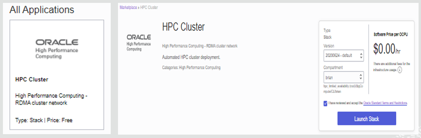
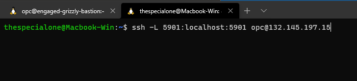
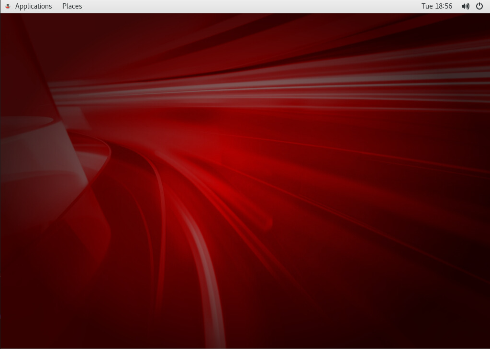
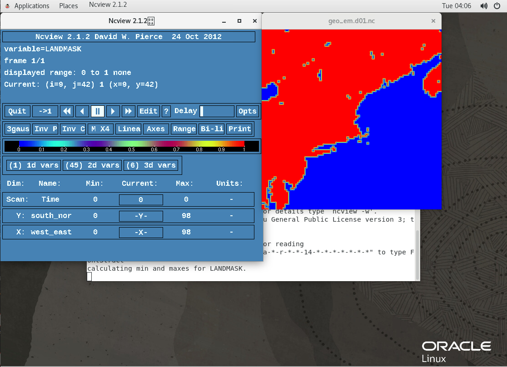
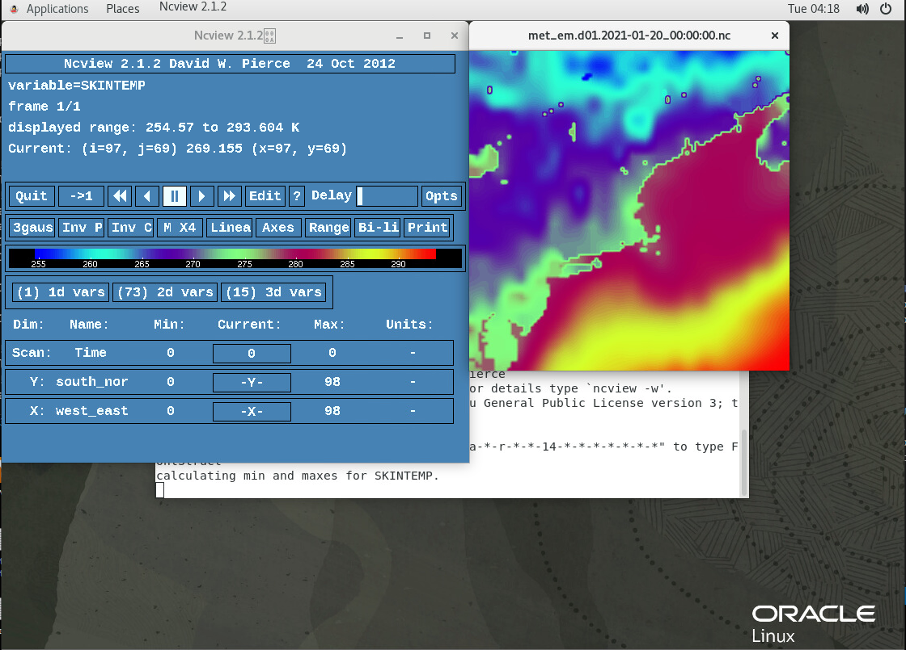
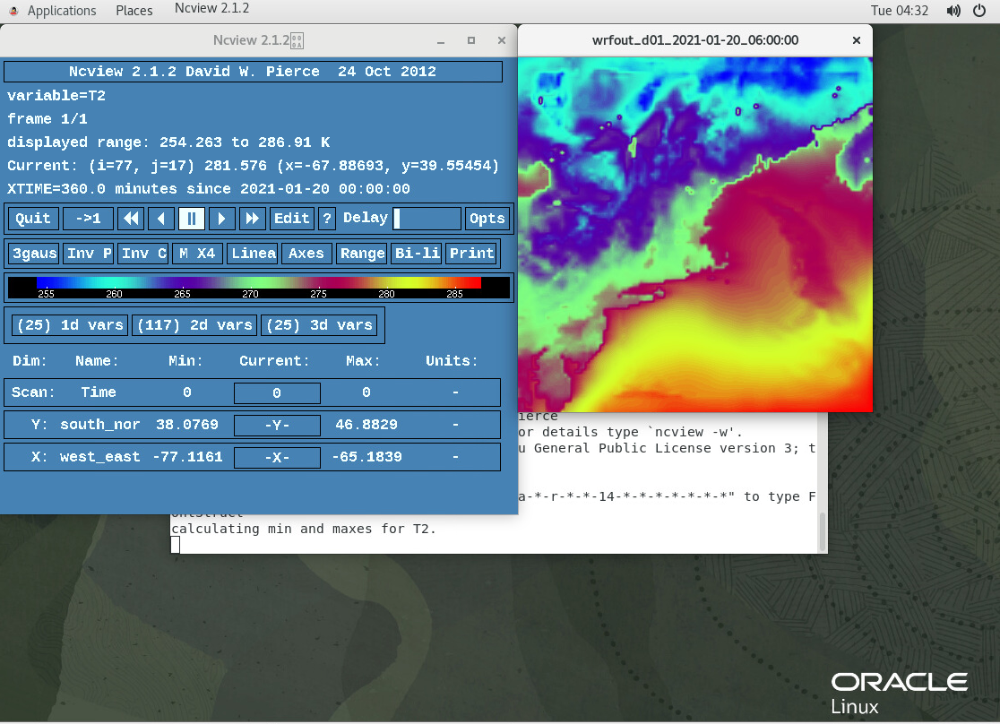

# Configuração, Instalação e Execução de WRF no Cluster HPC

## Introdução

Este laboratório discutirá e orientará você sobre como configurar e executar um cluster WRF na infraestrutura do OCI. Este guia tem o objetivo de mostrar como criar um cluster HPC de dois nós para configurar o ambiente em que você poderá executar experimentos e simulações meteorológicas.

Tempo Estimado de Laboratório: 90 minutos

### Objetivos

Neste laboratório, você vai aprender sobre:

*   Implantando um Cluster HPC de dois nós
*   Fazendo download de dependências e WRF/WPS
*   Compilando bibliotecas para WRF/WPS
*   Compilando WRF e WPS
*   Criando domínio WRF com Geogrid
*   Fazendo download de dados GFS e executando Ungrib e Metgrid
*   Executando WRF com dados reais

### Pré-requisitos

Este laboratório pressupõe que você tenha:

*   Uma conta de Avaliação ou de Nuvem Paga da Oracle
*   Observe que este laboratório usará dois nós **BM.HPC2.36** para nosso cluster e uma VM.Standard2.4 para nosso Bastion.

## Tarefa 1: Configurar Infraestrutura de HPC

1.  Use o menu de navegação à esquerda e navegue até **Soluções e Plataforma** > Marketplace > Aplicativos.
2.  No tipo de barra de pesquisa HPC, pressione a tecla ENTER/Return.
3.  Na seção Todos os Aplicativos, escolha Cluster de HPC e, em seguida, inicie a pilha. Ela deve observar a imagem à esquerda, seguida pela imagem à direita.  
    
4.  No menu de criação de pilha, forneça um nome e uma descrição, conforme apropriado, e clique em Próximo.
5.  Escolha um AD, cole sua chave SSH e deixe a caixa CONFIGURE NFS SHARE marcada.
6.  Para o Bastion, escolha o mesmo AD do cluster e escolha a forma **VM.Standard.2.4**, em seguida, clique em PRÓXIMO.
7.  Na tela de revisão, verifique duas vezes todas as informações inseridas e clique em Create.

## Tarefa 2: Configurar o Gnome Desktop

1.  Há várias tecnologias de desktop diferentes que você pode usar, mas este guia vai sobre a configuração e o ambiente de trabalho do Gnome, pois é o padrão para o Oracle Linux. As etapas a seguir farão download, instalarão e configurarão o Gnome Desktop para nossa instância do Oracle Linux 7 Bastion.
    
        <copy>
        sudo yum groupinstall "server with gui"
        Y
        sudo yum install tigervnc-server
        Y
        vncserver # DO NOT MAKE READ ONLY and password should be no greater than 8 characters
        </copy>
        
2.  Abra um terminal local  
    Execute o seguinte comando com informações pertencentes à sua instância: ssh -L 5901:localhost:5901 opc@IPADDRESS 
    
3.  Abra TigerVNC Tipo de Visualizador `localhost:1` no Servidor VNC: seção  
    Em seguida, clique em conectar  
    
    
4.  Digite sua senha da VNC  
    Em seguida, clique em OK  
    
    
5.  Você será finalmente apresentado a um desktop gnome e deverá continuar trabalhando aqui.  
    
    

## Tarefa 3: Configurando o Oracle Linux

1.  Agora que podemos acessar o ambiente de desktop de nossa instância, podemos começar a configurá-lo para executar o WRF. Para começar, vamos instalar as dependências para que precisemos avançar. Clique em Applications na parte superior esquerda, clique em System Tools e, em seguida, clique em Terminal. Execute o seguinte no terminal.
    
        <copy>
        sudo yum update -y
        sudo yum upgrade -y
        sudo yum group install "Development Tools" -y
        sudo yum install ncview -y
        sudo yum install mc -y
        </copy>
        

## Tarefa 4: Fazendo download e compilando bibliotecas para WRF

Agora que instalamos a maioria das dependências necessárias para o WRF, vamos começar a compilar as bibliotecas que o WRF precisa para funcionar.

### Criando estrutura de pastas e fazendo download de bibliotecas

1.  Digite os comandos a seguir no terminal remoto para começar a configurar a estrutura de pastas necessária.
    
        <copy>  
        cd /mnt/nfs-share
        mkdir WRF
        cd WRF
        mkdir downloads
        cd downloads
        </copy>
        
2.  No diretório de downloads, é possível fazer download de todas as bibliotecas necessárias com os comandos a seguir.
    
        <copy>
        curl -O ftp://ftp.unidata.ucar.edu/pub/netcdf/old/netcdf-4.1.2.tar.gz  
        curl -O https://www.zlib.net/zlib-1.2.11.tar.gz  
        curl -O ftp://ftp.simplesystems.org/pub/libpng/png/src/libpng16/libpng-1.6.37.tar.gz  
        curl -O https://www2.mmm.ucar.edu/wrf/OnLineTutorial/compile_tutorial/tar_files/jasper-1.900.1.tar.gz  
        curl -O https://www.mpich.org/static/downloads/3.3.2/mpich-3.3.2.tar.gz
        </copy>
        
3.  A instalação de descompactar os arquivos um por um, permite usar um **loop** para fazer isso por nós e voltar ao nosso diretório WRF.
    
        <copy>
        for i in *.gz ; do tar -xzf $i ; done
        cd /mnt/nfs-share/WRF  
        </copy>
        
4.  Agora que estamos de volta ao diretório WRF, vamos configurar a estrutura de pastas para nossas bibliotecas para WRF. Também criaremos uma variável ambiental para fazer referência ao caminho da biblioteca a ser usado posteriormente no guia.
    
        <copy>
        mkdir libs  
        cd libs  
        mkdir netcdf  
        mkdir mpich  
        mkdir grib2 # (this will be used for the jasper, libpng, and zlib libraries)  
        export LIBDIR=/mnt/nfs-share/WRF/libs
        </copy>
        

### Compilando a biblioteca grib2

Na verdade, a biblioteca grib2 é uma compilação de três bibliotecas separadas, especificamente, zlib, jasper e libpng.

5.  Compilando Zlib
    
        <copy> 
        cd /mnt/nfs-share/WRF/downloads
        cd zlib-1.2.11
        ./configure --prefix=$LIBDIR/grib2
        make
        make install
        </copy>
        
6.  Compilando libpng
    
        <copy>
        cd /mnt/nfs-share/WRF/downloads
        cd libpng-1.6.37/
        ./configure --prefix=$LIBDIR/grib2 LDFLAGS="-L$LIBDIR/grib2/lib" CPPFLAGS="-I$LIBDIR/grib2/include"
        make
        make install
        </copy>
        
7.  Compilando jasper
    
        <copy>
        cd /mnt/nfs-share/WRF/downloads
        cd jasper-1.900.1/
        ./configure --prefix=$LIBDIR/grib2
        make
        make install
        </copy>
        

### Compilando bibliotecas Netcdf e Mpich

8.  Compilando a biblioteca netcdf
    
        <copy>
        cd /mnt/nfs-share/WRF/downloads
        cd netcdf-4.1.2/
        ./configure --prefix=$LIBDIR/netcdf --disable-dap --disable-netcdf-4
        make
        make install
        </copy>
        
9.  Compilando biblioteca mpich
    
        <copy>
        cd /mnt/nfs-share/WRF/downloads
        cd mpich-3.3.2/
        ./configure --prefix=$LIBDIR/mpich
        make
        make install
        </copy>
        

## Tarefa 5: Compilando WRF e WPS

1.  Agora que configuramos a estrutura de pastas para as bibliotecas, podemos começar a fazer download e compilar WRF e WPS. O bloco de código a seguir fará download dos programas e os colocará nos locais apropriados.
    
        <copy>
        cd /mnt/nfs-share/WRF/downloads
        wget https://github.com/wrf-model/WRF/archive/v4.1.5.tar.gz
        wget https://github.com/wrf-model/WPS/archive/v4.1.tar.gz
        for i in *.gz ; do tar -xzf $i ; done
        mv WRF-4.1.5/ /mnt/nfs-share/WRF/
        mv WPS-4.1/ /mnt/nfs-share/WRF/
        </copy>
        
2.  Para podermos compilar o WRF, precisamos configurar algumas variáveis de ambiente para que o programa possa encontrar e usar as bibliotecas que compilamos para funcionar.
    
        <copy>
        cd .. or /mnt/nfs-share/WRF
        cd WRF-4.1.5/
        export NETCDF=$LIBDIR/netcdf
        export PATH=$LIBDIR/mpich/bin:$PATH
        export JASPERLIB=$LIBDIR/grib2/lib
        export JASPERINC=$LIBDIR/grib2/include
        </copy>
        
3.  Agora que referimos todas as bibliotecas a variáveis de ambiente, podemos finalmente compilar WRF. Para este laboratório estaremos compilando WRF para poder usar dados meteorológicos reais que foram coletados. Isso será dividido em duas seções: uma seção de configuração e uma seção de compilação.
    
    **Configurar:**  
    Escolhemos a opção 34 para acompanhar a nossa escolha de usar gfortran/gcc e a opção 1 porque não estaremos cobrindo o aninhamento neste guia.
    
        <copy>  
        ./configure
        34 (dmpar)
        1
        vi ~/.bashrc  
            export LIBDIR=/mnt/nfs-share/WRF/libs  
            export LD_LIBRARY_PATH=$LIBDIR/netcdf/lib:$LIBDIR/grib2/lib   
            export PATH=$LIBDIR/mpich/bin:$PATH
        source ~/.bashrc
        </copy>
        
    
    **Compilar:**  
    Aqui compilamos WRF e testamos se ele será executado.
    
        <copy>
        ./compile em_real
        cd main
        ./wrf.exe
        ./real.exe
        </copy>
        
4.  Agora que o WRF foi compilado, precisamos compilar o WPS. O WRF deve ser compilado primeiro. Aqui escolhemos a opção 3 porque estamos usando um sistema operacional Linux (Oracle Linux) na infraestrutura x86 (OCI BM.HPC2.36) junto com o compilador gfortran.
    
        <copy>
        cd /mnt/nfs-share/WRF/WPS-4.1
        export WRF_DIR=/mnt/nfs-share/WRF/WRF-4.1.5/
        ./configure
        3
        ./compile
        </copy>
        
5.  Agora que o WPS é compilado, precisamos baixar os dados que usaremos para simular a geografia do mundo. Criaremos uma nova pasta para armazenar essas informações. É preciso um tempo para descompactar, pois estamos usando os arquivos de alta resolução recomendados, portanto, estamos usando a caixa de diálogo PV para gerar uma barra de progresso para nós.
    
        <copy>
        cd /mnt/nfs-share/WRF/
        mkdir GEOG
        cd GEOG
        wget https://www2.mmm.ucar.edu/wrf/src/wps_files/geog_high_res_mandatory.tar.gz  
        tar xzf geog_high_res_mandatory.tar.gz
        </copy>
        
6.  Agora que baixamos e extraímos os dados de geografia, precisamos mover alguns arquivos para o local correto e excluir alguns arquivos adicionais que não precisamos. Usaremos o comandante da meia-noite para isso, mas você pode simplesmente usar comandos do terminal, se quiser. A seguir, o mc usará a interface do Midnight Commander, portanto, **`DO NOT`** `copy the following entire code block into terminal`.
    
        <copy>
        mc    #Opens Midnight Commander
        Click on the left WPS_GEOG
        Use CTRL + T to highlight all the folders
        F6    #This will move the files to the GEOG directory
        ENTER #This will confirm the choice
        F10   #This is used to exit Midnight commander
        sudo rm -r WPS_GEOG   #This will delete the additional GEOG folder.
        mc    #Opens Midnight Commander
        Highlight *._WPS_GEOG
        F8    #This deletes the highlighted file
        ENTER #This will confirm the choice
        F10 #This is used to exit Midnight commander
        </copy>
        
7.  Precisamos ajustar o arquivo namelist.wps para zero em um local de escolha. Eu serei uma pequena grade (10.000 x 10.000 metros) com Woburn Massachusetts USA como o ponto central.
    
        <copy>
        cd /mnt/nfs-share/WRF/WPS-4.1
        vi namelist.wps
        </copy>
        
    
    **Altere todos os valores abaixo para sua preferência com base em sua experiência**.
    
    *   `max_dom`: Um número inteiro especificando o número total de domínios, incluindo o domínio pai, na simulação. O valor padrão é 1.
    *   `e_we`: Inteiros que especificam a dimensão oeste-leste completa da grade. Nenhum valor padrão.
    *   `e_sn`: Inteiros que especificam a dimensão sul-norte completa da grade. Nenhum valor padrão.
    *   `dx`: Um valor real especificando a distância da grade (em metros) na direção x em que o fator de escala do mapa é 1.
    *   `dy`: Um valor real especificando a distância da grade (em metros) na direção y em que o fator de escala do mapa é 1.
    *   `ref_lat`: Um valor real especificando a parte de latitude de uma localização (latitude, longitude) cuja localização (i,j) no domínio de simulação é conhecida.
    *   `ref_lon`: Um valor real especificando a parte de longitude de um local (latitude, longitude) cujo local (i, j) no domínio de simulação é conhecido.
    *   `truelat1`: Um valor real especificando a primeira latitude verdadeira para a projeção conformal de Lambert, ou a única latitude verdadeira para as projeções Mercator e estereográfica polar.
    *   `truelat2`: Um valor real especificando a segunda latitude verdadeira para a projeção cônica conformal de Lambert.
    *   `stand_lon`: Um valor real especificando a longitude que é paralela ao eixo y nas projeções estereográficas conformais e polares de Lambert. Para a projeção regular de latitude-longitude, esse valor dá a rotação sobre os pólos geográficos da terra.
    *   `geog_data_path`: Uma string de caracteres que fornece o caminho, relativo ou absoluto, para o diretório no qual os diretórios de dados geográficos podem ser encontrados.
    
        <copy>
            &share  
            wrf_core = 'ARW',  
            max_dom = 1,  
            start_date = '2006-08-16_12:00:00','2006-08-16_12:00:00',  
            end_date   = '2006-08-16_18:00:00','2006-08-16_12:00:00',  
            interval_seconds = 21600  
            io_form_geogrid = 2,  
            /  
            &geogrid  
            parent_id         =   1,   1,  
            parent_grid_ratio =   1,   3,  
            i_parent_start    =   1,  31,  
            j_parent_start    =   1,  17,  
            e_we              =  100, 112,  
            e_sn              =  100,  97,  
            !  
            !!!!!!!!!!!!!!!!!!!!!!!!!!!!!!!!!!!!!!!!!!!!!! IMPORTANT NOTE !!!!!!!!!!!!!!!!!!!!!!!!!!!!!!!!!!!!!!!!!!!!!!  
            ! The default datasets used to produce the MAXSNOALB and ALBEDO12M  
            ! fields have changed in WPS v4.0. These fields are now interpolated  
            ! from MODIS-based datasets.  
            !  
            ! To match the output given by the default namelist.wps in WPS v3.9.1,  
            ! the following setting for geog_data_res may be used:  
            !  
            ! geog_data_res = 'maxsnowalb_ncep+albedo_ncep+default','maxsnowalb_ncep+albedo_ncep+default',  
            !  
            !!!!!!!!!!!!!!!!!!!!!!!!!!!!!!!!!!!!!!!!!!!!!! IMPORTANT NOTE !!!!!!!!!!!!!!!!!!!!!!!!!!!!!!!!!!!!!!!!!!!!!!  
            !  
            geog_data_res = 'default','default',  
            dx = 10000,  
            dy = 10000,  
            map_proj = 'lambert',  
            ref_lat   =  42.48,  
            ref_lon   = -71.15,  
            truelat1  =  42.48,  
            truelat2  =  42.48,  
            stand_lon = -71.15,  
            geog_data_path = '/mnt/nfs-share/WRF/GEOG/'  
            / 
        </copy>     
        
    
    **Para sair, basta pressionar esc, depois mudar: seguido por wq enter**  
    **Todas essas alterações são para uma área geográfica com Woburn MA como epicentro.**
    
8.  Agora que colocamos as informações para nossa área geográfica de interesse (Este guia usa Woburn MA USA como o ponto central) permite usar ncview para verificar que temos a localização correta após executar o programa geogrid.
    
        <copy>
        ./geogrid.exe
        sudo ncview geo_em.d01.nc
        </copy>
        
    
    Use a var 2d para verificar a máscara de terra para verificar a localização. Se estiver satisfeito com a imagem, concluímos a criação de domínio.
    
    
    
9.  Depois de configurar nossa área geográfica ou domínio. Agora precisamos obter dados meteorológicos para sobrepor ao domínio.
    
    1.  Em um Web browser, navegue até https://nomads.ncep.noaa.gov/pub/data/nccf/com/gfs/prod/
    2.  Clique no vínculo com a data mais recente (ex gfs.20210120/ como hoje é 20 de janeiro de 2021)
    3.  Escolha 00  
        Não baixar nada. Criaremos um script para isso. Vamos reduzir a resolução para facilitar o processamento de dados neste laboratório; portanto, 0p50 em vez de 0p25. Use 0p25 se você tiver armazenamento adicional e quiser dados de maior resolução/mais confiáveis. É necessário fazer download do número de arquivos durante o tempo que você deseja executar. Cada arquivo tem uma hora de dados em determinado intervalo. EX se você quiser executar por seis horas, precisará de gfs.t00z.pgrb2.0p50.f000, gfs.t00z.pgrb2.0p50.f003 e gfs.t00z.pgrb2.0p50.f006. 0p25 estará em uma hora de etapas e 0p50 estará em 3 horas de etapas. Para o tutorial, usaremos apenas 6 horas de dados. Sinta-se à vontade para usar mais à medida que se tornar mais confortável usando WRF mais tarde.
10.  Permite navegar até o diretório correto e criar nosso script para fazer download de dados.
    
        <copy>
        cd /mnt/nfs-share/WRF
        mkdir scripts
        mkdir GFS
        cd scripts
        vi download_gfs.sh
        </copy>
        
11.  O script será o seguinte:
    
        <copy>
        #!/bin/bash  
        
        inputdir=/mnt/nfs-share/WRF/GFS  
        rm -rf $inputdir  
        mkdir $inputdir  
        
        year=2021  
        month=01  
        day=20  
        cycle=00  
        
        for ((i=000; i<=006; i+=3))  
        do  
                ftime=`printf "%03d\n" "${i}"`  
                server=https://nomads.ncep.noaa.gov/pub/data/nccf/com/gfs/prod  
                directory=gfs.${year}${month}${day}/${cycle}  
                file=gfs.t${cycle}z.pgrb2.0p50.f${ftime}  
                url=${server}/${directory}/${file}  
                echo $url  
                wget -O ${inputdir}/${file} ${url}  
        done 
        </copy> 
        
    
    **Para sair, basta pressionar Esc e, em seguida, Shift: seguido por wq enter**  
    **Este script fará download de SIX horas de dados para a data 20/01/21 na resolução 0p50. Por favor, ajuste-se para atender às suas necessidades.**
    
12.  Os seguintes comandos tornam o script executável e o executam para fazer download dos dados:
    
        <copy>
        chmod +x download_gfs.sh
        ./download_gfs.sh
        </copy>
        
13.  Agora que baixamos nossos dados, vamos passar pelo processo de sobreposição sobre nosso domínio. Vamos usar ungrib e metgrid para fazer isso. Isso será dividido em duas seções: uma seção de configuração e execução.
    
    **Configurar:**
    
        <copy>
        cd /mnt/nfs-share/WRF/WPS-4.1
        ln -s ungrib/Variable_Tables/Vtable.GFS ./Vtable
        ./link_grib.csh /mnt/nfs-share/WRF/GFS/
        vi namelist.wps
        </copy>  
        
    
    **Altere todos os valores abaixo com base nos arquivos baixados**.
    
    *   `start_date` no formato: Ano-Mês-Dia\_hora:minuto:segundo
    *   `end_date` no formato: Ano-Mês-Dia\_hora:minuto:segundo
    *   `interval seconds`: O número inteiro de segundos entre arquivos de entrada meteorológicos que variam de tempo. Nenhum valor padrão.
    
        <copy>
        &share  
        wrf_core = 'ARW',  
        max_dom = 1,  
        start_date = '2021-01-20_00:00:00',         # start time  
        end_date   = '2021-01-20_06:00:00',         #6 hours later than start time  
        interval_seconds = 10800                    #3 hours worth of seconds interval between steps  
        io_form_geogrid = 2,  
        / 
        </copy>
        
    
    **Para sair, basta pressionar esc, em seguida, turno: seguido por wq entrar**
    
    **Executar:**
    
        <copy>
        ./ungrib.exe
        ln -s metgrid/METGRID.TBL.ARW ./METGRID.TBL
        ./metgrid.exe
        </copy>
        
14.  Podemos observar os resultados usando a ncview e ver o skintemp para ver o valor dos dados que baixamos.
    
        <copy>
        sudo ncview met_em.d01.2021-01-20_00:00:00.nc 
        </copy>
        
    
    
    

## Tarefa 6: Execução Real e WRF

1.  Nós reduzimos os dados para representar uma localização geográfica e adicionamos dados meteorológicos a ela; seu último tempo para executar WRF usando dados reais.
    
        <copy>
        cd /mnt/nfs-share/WRF/WRF-4.1.5
        cd run
        ln -s ../../WPS-4.1/met_em* .
        vi namelist.input
        </copy>
        
2.  No arquivo namelist.input, precisamos editar o conteúdo para refletir nossa área geográfica/domínio e nossa data e intervalo.  
    **Altere todos os valores ao seu gosto com base em seu experimento**.
    
    *   `run_days`: Tempo de execução em dias.
    *   `run_hours`: Tempo de execução em horas. **Observação**: se for mais de 1 dia, você poderá usar run\_days e run\_hours ou apenas run\_hours. Por exemplo, se o tamanho total da execução for 36 horas, defina run\_days = 1 e run\_hours = 12 ou run\_days = 0 e run\_hours = 36.
    *   `run_minutes`: Runtime em minutos.
    *   `run_seconds`: Runtime em segundos.
    *   `start_year`: Um ano de 4 dígitos do horário de início.
    *   `start_month`: Um mês de 2 dígitos do horário de início.
    *   `start_day`: Um dia de 2 dígitos do horário de início.
    *   `start_hour`: Uma hora de início com 2 dígitos.
    *   `end_year`: Um ano de 4 dígitos do horário de término.
    *   `end_month`: Um mês de 2 dígitos do horário de término.
    *   `end_day`: Um dia de 2 dígitos da hora de término.
    *   `end_hour`: Uma hora de 2 dígitos da hora de término.
    *   `interval_seconds`: O intervalo de tempo entre os dados reais de entrada, que será o intervalo entre o arquivo de condição do limite lateral.
    *   `e_we`: O índice final na direção x (west\_east) (dimensão alternada).
    *   `e_sn`: O índice final na direção y (norte-sul) (dimensão escalonada).
    *   `e_vert`: índice final na direção z (vertical) (dimensão alternada -- refere-se a níveis completos).
    *   `dx`: O tamanho da grade na direção x (em metros).
    *   `dy`: tamanho da grade na direção y (em metros).
    *   `frames_per_outfile`: Com que frequência você divide o arquivo de saída.
    *   `num_metgrid_levels`: O número de níveis verticais na saída WPS.
        *   Digite ncdump -h em um dos arquivos met\_em\* para descobrir esse número.
    *   `w_damping`: flag de amortecimento de velocidade vertical (para uso operacional). Definido como 1.
    
        <copy>
        &time_control
        run_days                            = 0,
        run_hours                           = 6,
        run_minutes                         = 0,
        run_seconds                         = 0,
        start_year                          = 2021, 2000, 2000,
        start_month                         = 01,   01,   01,
        start_day                           = 20,   24,   24,
        start_hour                          = 00,   12,   12,
        end_year                            = 2021, 2000, 2000,
        end_month                           = 01,   01,   01,
        end_day                             = 20,   25,   25,
        end_hour                            = 06,   12,   12,
        interval_seconds                    = 10800
        input_from_file                     = .true.,.true.,.true.,
        history_interval                    = 60,  60,   60,
        frames_per_outfile                  = 1, 1000, 1000,                                        
        restart                             = .false.,
        restart_interval                    = 7200,
        io_form_history                     = 2
        io_form_restart                     = 2
        io_form_input                       = 2
        io_form_boundary                    = 2
        /
        
        &domains
        time_step                           = 60,
        time_step_fract_num                 = 0,
        time_step_fract_den                 = 1,
        max_dom                             = 1,
        e_we                                = 100,    112,   94,
        e_sn                                = 100,    97,    91,
        e_vert                              = 40,    33,    33,
        p_top_requested                     = 5000,
        num_metgrid_levels                  = 34,
        num_metgrid_soil_levels             = 4,
        dx                                  = 10000, 10000,  3333.33,
        dy                                  = 10000, 10000,  3333.33,
        grid_id                             = 1,     2,     3,
        parent_id                           = 0,     1,     2,
        i_parent_start                      = 1,     31,    30,
        j_parent_start                      = 1,     17,    30,
        parent_grid_ratio                   = 1,     3,     3,
        parent_time_step_ratio              = 1,     3,     3,
        feedback                            = 1,
        smooth_option                       = 0
        /
        
        &physics
        physics_suite                       = 'CONUS'
        mp_physics                          = -1,    -1,    -1,
        cu_physics                          = -1,    -1,     0,
        ra_lw_physics                       = -1,    -1,    -1,
        ra_sw_physics                       = -1,    -1,    -1,
        bl_pbl_physics                      = -1,    -1,    -1,
        sf_sfclay_physics                   = -1,    -1,    -1,
        sf_surface_physics                  = -1,    -1,    -1,
        radt                                = 30,    30,    30,
        bldt                                = 0,     0,     0,
        cudt                                = 5,     5,     5,
        icloud                              = 1,
        num_land_cat                        = 21,
        sf_urban_physics                    = 0,     0,     0,
        /
        
        &dynamics
        hybrid_opt                          = 2,
        w_damping                           = 1,
        diff_opt                            = 1,      1,      1,
        km_opt                              = 4,      4,      4,
        diff_6th_opt                        = 0,      0,      0,
        diff_6th_factor                     = 0.12,   0.12,   0.12,
        base_temp                           = 290.
        damp_opt                            = 3,
        zdamp                               = 5000.,  5000.,  5000.,
        dampcoef                            = 0.2,    0.2,    0.2
        khdif                               = 0,      0,      0,
        kvdif                               = 0,      0,      0,
        non_hydrostatic                     = .true., .true., .true.,
        moist_adv_opt                       = 1,      1,      1,
        scalar_adv_opt                      = 1,      1,      1,
        gwd_opt                             = 0,
        /
        
        &bdy_control
        spec_bdy_width                      = 5,
        specified                           = .true.
        /
        
        &namelist_quilt
        nio_tasks_per_group = 0,
        nio_groups = 1,
        /
        </copy>
        
    
    **Para sair, basta pressionar esc, em seguida, turno: seguido por wq entrar**
    
3.  Agora, podemos finalmente executar real.exe e wrf.exe. Este programa leva um tempo para ser executado. Para ajudar a acelerar isso, usaremos o MPI para executar os programas em vários núcleos e nós de nosso cluster de HPC. Lembre-se de que este guia foi gravado usando uma forma VM.Standard2.4 para o servidor bastion; portanto, executaremos real.exe em 2 núcleos.
    
        <copy>
        cat /proc/cpuinfo #To get cpu infor (use if you forgot your OCI shape).
        mpirun -n 2 ./real.exe #This has real.exe running on two cores
        cat rsl.out.0000 #Use this command check for errors
        </copy>
        
4.  Vamos usar o ncview para ver nosso arquivo de entrada.
    
        <copy>
        sudo ncview wrfinput_d01
        </copy>
        
    
    Aqui você pode ver a temperatura em dois metros para a área de destino. 
    
5.  Temos nossa entrada, agora vamos usá-la para gerar uma previsão.
    
        <copy>
        mpirun -np 72 -hosts 172.16.1.2,172.16.1.3 ./wrf.exe #This will run on 72 cores on two nodes with ipaddesses of 172.16.1.2 and 172.16.1.3
        tail -F rsl.out.0000 #can be used to check for errors and progress. 
        </copy>
        
6.  Podemos verificar nossa previsão com o seguinte:
    
        <copy>
        sudo ncview wrfout_d01_2020-11-20_06\:00\:00 
        </copy>
        
    
      
    Da nossa previsão você pode ver que algumas mudanças ocorreram quando olhamos para a mesma área seis horas depois. Há muitas variáveis para explorar, então se divirta.
    
    Com isso, você aprendeu a configurar e configurar o WRF para executar previsões meteorológicas com dados reais em um Cluster HPC. Há muitas variáveis e configurações para explorar, então se divirta.
    

## Confirmação

*   **Autor** - Brian Bennett, Engenheiro de Soluções, Big Compute
*   **Última Atualização por/Data** - Brian Bennett, Big Compute, janeiro de 2021