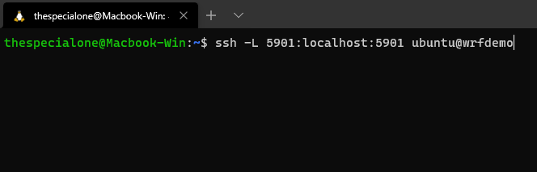
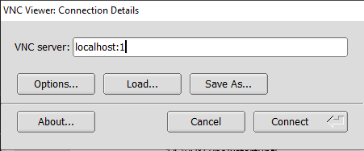
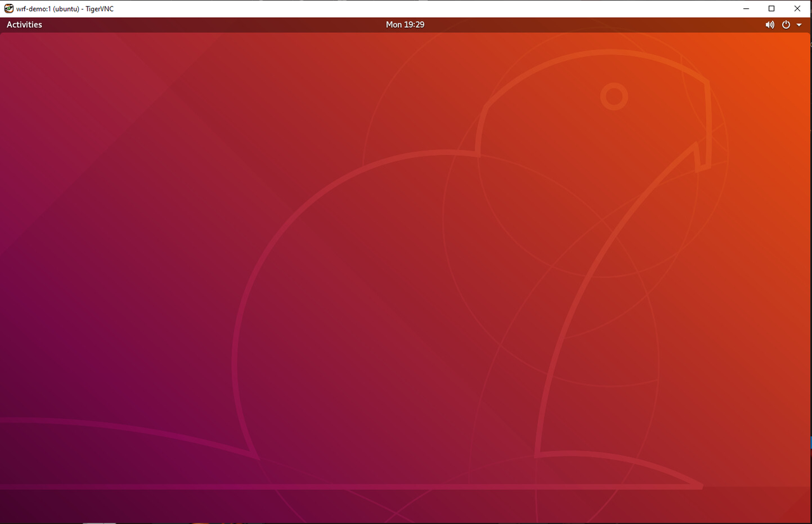
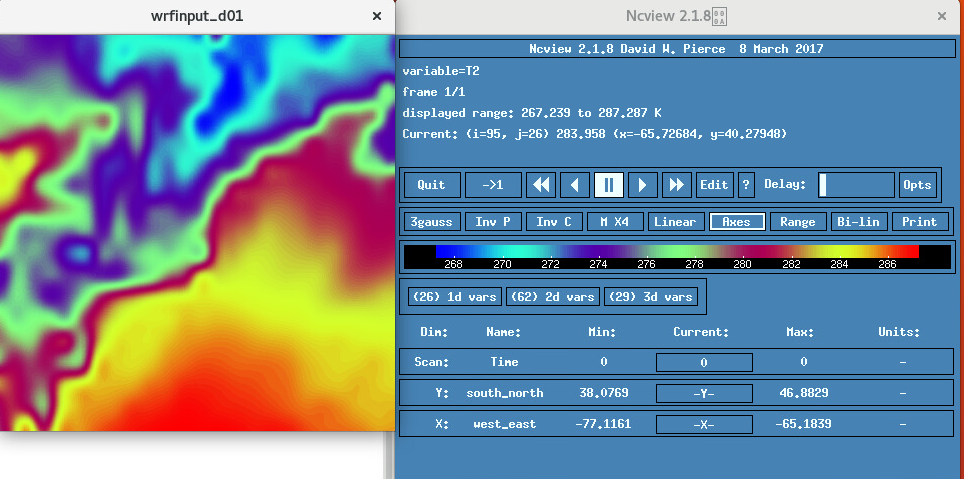
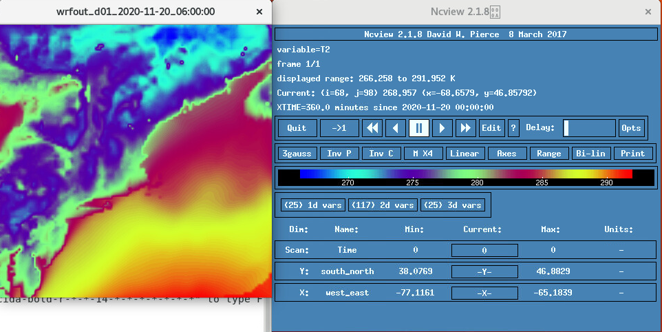

# Installation, installation et exécution WRF/WPS

## Présentation

Ce laboratoire vous explique comment configurer et exécuter WRF sur l'infrastructure OCI. Ce guide est destiné à vous montrer comment transformer une image Ubuntu vanille en un environnement dans lequel vous pourrez effectuer des expériences et exécuter des simulations météorologiques. Je vais également fournir une image personnalisée uniquement si vous voulez exécuter WRF sans apprendre à la configurer.

Téléchargez l'[image personnalisée WRF](https://objectstorage.us-ashburn-1.oraclecloud.com/p/lRqMYYN5VTdSgBz9f8nv7Tz5mzMGMqr7wlN2Y_q6g6GHmTdc9GX8lokgmTui81BA/n/hpc_limited_availability/b/Demo_Materials/o/WRF_DEMOV2).

Temps de laboratoire estimé : 90 minutes

### Objectifs

Dans cet atelier, vous allez découvrir :

*   Téléchargement des dépendances et WRF/WPS
*   Compilation des bibliothèques pour WRF/WPS
*   Compiler WRF et WPS
*   Création d'un domaine WRF avec Geogrid
*   Télécharger les données GFS et exécuter Ungrib et Metgrid
*   Exécuter WRF avec des données réelles

### Prérequis

Cet exercice suppose que vous avez :

*   Un compte de niveau gratuit ou de cloud payant Oracle
*   Accès à une instance de CPU Unbuntu 18.04, comme indiqué dans les exercices 1 et 2
*   Notez que nous allons utiliser la **forme VM.Standard2.16**. Vous pouvez utiliser une forme plus petite si vous le souhaitez.

Il existe un certain nombre de technologies et de dépendances qui seront utilisées pour faire fonctionner WRF. N'hésitez pas à utiliser les liens suivants pour vous familiariser avec la technologie. Les technologies utilisées dans cet exercice sont les suivantes :

*   [Forme OCI basée sur un processeur Intel](https://docs.cloud.oracle.com/en-us/iaas/Content/Compute/References/computeshapes.htm#vmshapes__vm-standard)
*   [Ubuntu 18.04](https://wiki.ubuntu.com/BionicBeaver/ReleaseNotes)
*   [gfortran 7.5.0](https://gcc.gnu.org/onlinedocs/gcc-7.5.0/gfortran.pdf)
*   [cpp](https://www.geeksforgeeks.org/cpp-command-in-linux-with-examples/)
*   [GCC,](https://gcc.gnu.org/onlinedocs/gcc-3.3.6/gcc/G_002b_002b-and-GCC.html)
*   [csh](https://www.computerhope.com/unix/ucsh.htm#:~:text=csh%20is%20a%20command%20language,and%20a%20C%2Dlike%20syntax.)
*   [Perl](https://www.perl.org/about.html)
*   [g++](https://www.geeksforgeeks.org/compiling-with-g-plus-plus/)
*   [Création](https://www.gnu.org/software/make/)
*   [NETCDF](https://www.unidata.ucar.edu/software/netcdf/) 4.1.2
*   [LIBPNG](http://www.libpng.org/pub/png/libpng.html) 1.6
*   [ZLIB](https://zlib.net/) 1.2.11
*   [JASPER](http://ftp.oregonstate.edu/.2/lfs-website/blfs/view/svn/general/jasper.html) 1.900.1
*   [MPICH](https://www.mpich.org/) 3.3.2 (pour le parallisme)
*   [RÉF. 4.1.5](https://github.com/wrf-model/WRF/releases/tag/v4.1.5)
*   [POINTS DE VENTE 4.1](https://github.com/wrf-model/WPS/releases/tag/v4.1)
*   [vue nc](http://meteora.ucsd.edu/~pierce/ncview_home_page.html)
*   [m4](https://www.gnu.org/software/m4/m4.html)
*   [bureau](https://htop.dev/)
*   [tigerVNC](https://tigervnc.org/)
*   [boîte de dialogue PV](https://www.geeksforgeeks.org/pv-command-in-linux-with-examples/)
*   [Midnight Comander](https://midnight-commander.org/) (facultatif)

## Tâche 1 : configuration de Gnome Desktop

1.  Il existe un certain nombre de technologies de bureau que vous pouvez utiliser, mais ce guide abordera la configuration et la congestion du bureau Gnome, car il s'agit de la valeur par défaut pour Ubuntu. Les étapes suivantes permettent de télécharger, d'installer et de configurer Gnome Desktop pour notre instance Ubuntu 18.04.
    
        <copy>
        sudo apt update
        sudo apt upgrade -y
        sudo reboot # Wait about 60 seconds before proceeding
        sudo apt install xserver-xorg-core -y
        sudo apt install tigervnc-standalone-server tigervnc-xorg-extension tigervnc-viewer -y
        sudo apt install ubuntu-gnome-desktop -y
        sudo systemctl start gdm
        sudo systemctl enable gdm
        vncserver # DO NOT MAKE READ ONLY and password should be no greater than 8 characters
        vncserver -kill :*
        </copy>
        
2.  vi ~/.vnc/xstartup  
    **Entrez les informations suivantes :**
    
        <copy>
        #!/bin/sh  
        [ -x /etc/vnc/xstartup ] && exec /etc/vnc/xstartup  
        [ -r $HOME/.Xresources ] && xrdb $HOME/.Xresources  
        vncconfig -iconic &  
        dbus-launch --exit-with-session gnome-session &  
        </copy>
        
    
    **Pour quitter, appuyez simplement sur esc, puis sur Maj : suivi de wq enter**
    
    Elle doit se présenter comme suit :  
    
    
3.  Rendez le fichier xstartup exécutable, puis exécutez le serveur VNC.
    
        <copy>
        sudo chmod +x ~/.vnc/xstartup
        vncserver -geometry 1440x900
        </copy>
        

## Tâche 2 : connexion au bureau Gnome

Nous utiliserons [TigerVNC Viewer](https://tigervnc.org/) pour nous connecter à notre instance.

1.  Ouvrir un terminal local
    
    Exécutez la commande suivante avec les informations relatives à votre instance : ssh -L 5901:localhost:5901 ubuntu@IPADDRESS
    
    
    
2.  Ouvrir le visualiseur TigerVNC
    
    Saisissez `localhost:1` dans la section VNC Server :  
    puis cliquez sur connect  
    
    
3.  Entrez votre mot de passe VNC  
    puis cliquez sur OK  
    
    
4.  Un bureau gnome vous sera enfin présenté et vous devriez continuer à travailler d'ici.  
    
    

## Tâche 3 : configuration d'Ubuntu

1.  Maintenant que nous pouvons accéder à l'environnement de bureau de notre instance, nous pouvons commencer à le configurer pour exécuter WRF. Pour commencer, nous allons devoir installer les dépendances. Cliquez sur Activités en haut à gauche, puis sur Afficher les applications. Recherchez et ouvrez un terminal. Effectuez les opérations suivantes dans le terminal.
    
        <copy>
        sudo apt install gfortran -y   
        # Verify install with command: which gfortran    
        # Should return a path: /usr/bin/gfortran  
        sudo apt install cpp    
        # Verify install with command: which cpp    
        # Should return a path: /usr/bin/cpp  
        sudo apt install gcc    
        # Verify install with command: which gcc    
        # Should return a path: /usr/bin/gcc  
        sudo apt install g++ -y  
        sudo apt install make  
        sudo apt install csh  
        sudo apt install perl  
        sudo apt-get install m4  
        sudo apt install htop  
        sudo apt install mc -y    
        sudo apt install ncview -y   
        </copy>
        

## Tâche 4 : Téléchargement et compilation de bibliothèques pour WRF

Maintenant que nous avons installé la plupart des dépendances dont nous aurons besoin pour WRF, commençons à compiler les bibliothèques dont WRF a besoin pour fonctionner.

### Créer une structure de dossiers et télécharger des bibliothèques

1.  Entrez les commandes suivantes dans le terminal distant pour commencer à configurer la structure de dossiers requise.
    
        <copy>
        mkdir WRF
        cd WRF
        mkdir downloads
        cd downloads
        </copy>
        
2.  Dans le répertoire des téléchargements, vous pouvez télécharger toutes les bibliothèques dont nous avons besoin à l'aide des commandes suivantes.
    
        <copy>
        curl -O ftp://ftp.unidata.ucar.edu/pub/netcdf/old/netcdf-4.1.2.tar.gz  
        curl -O https://www.zlib.net/zlib-1.2.11.tar.gz  
        curl -O ftp://ftp.simplesystems.org/pub/libpng/png/src/libpng16/libpng-1.6.37.tar.gz  
        curl -O https://www2.mmm.ucar.edu/wrf/OnLineTutorial/compile_tutorial/tar_files/jasper-1.900.1.tar.gz  
        curl -O https://www.mpich.org/static/downloads/3.3.2/mpich-3.3.2.tar.gz
        </copy>
        
3.  Au lieu de décompresser les fichiers un par un, utilisez une **boucle** pour le faire, puis revenez à notre répertoire WRF.
    
        <copy>
        for i in *.gz ; do tar -xzf $i ; done
        cd ~/WRF  
        </copy>
        
4.  Maintenant que nous sommes de nouveau dans le répertoire WRF, nous allons configurer la structure de dossiers de nos bibliothèques pour WRF. Nous allons également créer une variable d'environnement pour référencer le chemin de bibliothèque à utiliser ultérieurement dans le guide.
    
        <copy>
        mkdir libs  
        cd libs  
        mkdir netcdf  
        mkdir mpich  
        mkdir grib2 (this will be used for the jasper, libpng, and zlib libraries)  
        export LIBDIR=~/WRF/libs
        </copy>
        

### Compilation de la bibliothèque grib2

La bibliothèque grib2 est en fait une compilation de trois bibliothèques distinctes, en particulier zlib, jasper et libpng.

5.  Compilation de Zlib
    
        <copy> 
        cd ~/WRF/downloads
        cd zlib-1.2.11
        ./configure --prefix=$LIBDIR/grib2
        make
        make install
        </copy>
        
6.  Compilation de libpng
    
        <copy>
        cd ~/WRF/downloads
        cd libpng-1.6.37/
        ./configure --prefix=$LIBDIR/grib2 LDFLAGS="-L$LIBDIR/grib2/lib" CPPFLAGS="-I$LIBDIR/grib2/include"
        make
        make install
        </copy>
        
7.  Compilation de jasper
    
        <copy>
        cd ~/WRF/downloads
        cd jasper-1.900.1/
        ./configure --prefix=$LIBDIR/grib2
        make
        make install
        </copy>
        

### Compiler les bibliothèques Netcdf et Mpich

8.  Compilation de la bibliothèque netcdf
    
        <copy>
        cd ~/WRF/downloads
        cd netcdf-4.1.2/
        ./configure --prefix=$LIBDIR/netcdf --disable-dap --disable-netcdf-4
        make
        make install
        </copy>
        
9.  Compilation de la bibliothèque mpich
    
        <copy>
        cd ~/WRF/downloads
        cd mpich-3.3.2/
        ./configure --prefix=$LIBDIR/mpich
        make
        make install
        </copy>
        

## Tâche 5 : Compiler WRF et WPS

1.  Maintenant que nous avons configuré la structure des dossiers pour les bibliothèques, nous pouvons commencer à télécharger et compiler WRF et WPS. Le bloc de code suivant télécharge et place les programmes aux emplacements appropriés.
    
        <copy>
        cd ~/WRF/downloads
        wget https://github.com/wrf-model/WRF/archive/v4.1.5.tar.gz
        wget https://github.com/wrf-model/WPS/archive/v4.1.tar.gz
        for i in *.gz ; do tar -xzf $i ; done
        mv WRF-4.1.5/ ~/WRF/
        mv WPS-4.1/ ~/WRF/
        </copy>
        
2.  Pour pouvoir compiler WRF, nous devons configurer des variables d'environnement afin que le programme puisse trouver et utiliser les bibliothèques que nous avons compilées pour fonctionner.
    
        <copy>
        cd .. or /home/ubuntu/WRF
        cd WRF-4.1.5/
        export NETCDF=$LIBDIR/netcdf
        export PATH=$LIBDIR/mpich/bin:$PATH
        export JASPERLIB=$LIBDIR/grib2/lib
        export JASPERINC=$LIBDIR/grib2/include
        </copy>
        
3.  Maintenant que nous avons référencé toutes les bibliothèques dans les variables d'environnement, nous pouvons enfin compiler WRF. Pour ce laboratoire, nous allons compiler WRF afin de pouvoir utiliser des données météorologiques réelles qui ont été collectées. Nous allons décomposer cela en deux sections : une section de configuration et une section de compilation.
    
    **Configurer :**  
    Nous choisissons l'option 34 pour aller de pair avec notre choix d'utiliser gfortran/gcc et l'option 1, car nous ne couvrirons pas l'imbrication dans ce guide.
    
        <copy>
        ./configure
        34 (dmpar)
        1
        vi ~/.bashrc  
            export LIBDIR=/home/ubuntu/WRF/libs  
            export LD_LIBRARY_PATH=$LIBDIR/netcdf/lib:$LD_LIBRARY_PATH   
            export PATH=$LIBDIR/mpich/bin:$PATH
        source ~/.bashrc
        </copy>
        
    
    **Compilation :**  
    ici, nous compilons WRF et testons qu'il sera exécuté.
    
        <copy>
        ./compile em_real
        cd main
        ./wrf.exe
        ./real.exe
        </copy>
        
4.  Maintenant que WRF a été compilé, nous devons compiler WPS. WRF doit d'abord être compilé. Ici, nous choisissons l'option 3, car nous utilisons le système d'exploitation Linux (Ubuntu) sur l'infrastructure x86 (OCI VM.Standard2.16) avec le compilateur gfortran.
    
        <copy>
        cd /home/ubuntu/WRF/WPS-4.1
        export WRF_DIR=/home/ubuntu/WRF/WRF-4.1.5/
        ./configure
        3
        ./compile
        </copy>
        
5.  Maintenant que WPS est compilé, nous devons télécharger les données que nous allons utiliser pour simuler la géographie du monde. Nous allons créer un dossier contenant ces informations. Il faut un certain temps pour décompresser puisque nous utilisons les fichiers haute résolution recommandés, de sorte que nous utilisons la boîte de dialogue PV pour générer une barre de progression pour nous.
    
        <copy>
        cd /home/ubuntu/WRF
        mkdir GEOG
        cd GEOG
        wget https://www2.mmm.ucar.edu/wrf/src/wps_files/geog_high_res_mandatory.tar.gz  
        sudo apt-get install pv dialog -y
        (pv -n geog_high_res_mandatory.tar.gz| tar xzf - -C . ) \
        2>&1 | dialog --gauge "Extracting file..." 6 50
        </copy>
        
6.  Maintenant que nous avons téléchargé et extrait les données géographiques, nous avons besoin de déplacer certains fichiers vers le bon emplacement et de supprimer des fichiers supplémentaires dont nous n'avons pas besoin. Nous utiliserons le commandant de minuit pour cela, mais vous pouvez simplement utiliser des commandes de terminal si vous le souhaitez. Après mc, l'interface de commande de minuit sera utilisée, donc **`DO NOT`** `copy the following entire code block into terminal`.
    
        <copy>
        mc    #Opens Midnight Commander
        click on the left WPS_GEOG
        Use CTRL + T to highlight all the folders
        F6    #This will move the files to the GEOG directory
        ENTER #This will confirm the choice
        F10   #This is used to exit Midnight commander
        sudo rm -r WPS_GEOG   #This will delete the additional GEOG folder.
        mc    #Opens Midnight Commander
        Highlight *._WPS_GEOG
        F8    #This deletes the highlighted file
        ENTER #This will confirm the choice
        F10 #This is used to exit Midnight commander
        </copy>
        
7.  Nous devons ajuster le fichier namelist.wps à zéro à un emplacement de votre choix. Je serai une petite grille (10 000 x 10 000 mètres) avec Woburn Massachusetts USA comme point central.
    
        <copy>
        cd /home/ubuntu/WRF/WPS-4.1
        vi namelist.wps
        </copy>
        
    
    **Veuillez changer toutes les valeurs ci-dessous à votre goût en fonction de votre expérience**.
    
    *   `max_dom` : entier indiquant le nombre total de domaines, y compris le domaine parent, dans la simulation. La valeur par défaut est 1.
    *   `e_we` : entiers indiquant la dimension ouest-est complète de la grille. Aucune valeur par défaut.
    *   `e_sn` : entiers indiquant la dimension Sud-Nord complète de la grille. Aucune valeur par défaut.
    *   `dx` : valeur réelle indiquant la distance de la grille (en mètres) dans la direction X où le facteur d'échelle de la carte est 1.
    *   `dy` : valeur réelle indiquant la distance de la grille (en mètres) dans la direction Y où le facteur d'échelle de la carte est 1.
    *   `ref_lat` : valeur réelle indiquant la partie latitude d'un emplacement (latitude, longitude) dont l'emplacement (i,j) dans le domaine de simulation est connu.
    *   `ref_lon` : valeur réelle indiquant la partie de longitude d'un emplacement (latitude, longitude) dont l'emplacement (i, j) dans le domaine de simulation est connu.
    *   `truelat1` : Valeur réelle spécifiant la première latitude réelle pour la projection conforme de Lambert, ou la seule vraie latitude pour le Mercator et les projections stéréographiques polaires.
    *   `truelat2` : valeur réelle indiquant la deuxième latitude réelle pour la projection conique conforme de Lambert.
    *   `stand_lon` : valeur réelle indiquant la longitude parallèle à l'axe des y dans les projections stéréographiques conformes et polaires de Lambert. Pour la projection régulière de latitude-longitude, cette valeur donne la rotation autour des pôles géographiques de la terre.
    *   `geog_data_path` : chaîne de caractères indiquant le chemin, relatif ou absolu, du répertoire dans lequel les répertoires de données géographiques peuvent être trouvés.
    
        <copy>
            &share  
            wrf_core = 'ARW',  
            max_dom = 1,  
            start_date = '2006-08-16_12:00:00','2006-08-16_12:00:00',  
            end_date   = '2006-08-16_18:00:00','2006-08-16_12:00:00',  
            interval_seconds = 21600  
            io_form_geogrid = 2,  
            /  
            &geogrid  
            parent_id         =   1,   1,  
            parent_grid_ratio =   1,   3,  
            i_parent_start    =   1,  31,  
            j_parent_start    =   1,  17,  
            e_we              =  100, 112,  
            e_sn              =  100,  97,  
            !  
            !!!!!!!!!!!!!!!!!!!!!!!!!!!!!!!!!!!!!!!!!!!!!! IMPORTANT NOTE !!!!!!!!!!!!!!!!!!!!!!!!!!!!!!!!!!!!!!!!!!!!!!  
            ! The default datasets used to produce the MAXSNOALB and ALBEDO12M  
            ! fields have changed in WPS v4.0. These fields are now interpolated  
            ! from MODIS-based datasets.  
            !  
            ! To match the output given by the default namelist.wps in WPS v3.9.1,  
            ! the following setting for geog_data_res may be used:  
            !  
            ! geog_data_res = 'maxsnowalb_ncep+albedo_ncep+default','maxsnowalb_ncep+albedo_ncep+default',  
            !  
            !!!!!!!!!!!!!!!!!!!!!!!!!!!!!!!!!!!!!!!!!!!!!! IMPORTANT NOTE !!!!!!!!!!!!!!!!!!!!!!!!!!!!!!!!!!!!!!!!!!!!!!  
            !  
            geog_data_res = 'default','default',  
            dx = 10000,  
            dy = 10000,  
            map_proj = 'lambert',  
            ref_lat   =  42.48,  
            ref_lon   = -71.15,  
            truelat1  =  42.48,  
            truelat2  =  42.48,  
            stand_lon = -71.15,  
            geog_data_path = '/home/ubuntu/WRF/GEOG/'  
            /
        </copy>      
        
    
    **Pour quitter, appuyez simplement sur esc, puis sur Maj : suivi de wq enter**  
    **Toutes ces modifications concernent une zone géographique où Woburn MA est l'épicentre.**
    
8.  Maintenant que nous avons mis les informations pour notre zone géographique d'intérêt (ce guide utilise Woburn MA USA comme point central) permet d'utiliser ncview pour vérifier que nous avons le bon emplacement après avoir exécuté le programme geogrid.
    
        <copy>
        ./geogrid.exe
        ncview geo_em.d01.nc
        </copy>
        
    
    Utilisez la variable 2d pour vérifier le masque de terrain afin de vérifier l'emplacement. Si l'image est satisfaite, nous créons le domaine.
    
    
    
9.  Après avoir configuré notre zone géographique ou notre domaine. Nous devons maintenant obtenir des données météorologiques pour se superposer au domaine.
    
    1.  Dans un navigateur Web, accédez à https://nomads.ncep.noaa.gov/pub/data/nccf/com/gfs/prod/
    2.  Cliquez sur le lien avec la date la plus récente (ex gfs.20201120/ car aujourd'hui est le 20 novembre 2020)
    3.  Choisir 00
    
    Ne téléchargez rien. Nous allons créer un script pour cela. Nous allons à la résolution inférieure pour une taille de données plus facile à gérer pour cet atelier. Par conséquent, 0p50 au lieu de 0p25. Utilisez 0p25 si vous disposez d'un stockage supplémentaire et que vous souhaitez une résolution plus élevée/des données plus fiables. Vous devez télécharger le nombre de fichiers pour la durée d'exécution souhaitée. Chaque fichier correspond à une heure de données à un intervalle donné. EX si vous voulez exécuter pendant six heures, vous avez besoin de gfs.t00z.pgrb2.0p50.f000, gfs.t00z.pgrb2.0p50.f003 et gfs.t00z.pgrb2.0p50.f006. 0p25 est en étapes d'une heure et 0p50 en étapes de 3 heures. Pour le tutoriel, nous utiliserons seulement 6 heures de données. N'hésitez pas à en utiliser davantage lorsque vous serez plus à l'aise avec WRF ultérieurement.
    
10.  Permet d'accéder au répertoire correct et de créer notre script pour télécharger les données.
    
        <copy>
        cd ~/WRF
        mkdir scripts
        mkdir GFS
        cd scripts
        vi download_gfs.sh
        </copy>
        
11.  Le script sera le suivant :
    
        <copy>
        #!/bin/bash  
        
        inputdir=/home/ubuntu/WRF/GFS  
        rm -rf $inputdir  
        mkdir $inputdir  
        
        year=2020  
        month=11  
        day=20  
        cycle=00  
        
        for ((i=000; i<=006; i+=3))  
        do  
                ftime=`printf "%03d\n" "${i}"`  
                server=https://nomads.ncep.noaa.gov/pub/data/nccf/com/gfs/prod  
                directory=gfs.${year}${month}${day}/${cycle}  
                file=gfs.t${cycle}z.pgrb2.0p50.f${ftime}  
                url=${server}/${directory}/${file}  
                echo $url  
                wget -O ${inputdir}/${file} ${url}  
        done
        </copy>  
        
    
    **Pour quitter, appuyez simplement sur esc, puis sur Maj : suivi de wq enter**  
    **Ce script télécharge les heures SIX de données pour la date 11/20/20 à la résolution 0p50. Veuillez ajuster pour répondre à vos besoins.**
    
12.  Les commandes suivantes rendent le script exécutable et l'exécutent pour télécharger les données :
    
        <copy>
        chmod +x download_gfs.sh
        ./download_gfs.sh
        </copy>
        
13.  Maintenant que nous avons téléchargé nos données, passons par le processus de superposition sur notre domaine. Nous utiliserons ungrib et une métropole pour y parvenir. Nous allons décomposer cela en deux sections : une section de configuration et une section d'exécution.
    
    **Configurer :**
    
        <copy>
        cd ~/WRF/WPS-4.1
        ln -s ungrib/Variable_Tables/Vtable.GFS ./Vtable
        ./link_grib.csh ~/WRF/GFS/
        vi namelist.wps  
        </copy>
        
    
    **Modifiez toutes les valeurs ci-dessous en fonction des fichiers téléchargés**.
    
    *   `start_date` sous la forme : Année-Mois-Jour\_heure:minute:seconde
    *   `end_date` sous la forme : Année-Mois-Jour\_heure:minute:seconde
    *   `interval seconds` : nombre entier de secondes entre les fichiers d'entrée météorologique variables dans le temps. Aucune valeur par défaut.
    
        <copy>
        &share  
        wrf_core = 'ARW',  
        max_dom = 1,  
        start_date = '2020-11-20_00:00:00',         # start time  
        end_date   = '2020-11-20_06:00:00',         #6 hours later than start time  
        interval_seconds = 10800                    #3 hours worth of seconds interval between steps  
        io_form_geogrid = 2,  
        /
        </copy> 
        
    
    **Pour quitter, appuyez simplement sur esc, puis sur Maj : suivi de wq enter**
    
    **Exécuter :**
    
        <copy>
        ./ungrib.exe
        ln -s metgrid/METGRID.TBL.ARW ./METGRID.TBL
        ./metgrid.exe
        </copy>
        
14.  Nous pouvons examiner les résultats en utilisant ncview et en regardant skintemp pour voir la valeur des données que nous avons téléchargées.
    
        <copy>
        ncview met_em.d01.2020-11-20_00\:00\:00.nc
        </copy>
        
    
    
    

## Tâche 6 : Exécuter Real et WRF

1.  Nous avons réduit les données pour représenter un emplacement géographique et nous y avons ajouté des données météorologiques ; il est enfin temps d'exécuter WRF en utilisant des données réelles.
    
        <copy>
        cd ~/WRF/WRF-4.1.5
        cd run
        ln -s ../../WPS-4.1/met_em* .
        vi namelist.input
        </copy>
        
2.  Dans le fichier namelist.input, nous devons modifier le contenu pour refléter notre zone géographique/domaine, ainsi que notre date et intervalle.  
    **Veuillez modifier toutes les valeurs de votre choix en fonction de votre expérience**.
    
    *   `run_days` : durée d'exécution en jours.
    *   `run_hours` : durée d'exécution en heures. **Remarque :** s'il s'agit de plus d'1 jour, vous pouvez utiliser run\_days et run\_hours ou simplement run\_hours. Par exemple, si la longueur d'exécution totale est de 36 heures, vous pouvez définir run\_days = 1, run\_hours = 12 ou run\_days = 0 et run\_hours = 36.
    *   `run_minutes` : durée d'exécution en minutes.
    *   `run_seconds` : durée d'exécution en secondes.
    *   `start_year` : année de début à 4 chiffres.
    *   `start_month` : mois de début à 2 chiffres.
    *   `start_day` : jour de début à 2 chiffres.
    *   `start_hour` : heure de début sur 2 chiffres.
    *   `end_year` : année de fin à 4 chiffres.
    *   `end_month` : mois de fin à 2 chiffres.
    *   `end_day` : jour de fin à 2 chiffres.
    *   `end_hour` : heure de fin sur 2 chiffres.
    *   `interval_seconds` : intervalle entre les données réelles entrantes, qui sera l'intervalle entre le fichier de conditions de limite latérale.
    *   `e_we` : index de fin dans la direction x (west\_east) (dimension décalée).
    *   `e_sn` : index de fin dans la direction y (sud-nord) (dimension décalée).
    *   `e_vert` : index de fin dans la direction z (verticale) (dimension décalée - fait référence à des niveaux complets).
    *   `dx` : longueur de la grille dans la direction X (en mètres).
    *   `dy` : longueur de grille dans la direction Y (en mètres).
    *   `frames_per_outfile` : fréquence à laquelle vous fractionnez le fichier de sortie.
    *   `num_metgrid_levels` : nombre de niveaux verticaux dans la sortie WPS.
        *   Tapez ncdump -h sur l'un des fichiers met\_em\* pour connaître ce numéro.
    *   `w_damping` : indicateur d'amortissement de la vitesse verticale (pour une utilisation opérationnelle). Défini sur 1.
    
        <copy>
        &time_control
        run_days                            = 0,
        run_hours                           = 6,
        run_minutes                         = 0,
        run_seconds                         = 0,
        start_year                          = 2020, 2000, 2000,
        start_month                         = 11,   01,   01,
        start_day                           = 20,   24,   24,
        start_hour                          = 00,   12,   12,
        end_year                            = 2020, 2000, 2000,
        end_month                           = 11,   01,   01,
        end_day                             = 20,   25,   25,
        end_hour                            = 06,   12,   12,
        interval_seconds                    = 10800
        input_from_file                     = .true.,.true.,.true.,
        history_interval                    = 60,  60,   60,
        frames_per_outfile                  = 1, 1000, 1000,                                        
        restart                             = .false.,
        restart_interval                    = 7200,
        io_form_history                     = 2
        io_form_restart                     = 2
        io_form_input                       = 2
        io_form_boundary                    = 2
        /
        
        &domains
        time_step                           = 60,
        time_step_fract_num                 = 0,
        time_step_fract_den                 = 1,
        max_dom                             = 1,
        e_we                                = 100,    112,   94,
        e_sn                                = 100,    97,    91,
        e_vert                              = 40,    33,    33,
        p_top_requested                     = 5000,
        num_metgrid_levels                  = 34,
        num_metgrid_soil_levels             = 4,
        dx                                  = 10000, 10000,  3333.33,
        dy                                  = 10000, 10000,  3333.33,
        grid_id                             = 1,     2,     3,
        parent_id                           = 0,     1,     2,
        i_parent_start                      = 1,     31,    30,
        j_parent_start                      = 1,     17,    30,
        parent_grid_ratio                   = 1,     3,     3,
        parent_time_step_ratio              = 1,     3,     3,
        feedback                            = 1,
        smooth_option                       = 0
        /
        
        &physics
        physics_suite                       = 'CONUS'
        mp_physics                          = -1,    -1,    -1,
        cu_physics                          = -1,    -1,     0,
        ra_lw_physics                       = -1,    -1,    -1,
        ra_sw_physics                       = -1,    -1,    -1,
        bl_pbl_physics                      = -1,    -1,    -1,
        sf_sfclay_physics                   = -1,    -1,    -1,
        sf_surface_physics                  = -1,    -1,    -1,
        radt                                = 30,    30,    30,
        bldt                                = 0,     0,     0,
        cudt                                = 5,     5,     5,
        icloud                              = 1,
        num_land_cat                        = 21,
        sf_urban_physics                    = 0,     0,     0,
        /
        
        &dynamics
        hybrid_opt                          = 2,
        w_damping                           = 1,
        diff_opt                            = 1,      1,      1,
        km_opt                              = 4,      4,      4,
        diff_6th_opt                        = 0,      0,      0,
        diff_6th_factor                     = 0.12,   0.12,   0.12,
        base_temp                           = 290.
        damp_opt                            = 3,
        zdamp                               = 5000.,  5000.,  5000.,
        dampcoef                            = 0.2,    0.2,    0.2
        khdif                               = 0,      0,      0,
        kvdif                               = 0,      0,      0,
        non_hydrostatic                     = .true., .true., .true.,
        moist_adv_opt                       = 1,      1,      1,
        scalar_adv_opt                      = 1,      1,      1,
        gwd_opt                             = 0,
        /
        
        &bdy_control
        spec_bdy_width                      = 5,
        specified                           = .true.
        /
        
        &namelist_quilt
        nio_tasks_per_group = 0,
        nio_groups = 1,
        /
        </copy>
        
    
    **Pour quitter, appuyez simplement sur esc, puis sur Maj : suivi de wq enter**
    
3.  Nous pouvons enfin exécuter real.exe et wrf.exe. L'exécution de ce programme prend un certain temps. Pour accélérer ce processus, nous utiliserons MPI pour exécuter les programmes sur plusieurs cœurs de notre forme. N'oubliez pas que ce guide a été écrit en utilisant une forme VM.Standard2.16. Nous allons donc exécuter real.exe sur 2 coeurs.
    
        <copy>
        cat /proc/cpuinfo #To get cpu infor (use if you forgot your OCI shape).
        mpirun -n 2 ./real.exe #This has real.exe running on two cores
        cat rsl.out.0000 #Use this command check for errors
        </copy>
        
4.  Utilise ncview pour consulter notre fichier d'entrée.
    
        <copy>
        ncview wrfinput_d01
        </copy>
        
    
    Ici, vous pouvez voir la température à deux mètres pour la zone cible. 
    
5.  Nous avons notre avis, nous pouvons maintenant l'utiliser pour générer une prédiction.
    
        <copy>
        mpirun -n 10 ./wrf.exe #This will run on 10 cores
        tail -F rsl.out.0000 #can be used to check for errors and progress. 
        </copy>
        
6.  Nous pouvons vérifier nos prévisions avec les éléments suivants :
    
        <copy>
        ncview wrfout_d01_2020-11-20_06\:00\:00
        </copy> 
        
    
      
    Grâce à notre prédiction, vous pouvez constater que des changements sont survenus lorsque nous examinons la même zone six heures plus tard. Il y a beaucoup de variables à explorer, alors amusez-vous.
    
    Grâce à cela, vous avez appris à configurer WRF pour exécuter des prévisions météorologiques avec des données réelles. Je vais mettre en place un guide plus petit sur ce qu'il faut faire pour faire évoluer l'expérience avec de nouvelles données.
    
    Vous pouvez passer à l'exercice suivant pour savoir quoi faire pour modifier l'expérience avec de nouvelles données.
    

## Accusés de réception

*   **Auteur** - Brian Bennett, ingénieur solutions, Big Compute
*   **Dernière mise à jour le/la date** - Brian Bennett, Big Compute, décembre 2020